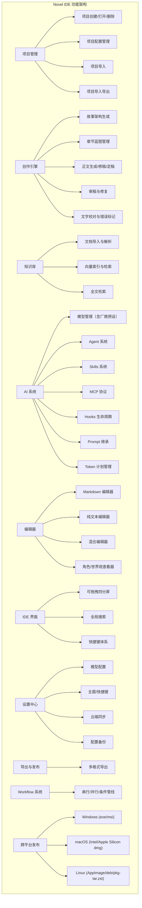
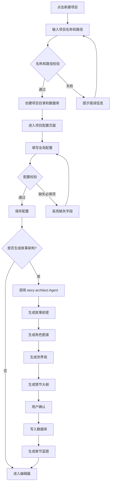
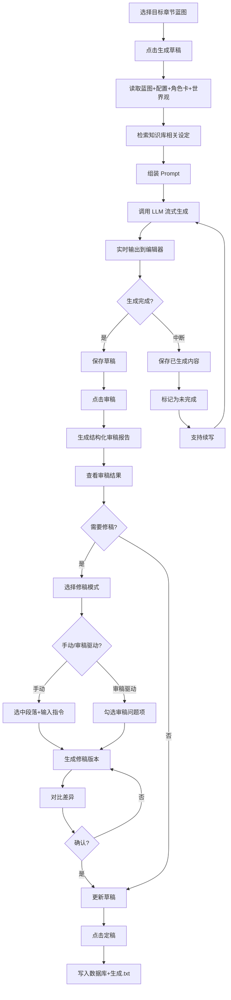
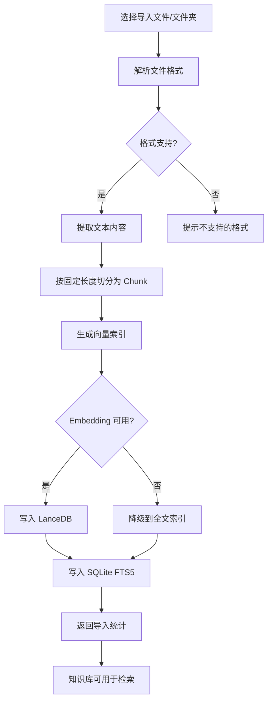
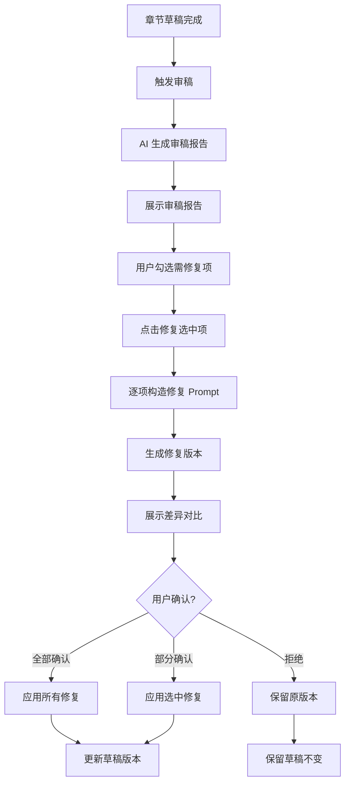
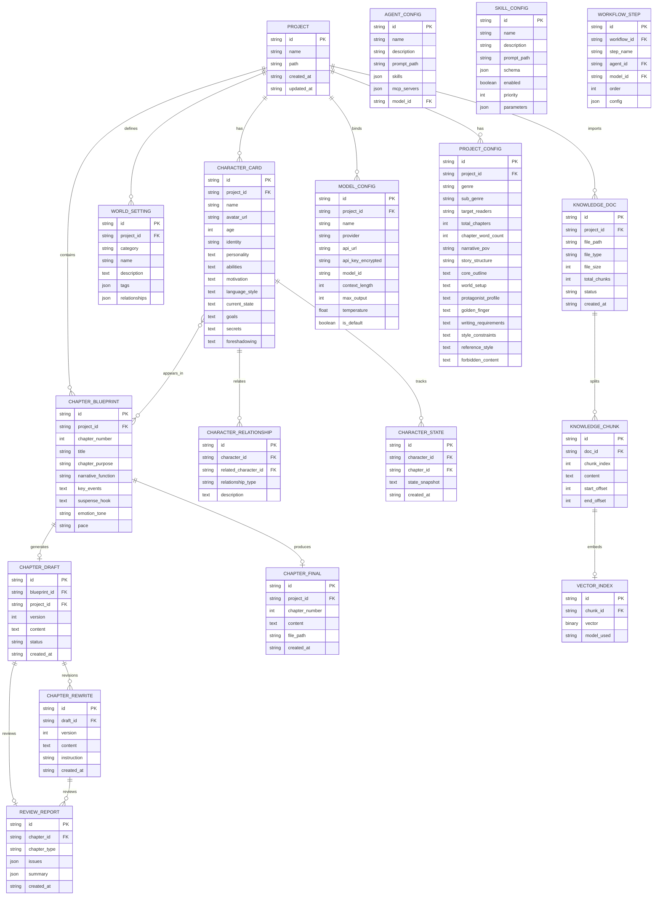

# Novel IDE 产品需求文档（PRD）

> 生成日期：2026-07-08
> 版本：v1.1
> 状态：初稿

---

## 1. 产品概述

### 1.1 背景

当前市场上的 AI 写作工具大多停留在"聊天框 + 文本编辑器"的初级形态，缺乏对长篇小说创作全流程的系统性支撑。作者在创作百万字级长篇小说时面临以下核心痛点：

1. **设定遗忘与人设崩塌**：长篇创作跨越数月甚至数年，AI 缺乏对前文设定的持久记忆，导致角色性格前后矛盾、世界观设定冲突。
2. **上下文窗口瓶颈**：单次对话无法承载百万字级小说的完整上下文，AI 输出质量随对话长度急剧下降。
3. **缺乏结构化创作流程**：现有工具无法将创作脑洞转化为可执行的结构化配置，大纲、角色、世界观、章节蓝图之间缺乏系统化关联。
4. **审稿与修稿割裂**：审稿发现的问题与修稿操作之间没有自动化闭环，需要作者手动比对和修复。
5. **工具碎片化**：作者需要在 Scrivener（结构管理）、Obsidian（知识库）、ChatGPT（AI 生成）、Word（定稿）等多个工具之间频繁切换。

Novel IDE 的定位是**专业小说创作 IDE**——不是又一个带对话框的文本编辑器，而是一套深度融合大语言模型能力、长文本上下文检索（RAG）、自动化创作管线的专业级小说写作引擎。核心目标：**让 AI 成为真正的小说创作团队，而不是聊天机器人。**

### 1.2 目标

| 编号 | 目标 | 量化指标 |
|------|------|---------|
| G1 | 本地冷启动性能 | 冷启动 ≤ 2s（SSD），项目打开 ≤ 3s（10 万章节索引以内） |
| G2 | 百万字级知识库支持 | RAG 检索 ≤ 200ms（百万字知识库），全文搜索 ≤ 100ms（SQLite FTS5） |
| G3 | 全流程 AI 创作管线 | 从创作脑洞到定稿输出，支持 9 步自动化管线（Idea → Export），每步可独立重执行 |
| G4 | 多模型智能调度 | 支持 OpenAI 兼容协议、Gemini 协议、本地模型（Ollama/LM Studio/vLLM），每个 Workflow 步骤可绑定不同模型 |
| G5 | 离线优先架构 | 所有本地功能（编辑、项目管理、本地模型推理）在断网状态下可正常工作 |
| G6 | 全平台覆盖发布 | Windows（exe/nsis + msi）、macOS（Intel + Apple Silicon dmg）、Linux（AppImage + deb + pkg-tar.zst），支持 x86_64 和 aarch64 |
| G7 | 国内外模型厂商全覆盖 | 预设 OpenAI/Anthropic/Google/DeepSeek/Qwen/GLM/百度/讯飞等主流厂商，支持自定义厂商和 Token 计划管理 |
| G8 | 云端加密同步 | 支持 WebDAV/OSS/S3 协议，API 密钥加密存储，项目配置可加密备份到云端 |

### 1.3 非目标

| 编号 | 非目标 | 说明 |
|------|--------|------|
| NG1 | 移动端适配 | 仅支持桌面端（Windows/macOS/Linux），不适配移动端 |
| NG2 | 多人协作编辑 | 不支持实时多人协同编辑（类似 Google Docs），仅支持单用户 + Git 版本管理 |

---

## 2. 用户与场景

### 2.1 目标用户

| 角色 | 描述 | 核心诉求 |
|------|------|---------|
| 网文作者 | 在起点/番茄等平台连载长篇小说，日更 2000-5000 字 | 高效生成符合平台风格的章节，保持百万字级设定一致性 |
| 传统文学作者 | 创作严肃文学、类型小说，注重文学性和叙事技巧 | AI 辅助润色和审稿，不干预创作风格，保留个人表达 |
| 编剧 | 撰写剧本、分镜脚本，需要强结构化叙事 | 场景拆分、对话优化、角色关系管理 |
| AI 辅助创作者 | 主要依赖 AI 生成内容，自己负责创意方向和质量把控 | 完整的 AI 创作管线，从大纲到定稿全流程自动化 |
| 同人/短篇作者 | 创作同人小说、短篇故事，篇幅较短但频率高 | 快速启动项目，轻量级创作流程 |

### 2.2 用户故事

1. 作为网文作者，我希望在新建项目时配置题材、目标读者、叙事视角等全局约束，以便 AI 生成的每章内容都符合我的创作方向。
2. 作为 AI 辅助创作者，我希望 AI 自动生成章节蓝图（含目的、关键事件、悬念钩子），以便正文生成不会偏离大纲。
3. 作为传统文学作者，我希望 AI 以"审稿编辑"视角审查章节并生成结构化审稿报告，以便我针对性修改。
4. 作为编剧，我希望导入已有小说并自动拆章、提取角色卡、分析文风，以便快速建立新项目的基础设定。
5. 作为网文作者，我希望在写稿时自动召回知识库中相关设定切片，以便避免人设崩塌和设定遗忘。
6. 作为 AI 辅助创作者，我希望每个 Workflow 步骤绑定不同模型（如大纲用 Claude、初稿用 DeepSeek、润色用 GPT-4），以便平衡质量和成本。
7. 作为所有用户，我希望所有数据存储在本地，断网时仍能正常创作，以便保护隐私和保证可用性。

### 2.3 核心场景

**场景 1：从零开始创作一部长篇小说**

- 前置条件：用户已安装 Novel IDE，本地已配置至少一个可用的 LLM 模型
- 操作步骤：
  1. 点击"新建项目"，输入书名和存储路径
  2. 在项目配置面板中填写：题材（仙侠）、细分（修仙）、目标读者（18-35 男性）、总章数（300）、单章字数（3000）、叙事视角（第三人称有限）
  3. 点击"生成故事架构"，AI 依次生成：故事前提 → 角色图谱 → 世界观 → 情节大纲
  4. 确认架构后，AI 自动生成章节蓝图（每章含目的、事件、出场角色、悬念钩子）
  5. 选择第一章蓝图，点击"生成草稿"，AI 流式输出正文
  6. 草稿完成后，点击"审稿"，AI 生成结构化审稿报告
  7. 确认审稿报告，点击"修稿"，AI 根据审稿意见修复问题
  8. 满意后点击"定稿"，内容写入数据库并同步生成 .txt 文件
- 预期结果：完成第一章从配置到定稿的完整流程，后续章节可重复步骤 5-8

**场景 2：导入已有小说并拆解分析**

- 前置条件：用户有一本已写完的 TXT/Markdown 格式小说文件
- 操作步骤：
  1. 点击"导入小说"，选择文件
  2. 系统自动拆章、采样文本
  3. AI 反推全局配置（题材、视角、结构），生成角色卡，生成章节蓝图
  4. 系统分析文风：节奏、句式密度、对话方式、场景推进模式，输出仿写指南
  5. 用户确认后，所有数据写入新项目
- 预期结果：基于导入小说生成完整项目配置，可直接用于后续创作

**场景 3：审稿驱动的修稿闭环**

- 前置条件：项目已有至少一个章节的草稿
- 操作步骤：
  1. 在章节列表中选择目标章节，点击"审稿"
  2. AI 读取章节正文、角色状态、世界观、知识库检索结果，生成结构化审稿报告（含剧情连贯性、角色状态、设定冲突、章节逻辑等维度）
  3. 用户查看审稿报告，勾选需要修复的问题
  4. 点击"修复选中项"，AI 生成修稿版本
  5. 用户对比草稿与修稿版本（差异高亮），确认后定稿
- 预期结果：审稿报告中的问题被逐项修复，修稿版本与草稿的差异清晰可见

---

## 3. 功能需求

### 3.1 功能架构



        F["IDE 界面"] --> F1["可拖拽面板布局"]
        F --> F2["文件树"]
        F --> F3["AI 面板"]
        F --> F4["底部终端"]
        F --> F5["全局搜索"]

        G["Workflow 系统"] --> G1["管线编排"]
        G --> G2["断点续写"]
        G --> G3["并行执行"]

        H["导出与发布"] --> H1["多格式导出"]
        H --> H2["版本快照"]
    end
```

### 3.2 功能清单

| 功能 | 描述 | 所属模块 | 优先级 | 验收标准 |
|------|------|---------|--------|---------|
| 项目创建 | 新建小说项目，生成独立目录和 SQLite 数据库 | 项目管理 | P0 | 创建后项目目录结构完整，数据库可读写 |
| 项目打开 | 打开已有项目，加载数据库和配置 | 项目管理 | P0 | 打开时间 ≤ 3s（10 万章节索引以内） |
| 项目配置 | 设置题材、目标读者、叙事视角、故事结构等全局约束 | 项目管理 | P0 | 配置项完整覆盖 15+ 字段，修改后实时保存 |
| 故事架构生成 | AI 生成故事前提、角色图谱、世界观、情节大纲 | 创作引擎 | P0 | 生成内容符合配置约束，角色关系图谱自动生成 |
| 章节蓝图管理 | 管理每章执行约束：目的、事件、角色、悬念钩子 | 创作引擎 | P0 | 蓝图字段完整，支持批量生成和手动编辑 |
| 正文生成 | 读取蓝图+配置+角色卡+世界观，流式生成章节草稿 | 创作引擎 | P0 | 流式输出，首 Token ≤ 1s（取决于模型） |
| 修稿 | 根据用户指令或审稿报告进行局部/整体精修 | 创作引擎 | P0 | 支持选中段落重写和整章重写 |
| 审稿 | AI 以编辑视角生成结构化审稿报告 | 创作引擎 | P0 | 报告包含剧情连贯性、角色状态、设定冲突、逻辑等维度 |
| 审稿驱动修复 | 基于审稿报告自动修复问题 | 创作引擎 | P1 | 修复版本与草稿差异高亮显示 |
| 定稿 | 确认最终版本，写入数据库并生成 .txt 文件 | 创作引擎 | P0 | 定稿后数据库和文件同步更新 |
| 文档导入 | 导入 TXT/Markdown 小说，自动拆章分析 | 知识库 | P1 | 支持 100MB 以内文件，拆章准确率 ≥ 95% |
| 向量检索 | 语义向量检索知识库内容 | 知识库 | P0 | 检索 ≤ 200ms（百万字），返回 Top-K 相关切片 |
| 全文检索 | SQLite FTS5 关键词检索 | 知识库 | P0 | 检索 ≤ 100ms，支持中英文分词 |
| 模型管理 | 管理 OpenAI 兼容/Gemini/本地模型配置 | AI 系统 | P0 | 支持添加、删除、测试模型连接 |
| Agent 系统 | 按需加载的 AI Agent（架构师、写手、审核等） | AI 系统 | P1 | Agent 生命周期完整，支持 Lazy Loading |
| Skills 系统 | 可组合的 AI 能力模块（重写、润色、对话优化等） | AI 系统 | P1 | 支持开启/关闭、优先级、参数配置、热重载 |
| MCP 协议 | 内置 MCP Client，外挂工具服务器 | AI 系统 | P1 | 支持标准 MCP 协议，可连接文件系统、浏览器等工具 |
| Hooks 生命周期 | 自动化钩子（会话开始/结束、生成前后等） | AI 系统 | P1 | 支持 Shell/Rust/Lua/JS 四种脚本 |
| Prompt 继承 | 多级 Prompt 模板继承（Global → Project → Agent → Skill） | AI 系统 | P1 | 继承链完整，支持变量替换 |
| Markdown 编辑器 | 支持 Markdown 语法高亮和预览 | 编辑器 | P0 | Monaco Editor 集成，实时预览 |
| 纯文本编辑器 | 支持纯文本编辑 | 编辑器 | P0 | 基础文本编辑功能完整 |
| 混合编辑器 | 左侧 Markdown + 右侧结构化信息 | 编辑器 | P1 | 角色、世界观、标签、AI 建议等面板可切换 |
| IDE 布局 | 可拖拽四分屏布局（文件树+编辑器+AI+终端） | IDE 界面 | P0 | 面板可拖拽、调整大小、关闭/打开 |
| 全局搜索 | 统一搜索角色、章节、设定、Prompt 等 | IDE 界面 | P1 | 搜索结果实时展示，支持模糊匹配 |
| Workflow 系统 | 串行/并行/条件/循环管线编排 | Workflow 系统 | P1 | 支持断点续写、自动恢复 |
| 多格式导出 | 导出 TXT/Markdown/DOCX/PDF/EPUB | 导出与发布 | P1 | 支持 7+ 格式，导出内容与定稿一致 |
| 文风分析 | 分析导入文本的节奏、句式、对话方式 | 知识库 | P2 | 输出仿写指南，包含 6+ 维度分析 |
| 文字校对 | AI 校对错别字、语病、标点错误、用词不当 | 编辑器 | P0 | 逐句标记错误，支持一键修复 |
| 错误标记 | 在编辑器中高亮标注校对错误 | 编辑器 | P0 | 错误类型分类（错别字/语病/标点/逻辑），支持跳转 |
| 云端同步 | 通过 WebDAV/OSS/S3 加密同步项目到云端 | 设置中心 | P1 | 支持 3 种协议，密钥 AES-256 加密 |
| 配置备份 | 全局设置和项目配置导出/导入 | 设置中心 | P1 | JSON 格式，支持加密 |
| 项目导入导出 | 整个项目打包导出和导入 | 项目管理 | P1 | ZIP 格式，含数据库+文件+配置 |

### 3.3 详细需求

#### 功能 1：项目创建

**所属模块：** 项目管理

**输入：**
- 项目名称（必填，50 字以内）
- 存储路径（必填，默认 `~/NovelProjects/{项目名}/`）
- 题材类型（选填，可后续配置）

**处理逻辑：**
1. 校验项目名称不包含非法字符（`/ \ : * ? " < > |`）
2. 校验存储路径可写且不存在同名目录
3. 创建项目目录结构：
   ```
   {项目名}/
   ├── novel.db          # SQLite 数据库
   ├── project.json      # 项目元数据
   ├── chapters/         # 章节文件
   ├── drafts/           # 草稿文件
   ├── final/            # 定稿文件
   ├── assets/           # 资源文件
   ├── prompts/          # Prompt 模板
   ├── hooks/            # Hook 脚本
   ├── skills/           # Skills 配置
   ├── references/       # 参考资料
   ├── rag/              # 知识库索引
   ├── export/           # 导出文件
   └── logs/             # 日志文件
   ```
4. 初始化 SQLite 数据库，创建所有数据表
5. 写入 project.json 默认配置
6. 返回项目 ID 和路径

**输出：**
- 项目创建成功提示
- 项目自动打开，进入配置页面

**异常处理：**
- 路径不可写 → 提示"存储路径无写入权限，请选择其他目录"
- 同名项目已存在 → 提示"该项目已存在，是否打开？"（提供打开/覆盖/取消选项）
- 磁盘空间不足 → 提示"剩余空间不足，请清理磁盘后重试"

---

#### 功能 2：项目配置管理

**所属模块：** 项目管理

**输入：**
- 配置字段（15+ 字段，见下表）

| 字段名 | 类型 | 必填 | 默认值 | 说明 |
|--------|------|------|--------|------|
| 题材 | 枚举 | 是 | - | 玄幻/仙侠/都市/科幻/历史/言情/悬疑/恐怖/其他 |
| 细分类别 | 文本 | 否 | - | 如"修仙""末日废土" |
| 目标读者 | 文本 | 否 | - | 如"18-35 男性" |
| 总章数 | 整数 | 是 | 100 | 10-10000 |
| 单章字数 | 整数 | 是 | 3000 | 1000-10000 |
| 叙事视角 | 枚举 | 是 | 第三人称有限 | 第一人称/第三人称有限/第三人称全知/第二人称 |
| 故事结构 | 枚举 | 否 | 三幕式 | 三幕式/英雄之旅/起承转合/非线性/自定义 |
| 核心大纲 | 长文本 | 否 | - | 5000 字以内的核心剧情描述 |
| 世界设定 | 长文本 | 否 | - | 世界观核心描述 |
| 主角档案 | 长文本 | 否 | - | 主角核心设定 |
| 金手指/外挂 | 长文本 | 否 | - | 主角核心能力或优势 |
| 全局写作要求 | 长文本 | 否 | - | 如"不要出现现代词汇" |
| 文风约束 | 长文本 | 否 | - | 如"简洁利落，少用形容词" |
| 参考风格 | 文本 | 否 | - | 如"类似《斗破苍穹》的节奏" |
| 禁止内容 | 长文本 | 否 | - | 如"不要出现政治敏感内容" |

**处理逻辑：**
1. 前端展示配置表单，所有字段可编辑
2. 修改任意字段后自动保存（debounce 500ms）
3. 保存时校验必填字段完整性
4. 配置变更后触发 `config-changed` 事件，通知所有订阅者（如 Agent、Workflow）
5. 配置历史自动保存最近 20 个版本，支持回滚

**输出：**
- 配置保存成功提示
- 变更字段高亮显示

**异常处理：**
- 必填字段为空 → 阻止保存，高亮缺失字段
- 数据类型不匹配 → 提示"请输入有效的数字"等
- 保存失败 → 提示"配置保存失败，已恢复到上一版本"

---

#### 功能 3：故事架构生成

**所属模块：** 创作引擎

**输入：**
- 项目配置（题材、视角、结构等）
- 用户补充说明（选填，自由文本）

**处理逻辑：**
1. 读取项目配置中的全局约束
2. 构造 Prompt：系统指令 + 项目配置 + 用户补充说明
3. 调用 LLM 生成故事前提（1-2 段）
4. 读取故事前提，调用 LLM 生成角色图谱（5-20 个核心角色）
5. 读取故事前提 + 角色图谱，调用 LLM 生成世界观设定
6. 读取以上所有内容，调用 LLM 生成情节大纲（按故事结构组织）
7. 每步生成后展示给用户确认，确认后写入数据库
8. 角色图谱自动拆解为角色卡，写入角色表
9. 生成角色关系图谱数据

**输出：**
- 故事前提文本
- 角色图谱列表（含角色名、身份、性格、动机）
- 世界观设定文档
- 情节大纲（按故事结构组织的章节级大纲）
- 角色关系图谱可视化

**异常处理：**
- LLM 输出格式不合规 → 自动重试 2 次，仍失败则提示"生成失败，请检查模型配置"
- 生成内容与配置约束冲突 → 自动检测并提示"生成的角色性别与配置不符，是否接受？"
- 网络异常 → 暂存已生成内容，网络恢复后可继续

---

#### 功能 4：章节蓝图管理

**所属模块：** 创作引擎

**输入：**
- 情节大纲（来自故事架构）
- 项目配置

**处理逻辑：**
1. 读取情节大纲，按章节拆分为蓝图条目
2. 每个蓝图条目包含以下字段：

| 字段 | 类型 | 说明 |
|------|------|------|
| 章节编号 | 整数 | 从 1 开始 |
| 标题 | 文本 | 章节标题 |
| 章节目的 | 枚举 | 推进主线/支线发展/角色塑造/世界观展开/过渡/高潮/结局 |
| 叙事功能 | 文本 | 该章在叙事结构中的功能 |
| 出场角色 | 角色列表 | 本章出场的核心角色 |
| 关键事件 | 长文本 | 本章必须发生的关键事件 |
| 悬念钩子 | 文本 | 章末悬念或钩子 |
| 情绪基调 | 枚举 | 紧张/轻松/悲伤/愤怒/温馨/神秘/激昂 |
| 节奏 | 枚举 | 快/中/慢 |
| 引用角色 | 角色列表 | 关联的角色卡 |
| 引用世界观 | 设定列表 | 关联的世界观设定 |
| 引用知识库 | 知识列表 | 关联的知识库条目 |

3. 支持批量生成（AI 一次性生成全部蓝图）
4. 支持单条编辑和手动调整
5. 支持拖拽排序调整章节顺序
6. 蓝图变更后自动同步情节大纲

**输出：**
- 完整的章节蓝图列表
- 蓝图统计信息（总章数、已完成章数、待写章数）

**异常处理：**
- AI 生成的蓝图字段缺失 → 自动补全默认值，标记为"待确认"
- 蓝图与情节大纲不一致 → 提示"蓝图与大纲存在差异，是否同步？"
- 章节编号冲突 → 自动重新编号

---

#### 功能 5：正文生成

**所属模块：** 创作引擎

**输入：**
- 目标章节蓝图
- 项目配置（全局约束）
- 角色卡（出场角色的完整设定）
- 世界观设定
- 文风约束
- 前文摘要（前 3-5 章的 AI 摘要）
- 知识库检索结果（当前章节相关设定）

**处理逻辑：**
1. 读取蓝图字段，构造章节级 Prompt
2. 加载出场角色的完整角色卡（身份、性格、语言风格、当前状态）
3. 加载关联的世界观设定
4. 检索知识库中与当前章节语义相关的设定切片（Top-5）
5. 加载前文摘要（防止设定遗忘）
6. 组装完整 Prompt：系统指令 + 项目约束 + 蓝图 + 角色卡 + 世界观 + 知识库 + 前文摘要
7. 调用 LLM，以流式输出方式生成正文
8. 流式输出过程中实时显示在编辑器中
9. 生成完成后自动保存草稿到 `drafts/` 目录
10. 更新数据库中的草稿状态

**输出：**
- 流式输出的章节草稿文本
- 草稿文件保存到 `drafts/ch{N}_draft.md`
- 数据库草稿记录更新

**异常处理：**
- LLM 输出中断 → 保存已生成内容，标记为"未完成"，支持续写
- 生成内容超出单章字数限制 → 自动截断并提示"已达到单章字数上限"
- 角色设定与前文冲突 → 在生成后的一致性检查中标记（参见审稿功能）
- 模型不可用 → 提示"当前模型不可用，请检查模型配置或切换模型"

---

#### 功能 6：修稿

**所属模块：** 创作引擎

**输入：**
- 目标章节草稿
- 用户修稿指令（自然语言，如"让对话更自然""增加紧张感"）
- 或：审稿报告（来自审稿功能）

**处理逻辑：**
1. **手动修稿模式**：
   - 用户选中段落 + 输入修稿指令
   - 系统将选中段落 + 指令 + 上下文发送给 LLM
   - 生成替换文本，以 diff 形式展示
   - 用户确认后替换

2. **审稿驱动修稿模式**：
   - 读取审稿报告中的问题项
   - 逐项构造修复 Prompt
   - 生成修复版本，与原版本对比
   - 用户逐项确认或批量确认

3. 修稿版本保存到 `drafts/ch{N}_rewrite_v{M}.md`
4. 更新数据库修稿历史

**输出：**
- 修稿版本文本
- 与草稿的差异对比（高亮显示）
- 修稿历史记录

**异常处理：**
- 修稿后内容质量下降 → 提示"修稿版本可能不如原版本，是否保留？"
- 修稿指令模糊 → 提示"请更具体地描述修改需求"
- 修稿版本与前文冲突 → 自动检测并警告

---

#### 功能 7：审稿

**所属模块：** 创作引擎

**输入：**
- 目标章节正文（草稿或修稿版本）
- 项目配置
- 角色卡及当前状态
- 世界观设定
- 知识库检索结果
- 前文摘要

**处理逻辑：**
1. 构造审稿 Prompt：系统指令（编辑视角） + 章节正文 + 上下文
2. 调用 LLM 生成结构化审稿报告
3. 审稿报告包含以下维度：

| 维度 | 检查内容 | 严重级别 |
|------|---------|---------|
| 剧情连贯性 | 是否与前文矛盾、是否跳章 | S1（致命） |
| 角色一致性 | 角色行为是否符合人设、状态是否正确 | S1（致命） |
| 设定冲突 | 是否违反世界观设定 | S1（致命） |
| 章节逻辑 | 事件因果关系是否合理 | S2（严重） |
| 节奏控制 | 节奏是否符合蓝图设定 | S3（建议） |
| 情绪渲染 | 情绪基调是否符合蓝图 | S3（建议） |
| 对话质量 | 对话是否自然、是否符合角色语言风格 | S3（建议） |
| 描写密度 | 描写是否过于冗长或简略 | S3（建议） |
| 伏笔追踪 | 已设伏笔是否推进、新伏笔是否合理 | S2（严重） |
| 错别字/语病 | 文字错误 | S4（轻微） |

4. 每个问题项包含：问题描述、严重级别、所在段落、修复建议
5. 审稿报告保存到 `logs/review_ch{N}_{timestamp}.json`

**输出：**
- 结构化审稿报告（JSON + 可视化展示）
- 问题统计（按级别分组）
- 修复优先级排序

**异常处理：**
- 审稿报告生成失败 → 提示"审稿失败，请重试或更换模型"
- 审稿结果为空 → 提示"未发现明显问题，建议人工复核"
- 章节过长超出模型上下文 → 自动分段审稿后合并报告

---

#### 功能 8：知识库与 RAG 检索

**所属模块：** 知识库

**输入：**
- 导入文件（TXT/Markdown/DOCX/PDF/HTML/EPUB/ZIP/Folder）
- 查询文本（来自生成/审稿流程）

**处理逻辑：**
1. **文档导入与解析**：
   - 支持格式：TXT、Markdown、DOCX、PDF、HTML、EPUB、ZIP（递归解压）、文件夹（递归扫描）
   - 文档解析后按固定长度切分为 Chunk（默认 500 字，重叠 50 字）
   - 每个 Chunk 保留元数据：来源文件、页码、章节、位置偏移

2. **索引构建**：
   - SQLite FTS5 全文索引（关键词检索）
   - LanceDB 向量索引（语义检索，需可用 Embedding 模型）
   - 索引增量更新，新增文档不重建全量索引

3. **检索流程**：
   - 查询输入后，同时执行向量检索和关键词检索
   - 向量检索返回 Top-K 语义相关 Chunk
   - 关键词检索返回 Top-K 精确匹配 Chunk
   - 两路结果合并去重，按相关性评分排序
   - 可选 Rerank 模型对结果重排序

4. **降级策略**：
   - Embedding 模型不可用 → 降级到纯关键词检索
   - 向量索引损坏 → 自动重建索引

**输出：**
- 导入进度和统计（总文件数、总字数、Chunk 数）
- 检索结果列表（Chunk 内容 + 来源信息 + 相关性评分）

**异常处理：**
- 文件格式不支持 → 提示"不支持的文件格式：{格式}，支持格式：TXT, Markdown, DOCX..."
- 文件损坏 → 跳过损坏文件，记录日志，提示"以下文件解析失败"
- 索引空间不足 → 提示"磁盘空间不足，无法完成索引构建"
- 导入文件过大（>100MB） → 提示"文件过大，建议拆分后导入"

---

#### 功能 9：模型管理

**所属模块：** AI 系统

**输入：**
- 模型配置信息

| 字段 | 类型 | 说明 |
|------|------|------|
| 模型名称 | 文本 | 如 "gpt-4o", "deepseek-chat" |
| 提供商 | 枚举 | 预设厂商列表（见下表）或自定义 |
| API 地址 | URL | 如 "https://api.openai.com/v1" |
| API Key | 密码 | 加密存储 |
| 模型 ID | 文本 | 如 "gpt-4o", "deepseek-v3" |
| 上下文长度 | 整数 | 模型支持的最大上下文 Token 数 |
| 输出长度限制 | 整数 | 最大输出 Token 数 |
| 温度 | 浮点数 | 0.0-2.0 |
| 是否默认 | 布尔 | 是否为全局默认模型 |
| Token 计划 | 选填 | 关联 Token 计划，跟踪用量和费用 |

**处理逻辑：**
1. 支持添加、编辑、删除模型配置
2. 添加时自动测试连接（发送测试请求）
3. API Key 加密存储（AES-256）
4. 支持按 Workflow 步骤绑定不同模型
5. 内置模型预设（见下表），一键添加常用厂商
6. 支持本地模型自动发现（扫描 Ollama/LM Studio 端口）
7. 支持自定义厂商（用户可自行配置 OpenAI 兼容接口）

**预设厂商列表：**

| 厂商 | 协议 | 默认端点 | 包含模型 |
|------|------|---------|---------|
| OpenAI | OpenAI | https://api.openai.com/v1 | gpt-4o, gpt-4o-mini, gpt-4-turbo, o1 |
| Anthropic | 自定义 | https://api.anthropic.com | claude-opus-4, claude-sonnet-4, claude-haiku |
| Google Gemini | Gemini | https://generativelanguage.googleapis.com | gemini-2.5-pro, gemini-2.5-flash |
| DeepSeek | OpenAI 兼容 | https://api.deepseek.com | deepseek-chat, deepseek-reasoner |
| 通义千问 | OpenAI 兼容 | https://dashscope.aliyuncs.com/compatible-mode/v1 | qwen-max, qwen-plus, qwen-turbo |
| 智谱 GLM | 自定义 | https://open.bigmodel.cn/api/paas/v4 | glm-4, glm-4-flash |
| 百度文心 | 自定义 | https://aip.baidubce.com/rpc/2.0/ai_custom/v1 | ernie-4.0, ernie-speed |
| 讯飞星火 | 自定义 | https://spark-api-open.xf-yun.com | spark-max, spark-pro |
| 月之暗面 | OpenAI 兼容 | https://api.moonshot.cn/v1 | moonshot-v1-128k |
| 零一万物 | OpenAI 兼容 | https://api.lingyiwanwu.com/v1 | yi-large, yi-medium |
| Ollama | OpenAI 兼容 | http://localhost:11434/v1 | 自动发现本地模型 |
| LM Studio | OpenAI 兼容 | http://localhost:1234/v1 | 自动发现本地模型 |
| vLLM | OpenAI 兼容 | http://localhost:8000/v1 | 自动发现本地模型 |
| 自定义 | OpenAI 兼容 | 用户配置 | 用户配置 |

**Token 计划管理：**

| 字段 | 类型 | 说明 |
|------|------|------|
| 计划名称 | 文本 | 如 "OpenAI 月度计划" |
| 关联厂商 | 枚举 | 预设厂商或自定义 |
| 计划类型 | 枚举 | 按量付费 / 包月套餐 / 免费额度 |
| Token 上限 | 整数 | 计划包含的 Token 总量（0=无限） |
| 已用 Token | 整数 | 当前已消耗的 Token 数量 |
| 费用上限 | 浮点数 | 预算上限（可选） |
| 重置周期 | 枚举 | 月度 / 季度 / 年度 / 不重置 |
| 重置日期 | 日期 | 下次额度重置日期 |

**输出：**
- 模型列表（含连接状态）
- 连接测试结果
- 用量统计（调用次数、Token 消耗、成本估算）
- Token 计划用量概览

**异常处理：**
- 连接测试失败 → 提示"无法连接到模型服务，请检查 API 地址和 Key"
- API Key 无效 → 提示"API Key 无效，请检查后重试"
- 模型不可用 → 在模型列表中标记为"不可用"
- Token 计划超限 → 提示"当前计划 Token 已用完，请升级计划或切换模型"

---

#### 功能 10：Agent 系统

**所属模块：** AI 系统

**输入：**
- Agent 定义文件（agent.yaml）

**处理逻辑：**
1. 内置 Agent 清单：

| Agent | 职责 | 推荐模型 |
|-------|------|---------|
| story-architect | 故事架构：题材定位、大纲结构、钩子/反转设计 | 高能力模型 |
| character-designer | 角色设计：角色档案、语言风格、动机链 | 中等模型 |
| narrative-writer | 叙事写手：正文写作、去 AI 味、格式合规 | 中等模型 |
| consistency-checker | 一致性检查：事实冲突扫描、伏笔追踪 | 轻量模型 |
| story-researcher | 资料研究：搜索+正文提取、多源验证 | 中等模型 |
| story-explorer | 故事查询：角色/伏笔/设定/进度只读查询 | 轻量模型 |
| chapter-extractor | 章节提取：摘要+情节点+角色提及 | 轻量模型 |

2. Agent 生命周期：
   ```
   Init → Load Prompt → Load Skills → Load MCP → Load References → Execute → Output → Memory Update
   ```

3. 按需加载（Lazy Loading）：Agent 不预占上下文，仅在执行时加载 references/ 中的写作理论文件
4. Agent 间可传递上下文（如 story-architect 的输出作为 narrative-writer 的输入）

**输出：**
- Agent 执行结果
- 执行日志
- 上下文传递数据

**异常处理：**
- Agent 定义文件缺失 → 提示"Agent 配置文件缺失，请重新安装"
- Agent 执行超时 → 自动终止并提示"Agent 执行超时（>5min），请检查模型配置"
- Agent 输出格式异常 → 自动重试 1 次，仍失败则返回原始输出

---

#### 功能 11：Skills 系统

**所属模块：** AI 系统

**输入：**
- Skill 包（skill.yaml + prompt.md + schema.json + script.rs + icon.svg）

**处理逻辑：**
1. Skill 组成结构：
   ```
   skills/
   ├── rewrite/          # 重写
   ├── summarize/        # 摘要
   ├── emotion/          # 情绪分析
   ├── dialogue/         # 对话优化
   ├── style/            # 文风调整
   ├── outline/          # 大纲生成
   ├── review/           # 审稿
   ├── character/        # 角色分析
   ├── rag/              # 知识库检索
   └── export/           # 导出
   ```

2. 每个 Skill 支持：
   - 开启/关闭状态
   - 优先级（影响 Agent 加载顺序）
   - 参数配置（通过 schema.json 定义）
   - 热重载（修改后无需重启）
   - 项目级覆盖（项目目录下的 skills/ 优先于全局）
   - 全局安装（安装到用户配置目录）

3. Skill 可被 Agent 加载，扩展 Agent 的能力
4. Skill 间可组合（如 rewrite + emotion 组合为"情感化重写"）

**输出：**
- Skill 列表（含状态、参数）
- Skill 执行结果

**异常处理：**
- Skill 配置文件格式错误 → 跳过该 Skill，记录警告日志
- Skill 执行失败 → 提示"Skill {名称} 执行失败：{错误信息}"
- Skill 依赖缺失 → 提示"Skill {名称} 依赖 {依赖名}，请先安装"

---

#### 功能 12：MCP 协议集成

**所属模块：** AI 系统

**输入：**
- MCP Server 配置（地址、参数、权限）

**处理逻辑：**
1. 内置 MCP Client，支持连接标准 MCP Server
2. 内置 MCP Server 清单：

| Server | 用途 |
|--------|------|
| Filesystem | 文件系统操作 |
| Git | 版本控制 |
| SQLite | 数据库查询 |
| Browser | 网页浏览和抓取 |
| Fetch | HTTP 请求 |
| Search | 网络搜索 |
| Embedding | 向量生成 |
| Vector DB | 向量数据库操作 |
| Custom | 自定义 MCP Server |

3. MCP Server 管理：
   - 启动/关闭
   - 日志查看
   - 参数配置
   - 权限控制（文件读写、网络请求等）
   - 自动启动（项目打开时自动启动指定 Server）

4. Agent 执行时可调用 MCP Server 提供的工具

**输出：**
- MCP Server 列表（含运行状态）
- 工具调用结果
- 工具调用日志

**异常处理：**
- MCP Server 连接失败 → 提示"无法连接到 MCP Server：{地址}"
- 工具调用超时 → 自动终止，提示"工具调用超时"
- 权限不足 → 提示"权限不足，无法执行此操作"

---

#### 功能 13：Hooks 生命周期

**所属模块：** AI 系统

**输入：**
- Hook 脚本（Shell/Rust/Lua/JS）

**处理逻辑：**
1. Hook 触发时机：

| Hook | 触发时机 | 用途 |
|------|---------|------|
| session-start | 会话开始 | 显示分支、进度快照 |
| session-end | 会话结束 | 记录会话日志 |
| project-open | 项目打开 | 检测设定缺口 |
| project-close | 项目关闭 | 保存进度快照 |
| before-prompt | Prompt 构造前 | 修改/增强 Prompt |
| after-prompt | Prompt 构造后 | 日志记录 |
| before-generate | 生成前 | 参数调整 |
| after-generate | 生成后 | 内容后处理 |
| before-rewrite | 修稿前 | 备份原版本 |
| after-rewrite | 修稿后 | 差异记录 |
| before-review | 审稿前 | 准备审稿上下文 |
| after-review | 审稿后 | 审稿报告处理 |
| before-save | 保存前 | 数据校验 |
| after-save | 保存后 | 索引更新 |
| git-commit | Git 提交时 | 设定检查 |
| export | 导出时 | 格式转换 |

2. Hook 执行顺序：按优先级数字从小到大执行
3. Hook 可阻断后续流程（如 guard-outline-before-prose 在缺细纲时阻止写正文）
4. Hook 执行结果写入日志

**输出：**
- Hook 执行日志
- Hook 阻断状态

**异常处理：**
- Hook 脚本执行失败 → 记录错误日志，不阻断主流程（除非是阻断型 Hook）
- Hook 执行超时（>10s） → 自动终止，记录超时日志
- Hook 脚本语法错误 → 提示"Hook 脚本 {名称} 语法错误，请检查"

---

#### 功能 14：Prompt 继承系统

**所属模块：** AI 系统

**输入：**
- 多级 Prompt 模板

**处理逻辑：**
1. Prompt 继承链：
   ```
   Global（全局默认）
     ↓ 继承覆盖
   Project（项目级）
     ↓ 继承覆盖
   Workflow（工作流级）
     ↓ 继承覆盖
   Agent（Agent 级）
     ↓ 继承覆盖
   Skill（Skill 级）
     ↓ 继承覆盖
   Runtime（运行时）
   ```

2. 每级 Prompt 包含：
   - `system.md`：系统指令
   - `user.md`：用户指令模板
   - `assistant.md`：助手角色定义
   - `variables.json`：变量定义
   - `schema.json`：输出格式约束

3. 变量替换：`{{variable_name}}` 语法，运行时注入实际值
4. 支持 Prompt 调试器：查看最终拼接 Prompt、Token 占用

**输出：**
- 最终拼接的 Prompt
- Token 使用统计
- 继承链可视化

**异常处理：**
- 模板文件缺失 → 使用上一级模板
- 变量未定义 → 保留原始占位符，记录警告
- Prompt 超出模型上下文限制 → 自动截断并提示

---

#### 功能 15：IDE 界面

**所属模块：** IDE 界面

**输入：**
- 用户界面操作

**处理逻辑：**
1. 布局结构：
   ```
   ┌───────────────────────────────────────────────┐
   │ TitleBar（自定义悬浮标题栏）                    │
   ├────────┬────────────────────────────┬─────────┤
   │Sidebar │      Editor                │ AI      │
   │ 文件树  │    Monaco Editor           │ Panel   │
   │ 导航    │    Markdown/Text/Hybrid   │ 对话    │
   │        │                            │ Agent   │
   ├────────┴────────────────────────────┴─────────┤
   │ Bottom Panel（终端/日志/审稿报告）              │
   └───────────────────────────────────────────────┘
   ```

2. 面板特性：
   - 可拖拽调整面板大小
   - 面板可关闭/打开
   - 支持四分屏布局
   - 标签页系统（多文件同时编辑）
   - 多窗口支持
   - 多项目同时打开

3. 特殊模式：
   - Zen 模式：隐藏所有面板，仅保留编辑器
   - 专注模式：隐藏侧边栏和底部面板

4. 主题：深色主题（默认）+ 浅色主题
5. 快捷键：全局快捷键（Cmd/Ctrl + N/O/S/F/G 等）

**输出：**
- 完整的 IDE 界面
- 用户操作响应

**异常处理：**
- 面板拖拽导致布局异常 → 提供"重置布局"按钮
- 编辑器加载缓慢 → 显示加载动画
- 内存占用过高 → 提示"内存占用较高，建议关闭不必要的标签页"

---

#### 功能 16：Workflow 系统

**所属模块：** Workflow 系统

**输入：**
- Workflow 定义（JSON/YAML）

**处理逻辑：**
1. 支持的执行模式：
   - 串行：步骤依次执行
   - 并行：无依赖步骤同时执行
   - 条件：根据条件选择执行分支
   - 循环：重复执行直到满足条件
   - 人工确认：执行前等待用户确认
   - 自动恢复：异常中断后可从断点继续
   - 断点继续：支持手动设置断点

2. 默认 Workflow（创作管线）：
   ```
   Idea → Story → Outline → Blueprint → Draft → Rewrite → Refine → Review → Finalize → Export
   ```

3. 每个步骤可绑定独立模型
4. 步骤间数据自动传递
5. 步骤执行状态实时展示

**输出：**
- Workflow 执行状态
- 每个步骤的输出
- 执行日志

**异常处理：**
- 步骤执行失败 → 支持重试（最多 3 次）或跳过
- Workflow 中断 → 保存执行状态，支持从断点继续
- 并行步骤冲突 → 自动加锁，避免数据竞争

---

#### 功能 17：小说导入与文风分析

**所属模块：** 知识库

**输入：**
- 小说文件（TXT/Markdown）

**处理逻辑：**
1. **拆章**：
   - 基于标题模式匹配（"第X章""Chapter X"等）
   - 基于字数阈值（无标题时按字数拆分）
   - 拆章准确率 ≥ 95%

2. **文风分析**（6 维度）：
   - 节奏：句长分布、段落长度、章节长度
   - 句式：主动句/被动句比例、长短句分布
   - 描写密度：叙述/描写/对话比例
   - 对话方式：对话占比、对话标记风格、对话长度
   - 场景推进：场景切换频率、视角切换模式
   - 情感色彩：情感词频率、情感强度变化

3. **仿写指南生成**：
   - 基于分析结果生成结构化仿写指南
   - 作为项目配置中的"文风约束"自动填充

4. **角色提取**：
   - 基于命名实体识别提取角色名
   - 基于对话分析推断角色关系
   - 生成角色卡草案

5. **蓝图生成**：
   - 基于拆章结果生成章节蓝图草案

**输出：**
- 拆章结果列表
- 文风分析报告（6 维度 + 仿写指南）
- 角色卡草案
- 章节蓝图草案
- 全局配置反推结果

**异常处理：**
- 拆章失败 → 提示"无法自动拆章，请手动标记章节分隔"
- 文件编码不支持 → 提示"不支持的文件编码，请转换为 UTF-8"
- 文件过大（>100MB） → 提示"文件过大，建议拆分后导入"

---

#### 功能 18：导出与发布

**所属模块：** 导出与发布

**输入：**
- 定稿内容
- 导出格式选择
- 导出参数（如字体、页边距等）

**处理逻辑：**
1. 支持的导出格式：

| 格式 | 用途 | 说明 |
|------|------|------|
| TXT | 纯文本发布 | 按章节拼接 |
| Markdown | 格式化文本 | 保留标题结构 |
| DOCX | Word 文档 | 可自定义样式 |
| PDF | 打印/分享 | 可自定义排版 |
| EPUB | 电子书 | 适配阅读器 |
| HTML | 网页展示 | 可自定义样式 |
| JSON | 数据交换 | 保留完整结构 |
| ZIP | 打包导出 | 包含所有文件 |

2. 导出流程：
   - 读取所有定稿内容
   - 按章节顺序拼接
   - 应用导出参数（字体、样式等）
   - 生成目标格式文件
   - 保存到 `export/` 目录

**输出：**
- 导出文件
- 导出统计（总字数、章节数、文件大小）

**异常处理：**
- 导出格式不支持 → 提示"不支持的导出格式"
- 导出失败 → 提示"导出失败：{错误信息}"
- 磁盘空间不足 → 提示"磁盘空间不足，无法完成导出"

---

#### 功能 19：文字校对与错误标记

**所属模块：** 编辑器

**输入：**
- 章节正文内容
- 校对维度选择（错别字/语病/标点/用词/逻辑）

**处理逻辑：**
1. AI 逐句扫描文本，识别以下错误类型：

| 错误类型 | 说明 | 示例 |
|---------|------|------|
| 错别字 | 同音字、形近字错误 | "在见" → "再见" |
| 语病 | 语法不通、成分残缺 | "我去了北京回来" → "我去了北京，又回来了" |
| 标点错误 | 标点使用不当或缺失 | 句号逗号混用、缺少引号 |
| 用词不当 | 词语搭配或语境不当 | "他非常聪明的走了" → "他聪明地走了" |
| 逻辑错误 | 前后矛盾、时间线冲突 | "他昨天已经走了，今天又见到他" |

2. 在编辑器中高亮标注错误位置：
   - 错别字：红色波浪线
   - 语病：橙色波浪线
   - 标点错误：蓝色波浪线
   - 用词不当：紫色波浪线
   - 逻辑错误：灰色背景

3. 错误侧边栏显示所有错误列表，点击跳转到对应位置
4. 每个错误显示：错误原文、建议修改、错误类型、置信度
5. 支持一键修复单个错误或批量修复所有错误
6. 支持忽略误报（添加到忽略词库）

**输出：**
- 校对结果列表（含错误位置、类型、建议）
- 编辑器高亮标注
- 校对统计（总字数、错误数、错误率）

**异常处理：**
- 校对超时 → 提示"校对超时，请缩小文本范围"
- 模型不可用 → 降级到本地规则校对（基础错别字检查）
- 文本过长（>50000字） → 自动分段校对

---

#### 功能 20：云端同步

**所属模块：** 设置中心

**输入：**
- 同步协议选择（WebDAV / OSS / S3）
- 服务器连接信息
- API 密钥（加密存储）
- 同步范围（全局配置 / 项目数据 / 全部）

**处理逻辑：**
1. 支持三种同步协议：

| 协议 | 适用场景 | 配置项 |
|------|---------|--------|
| WebDAV | 自建 NAS / 坚果云 / Nextcloud | 服务器地址、用户名、密码 |
| OSS (阿里云) | 国内云存储 | AccessKey、SecretKey、Bucket、Endpoint |
| S3 (AWS) | 海外云存储 | AccessKey、SecretKey、Bucket、Region |

2. 同步流程：
   - 本地数据 AES-256 加密后上传
   - 增量同步（仅同步变更文件）
   - 支持手动同步和自动定时同步（可配置间隔）
   - 同步状态显示（最后同步时间、冲突检测）

3. 加密策略：
   - API 密钥使用应用级密钥加密存储在本地
   - 同步数据使用用户设置的同步密码加密
   - 同步密码不上传到云端，仅存储在本地

4. 冲突处理：
   - 检测本地和云端版本差异
   - 提示用户选择：保留本地 / 使用云端 / 手动合并

**输出：**
- 同步状态（成功/失败/冲突）
- 同步日志
- 最后同步时间

**异常处理：**
- 网络不可用 → 提示"网络不可用，同步暂停"，本地功能正常
- 密钥错误 → 提示"认证失败，请检查密钥配置"
- 存储空间不足 → 提示"云端存储空间不足"
- 同步冲突 → 弹出冲突解决对话框

---

#### 功能 21：配置备份

**所属模块：** 设置中心

**输入：**
- 备份范围（全局设置 / 项目配置 / 模型配置 / 全部）
- 备份格式（JSON / 加密 JSON）
- 备份密码（可选）

**处理逻辑：**
1. 导出备份：
   - 收集所有配置数据（全局设置、模型配置、项目配置、快捷键、主题等）
   - 序列化为 JSON 格式
   - 可选加密（AES-256-GCM，使用用户密码）
   - 保存为 `.novel-ide-backup` 文件

2. 导入备份：
   - 读取备份文件
   - 如加密则验证密码
   - 解析配置并合并到当前环境
   - 冲突时提示用户选择覆盖或保留

3. 自动备份：
   - 每次退出应用时自动备份到 `~/.novel-ide/backups/`
   - 保留最近 10 个备份
   - 自动清理超过 30 天的旧备份

**输出：**
- 备份文件
- 导入结果（成功项数、冲突项数）

**异常处理：**
- 备份文件损坏 → 提示"备份文件损坏，无法导入"
- 密码错误 → 提示"密码错误"
- 配置版本不兼容 → 提示"备份版本不兼容，部分配置可能丢失"

---

#### 功能 22：项目导入导出

**所属模块：** 项目管理

**输入：**
- 导入：ZIP 项目包
- 导出：项目选择、导出选项

**处理逻辑：**
1. 项目导出：
   - 将项目目录打包为 ZIP 文件
   - 包含：novel.db、project.json、chapters/、drafts/、final/、prompts/、skills/、配置文件
   - 可选排除：日志、缓存、临时文件
   - 可选加密（AES-256）
   - 导出文件扩展名：`.novel-ide-project`

2. 项目导入：
   - 读取 `.novel-ide-project` 或 ZIP 文件
   - 如加密则验证密码
   - 解压到用户指定目录
   - 校验数据库完整性
   - 导入完成提示用户打开项目

3. 跨设备迁移：
   - 导出项目 → 传输到新设备 → 导入项目
   - 保持所有数据完整性（数据库、文件、配置）

**输出：**
- 导出的项目 ZIP 文件
- 导入结果（数据完整性报告）

**异常处理：**
- 项目文件损坏 → 提示"项目文件损坏，无法导入"
- 数据库不完整 → 提示"数据库异常，建议重新校验"
- 磁盘空间不足 → 提示"磁盘空间不足，无法完成导入"
- 版本不兼容 → 提示"项目版本不兼容，部分数据可能丢失"

---

## 4. 非功能需求

### 4.1 性能

| 指标 | 目标值 | 测量条件 |
|------|--------|---------|
| 冷启动时间 | ≤ 2s | SSD 环境，首次启动 |
| 项目打开时间 | ≤ 3s | 10 万章节索引以内 |
| 单章草稿生成首 Token 响应 | ≤ 1s | 取决于模型响应速度 |
| 单章草稿完整生成 | ≤ 60s | 3000 字章节，取决于模型 |
| RAG 检索延迟 | ≤ 200ms | 百万字知识库 |
| 全文搜索延迟 | ≤ 100ms | SQLite FTS5 |
| 编辑器输入延迟 | ≤ 16ms | 60fps 流畅输入 |
| 内存占用（空闲） | ≤ 200MB | 无项目打开时 |
| 内存占用（工作） | ≤ 500MB | 单项目 + AI 生成中 |
| SQLite 数据库容量 | ≥ 10GB | 单项目 |
| 并发文件操作 | ≥ 10 个 | 同时读写不同文件 |

### 4.2 安全

| 项目 | 要求 |
|------|------|
| API Key 存储 | AES-256 加密存储，不以明文保存 |
| 本地数据 | 所有数据存储在用户本机，不上传云端 |
| 网络通信 | 仅与用户配置的 LLM API 端点通信，不收集用户数据 |
| 文件权限 | 仅访问用户授权的项目目录 |
| 导入文件 | 导入前进行格式校验，防止恶意文件 |

### 4.3 可用性

| 项目 | 要求 |
|------|------|
| 操作系统 | Windows 10+（x86_64）、macOS 12+（Intel + Apple Silicon）、Linux（Ubuntu 20.04+ / x86_64 + aarch64） |
| 最低配置 | 4GB RAM、2GB 可用磁盘空间 |
| 推荐配置 | 8GB RAM、SSD、稳定网络（用于 LLM API） |
| 离线支持 | 本地模型推理 + 本地编辑完全离线可用 |
| 无障碍 | 支持键盘导航，屏幕阅读器基本兼容 |

### 4.4 打包与发布

| 平台 | 格式 | 架构 | 说明 |
|------|------|------|------|
| Windows | exe (NSIS) | x86_64 | 主要安装包，支持静默安装 |
| Windows | msi | x86_64 | 企业部署使用 |
| macOS | dmg (Intel) | x86_64 | Intel 芯片 Mac |
| macOS | dmg (Apple Silicon) | aarch64 | M1/M2/M3/M4 芯片 Mac |
| macOS | dmg (Universal) | x86_64 + aarch64 | 通用二进制（可选） |
| Linux | AppImage | x86_64 | 免安装，直接运行 |
| Linux | deb | x86_64 | Debian/Ubuntu 系 |
| Linux | pkg-tar.zst | x86_64 | Arch Linux 系 |

### 4.5 数据

| 项目 | 要求 |
|------|------|
| 存储方案 | SQLite（项目数据）+ LanceDB（向量索引）+ 文件系统（文档） |
| 备份策略 | 本地自动备份（退出时）+ 云端加密同步（WebDAV/OSS/S3） |
| 数据保留 | 无自动删除，用户自行管理 |
| 数据迁移 | 项目目录可整体复制迁移，或通过项目导入导出 |
| 数据恢复 | 支持从 Git 历史恢复、从云端同步恢复、从本地备份恢复 |
| 日志保留 | 应用日志保留 30 天，自动清理 |
| 加密要求 | API 密钥 AES-256 加密存储，云端同步数据 AES-256-GCM 加密 |
| 云同步协议 | WebDAV（自建/坚果云/Nextcloud）、OSS（阿里云）、S3（AWS） |

---

## 5. 用户流程

### 5.1 新建项目流程



### 5.2 章节创作流程



### 5.3 知识库导入流程



### 5.4 审稿驱动修稿流程



---

## 6. 数据模型

### 6.1 核心实体关系



### 6.2 数据库表清单

| 表名 | 用途 | 预估行数（百万字小说） |
|------|------|----------------------|
| projects | 项目元数据 | 1 |
| project_configs | 项目配置 | 1 |
| chapter_blueprints | 章节蓝图 | 300-1000 |
| chapter_drafts | 章节草稿（含历史版本） | 600-3000 |
| chapter_finals | 定稿 | 300-1000 |
| chapter_rewrites | 修稿版本 | 300-3000 |
| review_reports | 审稿报告 | 300-1000 |
| character_cards | 角色卡 | 50-200 |
| character_relationships | 角色关系 | 100-500 |
| character_states | 角色状态快照 | 1000-5000 |
| world_settings | 世界设定 | 100-500 |
| knowledge_docs | 知识库文档 | 10-100 |
| knowledge_chunks | 知识库切片 | 10000-100000 |
| model_configs | 模型配置 | 5-20 |
| agent_configs | Agent 配置 | 5-10 |
| skill_configs | Skill 配置 | 10-30 |
| workflow_steps | Workflow 步骤 | 10-50 |

---

## 7. 排期与里程碑

| 阶段 | 内容 | 工期 | 交付物 |
|------|------|------|--------|
| M0 | 技术验证 | 2 周 | Tauri 2 项目脚手架、SQLite 集成、Monaco Editor 集成验证 |
| M1 | 核心框架 | 4 周 | 项目管理、基础编辑器、IDE 布局、模型管理 |
| M2 | 创作引擎 | 4 周 | 故事架构生成、章节蓝图、正文生成、审稿、修稿 |
| M3 | 知识库 | 3 周 | 文档导入、FTS5 全文检索、LanceDB 向量检索、RAG 管线 |
| M4 | AI 系统 | 3 周 | Agent 系统、Skills 系统、MCP 集成、Hooks、Prompt 继承 |
| M5 | 导入导出 | 2 周 | 小说导入、文风分析、多格式导出 |
| M6 | 集成测试 | 2 周 | 全流程集成测试、性能优化、Bug 修复 |
| M7 | 发布准备 | 1 周 | 打包发布（Windows zip/macOS dmg/Linux AppImage）、文档 |

**总工期预估：21 周（约 5 个月）**

---

## 8. 验收标准

1. 项目创建后目录结构完整，数据库可正常读写
2. 项目配置 15+ 字段完整，修改后实时保存，支持 20 版本回滚
3. 故事架构生成包含故事前提、角色图谱、世界观、情节大纲四个步骤，每步可独立确认
4. 角色关系图谱自动生成并可视化展示
5. 章节蓝图包含 11 个字段，支持批量生成和单条编辑
6. 正文生成支持流式输出，首 Token 响应 ≤ 1s（取决于模型）
7. 审稿报告包含 10 个维度，按 S1-S4 分级，每个问题项有描述、位置和修复建议
8. 修稿支持手动模式和审稿驱动模式，修稿版本与草稿差异高亮显示
9. 知识库支持 7+ 格式导入，RAG 检索 ≤ 200ms（百万字），全文检索 ≤ 100ms
10. 模型管理支持 OpenAI 兼容、Gemini、本地模型三种类型，API Key 加密存储
11. Agent 系统包含 7 个内置 Agent，支持按需加载和上下文传递
12. Skills 系统支持开启/关闭、优先级、参数配置、热重载、项目级覆盖
13. MCP 协议集成支持标准 MCP Client，可连接内置和自定义 MCP Server
14. Hooks 支持 16 个触发时机，Shell/Rust/Lua/JS 四种脚本
15. Prompt 继承链完整（Global → Project → Workflow → Agent → Skill → Runtime）
16. IDE 界面支持可拖拽四分屏布局、标签页、多窗口、Zen 模式
17. Workflow 系统支持串行/并行/条件/循环/人工确认/断点续写
18. 小说导入支持拆章、文风分析（6 维度）、角色提取、蓝图生成
19. 导出支持 TXT/Markdown/DOCX/PDF/EPUB/HTML/JSON/ZIP 8 种格式
20. 冷启动 ≤ 2s，项目打开 ≤ 3s，RAG 检索 ≤ 200ms
21. 支持 Windows/macOS/Linux 三平台发布

---

## 9. 风险与依赖

| 风险/依赖 | 影响 | 缓解措施 |
|-----------|------|---------|
| LLM API 不稳定 | 生成流程中断、响应延迟 | 多模型 fallback 机制、自动重试、断点续写 |
| 本地模型推理速度慢 | 单章生成时间过长 | 支持流式输出、可中止、推荐使用云端 API |
| Tree-sitter 中文解析精度 | Markdown 语法高亮和结构解析不准确 | 使用专用中文分词库、支持自定义解析规则 |
| LanceDB 成熟度 | 向量检索性能和稳定性未知 | 预留 SQLite FTS5 降级方案、持续监控性能 |
| Tauri 2 桌面端兼容性 | Windows/macOS/Linux 行为不一致 | 跨平台 CI/CD 测试、平台特定代码封装 |
| 百万字级数据性能 | SQLite 查询和索引构建变慢 | 分区存储、异步索引、查询优化 |
| AI 生成质量不稳定 | 章节质量参差不齐 | 多轮审稿+修稿闭环、人工确认节点、质量评分 |
| 文件格式兼容性 | DOCX/EPUB 解析库在不同平台表现不一 | 使用成熟解析库（如 calibre）、格式降级处理 |
| 用户数据安全 | API Key 泄露、项目数据丢失 | AES-256 加密、Git 备份、本地存储不上传 |
| 开发工期风险 | 5 个月工期可能不足 | 优先实现 P0 功能、P1/P2 功能可延期 |

---

> 文档结束
