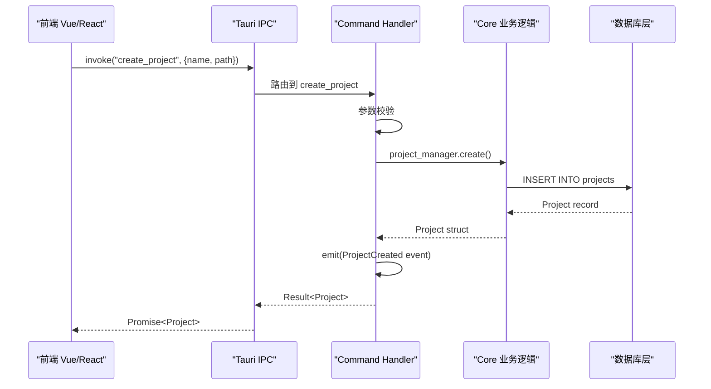
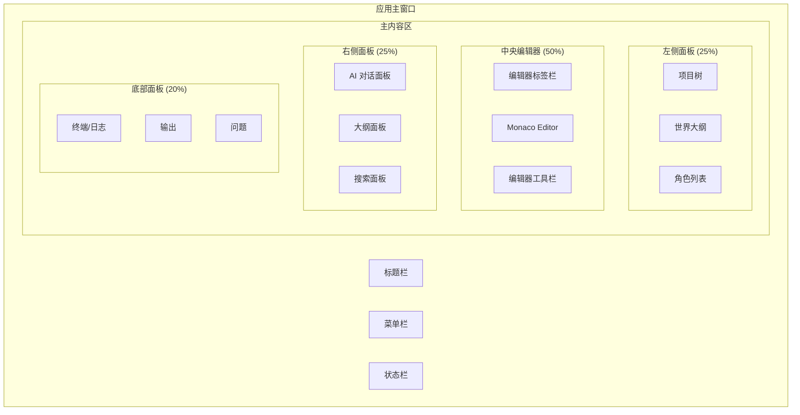
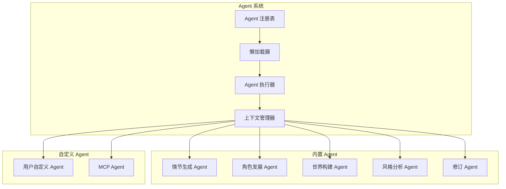
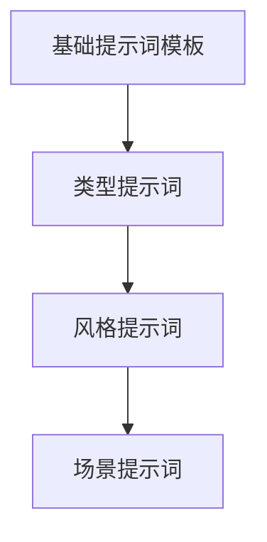

# 架构设计与开发指南

> Novel IDE 系统级架构文档，覆盖技术栈、项目结构、后端/前端架构、数据层、AI 系统、开发规范与部署方案。

生成日期：2026-07-08

---

## 1. 系统总览

### 1.1 架构拓扑

```mermaid
graph TB
    subgraph "用户层"
        User["用户"]
    end

    subgraph "前端层 - Tauri 2 WebView"
        UI["Vue3/React UI"]
        Monaco["Monaco Editor"]
        Panel["面板布局系统"]
        AIChat["AI 对话面板"]
    end

    subgraph "IPC 层 - Tauri 2"
        IPC["Tauri IPC Bridge"]
        Events["事件总线"]
    end

    subgraph "后端层 - Rust"
        Commands["Tauri Commands"]
        ProjectMgmt["项目管理模块"]
        WorldBuilding["世界构建模块"]
        CharacterMgmt["角色管理模块"]
        EditorCore["编辑器核心模块"]
        AIModule["AI 模块"]
        AgentSystem["Agent 系统"]
        SkillSystem["技能系统"]
        HookSystem["钩子系统"]
        WorkflowEngine["工作流引擎"]
        RAGModule["RAG 模块"]
        PromptMgmt["提示词管理"]
        ModelMgmt["模型管理"]
        MCPClient["MCP 客户端"]
        SettingsMgmt["设置管理"]
        ExportModule["导出模块"]
        CloudSync["云端同步模块"]
        Proofreading["文字校对模块"]
    end

    subgraph "数据层"
        SQLiteDB["SQLite 数据库"]
        LanceDBVec["LanceDB 向量存储"]
        FTS5["FTS5 全文搜索"]
        ProjectFiles["项目文件"]
    end

    subgraph "外部服务"
        OpenAI["OpenAI 兼容 API"]
        Gemini["Gemini API"]
        Anthropic["Anthropic API"]
        DeepSeek["DeepSeek API"]
        Qwen["通义千问 API"]
        GLM["智谱 GLM API"]
        Ollama["Ollama 本地模型"]
        LMStudio["LM Studio"]
        MCPServer["MCP 服务器"]
        WebDAV["WebDAV 服务器"]
        OSS["阿里云 OSS"]
        S3["AWS S3"]
    end

    User --> UI
    UI --> Monaco
    UI --> Panel
    UI --> AIChat
    UI --> IPC
    IPC --> Commands
    Commands --> ProjectMgmt
    Commands --> WorldBuilding
    Commands --> CharacterMgmt
    Commands --> EditorCore
    Commands --> AIModule
    Commands --> AgentSystem
    Commands --> SkillSystem
    Commands --> HookSystem
    Commands --> WorkflowEngine
    Commands --> RAGModule
    Commands --> PromptMgmt
    Commands --> ModelMgmt
    Commands --> MCPClient
    Commands --> SettingsMgmt
    Commands --> ExportModule
    Commands --> CloudSync
    Commands --> Proofreading
    Commands --> Events
    ProjectMgmt --> SQLiteDB
    WorldBuilding --> SQLiteDB
    CharacterMgmt --> SQLiteDB
    EditorCore --> SQLiteDB
    EditorCore --> ProjectFiles
    RAGModule --> LanceDBVec
    RAGModule --> FTS5
    AIModule --> OpenAI
    AIModule --> Gemini
    AIModule --> Anthropic
    AIModule --> DeepSeek
    AIModule --> Qwen
    AIModule --> GLM
    AIModule --> Ollama
    AIModule --> LMStudio
    MCPClient --> MCPServer
    CloudSync --> WebDAV
    CloudSync --> OSS
    CloudSync --> S3
```



### 1.2 依赖版本矩阵

| 层级 | 依赖 | 版本 | 说明 |
|---|---|---|---|
| 运行时 | Rust | 1.90+ | 主后端语言，要求 2024 edition |
| 框架 | Tauri | 2.x | 桌面应用框架，Webview 渲染 |
| 异步运行时 | Tokio | 1.x | Rust 异步运行时 |
| 数据库 | SQLite | 3.40+ | 项目数据存储 |
| ORM | SQLx | 0.8+ | 编译时检查的 SQLite 驱动 |
| 向量数据库 | LanceDB | 0.17+ | 本地向量存储与检索 |
| 全文搜索 | SQLite FTS5 | 内置 | SQLite 全文搜索引擎 |
| 前端框架 | Vue 3 / React | 3.4+ / 18+ | 可选，Composition API |
| 语言 | TypeScript | 5.5+ | 前端类型安全 |
| 编辑器 | Monaco Editor | 0.50+ | VS Code 核心编辑器 |
| 包管理器 | Bun | 1.2+ | 替代 Node.js/npm |
| AI 协议 | MCP | 1.0+ | Model Context Protocol 客户端 |
| 加密 | AES-256-GCM | 内置 | API 密钥和云端同步加密 |
| WebDAV | dav-server | 0.6+ | WebDAV 协议支持 |
| 对象存储 | aws-sdk-s3 | 1.0+ | S3/OSS 兼容存储 |
| 压缩 | zip | 2.x | 项目打包导入导出 |
| 校对 | 自定义规则引擎 | — | 基础错别字本地检查 |
| 日志 | tracing | 0.1 | Rust 结构化日志 |
| 序列化 | serde | 1.0 | JSON/MessagePack 序列化 |
| HTTP 客户端 | reqwest | 0.12 | 异步 HTTP 客户端 |
| 流式处理 | tokio-stream | 0.1 | 异步流处理 |
| 错误处理 | thiserror / anyhow | 2.x / 1.x | 错误派生与上下文 |
| 配置 | toml / serde_json | 0.8 / 1.0 | 配置文件解析 |

---

## 2. 项目结构

### 2.1 Monorepo 目录布局

```
novel-ide/
├── src-tauri/                          # Rust 后端
│   ├── Cargo.toml
│   ├── tauri.conf.json
│   ├── build.rs
│   ├── icons/
│   ├── src/
│   │   ├── main.rs                     # 应用入口
│   │   ├── lib.rs                      # 库入口
│   │   ├── commands/                   # Tauri 命令层
│   │   │   ├── mod.rs
│   │   │   ├── project.rs
│   │   │   ├── worldbuilding.rs
│   │   │   ├── characters.rs
│   │   │   ├── editor.rs
│   │   │   ├── ai.rs
│   │   │   ├── agent.rs
│   │   │   ├── skill.rs
│   │   │   ├── hook.rs
│   │   │   ├── workflow.rs
│   │   │   ├── rag.rs
│   │   │   ├── prompt.rs
│   │   │   ├── model.rs
│   │   │   ├── mcp.rs
│   │   │   ├── settings.rs
│   │   │   └── export.rs
│   │   ├── core/                       # 核心业务逻辑
│   │   │   ├── mod.rs
│   │   │   ├── project/
│   │   │   │   ├── mod.rs
│   │   │   │   ├── manager.rs
│   │   │   │   ├── schema.rs
│   │   │   │   └── migration.rs
│   │   │   ├── worldbuilding/
│   │   │   │   ├── mod.rs
│   │   │   │   ├── world.rs
│   │   │   │   ├── factions.rs
│   │   │   │   ├── magic_system.rs
│   │   │   │   ├── geography.rs
│   │   │   │   └── timeline.rs
│   │   │   ├── characters/
│   │   │   │   ├── mod.rs
│   │   │   │   ├── character.rs
│   │   │   │   ├── relationship.rs
│   │   │   │   └── growth.rs
│   │   │   ├── editor/
│   │   │   │   ├── mod.rs
│   │   │   │   ├── document.rs
│   │   │   │   ├── chapter.rs
│   │   │   │   └── outline.rs
│   │   │   ├── ai/
│   │   │   │   ├── mod.rs
│   │   │   │   ├── provider.rs
│   │   │   │   ├── streaming.rs
│   │   │   │   ├── completion.rs
│   │   │   │   └── embedding.rs
│   │   │   ├── agent/
│   │   │   │   ├── mod.rs
│   │   │   │   ├── registry.rs
│   │   │   │   ├── executor.rs
│   │   │   │   └── lazy_loader.rs
│   │   │   ├── skill/
│   │   │   │   ├── mod.rs
│   │   │   │   ├── loader.rs
│   │   │   │   ├── runtime.rs
│   │   │   │   └── builtin/
│   │   │   │       ├── plot_generator.rs
│   │   │   │       ├── character_developer.rs
│   │   │   │       ├── world_builder.rs
│   │   │   │       └── style_analyzer.rs
│   │   │   ├── hook/
│   │   │   │   ├── mod.rs
│   │   │   │   ├── registry.rs
│   │   │   │   ├── dispatcher.rs
│   │   │   │   └── hooks/
│   │   │   │       ├── on_chapter_save.rs
│   │   │   │       ├── on_character_update.rs
│   │   │   │       ├── on_ai_response.rs
│   │   │   │       └── on_export.rs
│   │   │   ├── workflow/
│   │   │   │   ├── mod.rs
│   │   │   │   ├── engine.rs
│   │   │   │   ├── state_machine.rs
│   │   │   │   └── templates/
│   │   │   │       ├── single_chapter.rs
│   │   │   │       ├── full_novel.rs
│   │   │   │       └── revision.rs
│   │   │   ├── rag/
│   │   │   │   ├── mod.rs
│   │   │   │   ├── indexer.rs
│   │   │   │   ├── retriever.rs
│   │   │   │   ├── chunker.rs
│   │   │   │   └── reranker.rs
│   │   │   ├── prompt/
│   │   │   │   ├── mod.rs
│   │   │   │   ├── template.rs
│   │   │   │   ├── inheritance.rs
│   │   │   │   └── library/
│   │   │   │       ├── writing_styles.rs
│   │   │   │       └── genre_prompts.rs
│   │   │   ├── model/
│   │   │   │   ├── mod.rs
│   │   │   │   ├── registry.rs
│   │   │   │   ├── capabilities.rs
│   │   │   │   └── providers/
│   │   │   │       ├── openai_compatible.rs
│   │   │   │       ├── gemini.rs
│   │   │   │       ├── ollama.rs
│   │   │   │       └── local.rs
│   │   │   ├── mcp/
│   │   │   │   ├── mod.rs
│   │   │   │   ├── client.rs
│   │   │   │   ├── transport.rs
│   │   │   │   └── tool_executor.rs
│   │   │   ├── settings/
│   │   │   │   ├── mod.rs
│   │   │   │   ├── global.rs
│   │   │   │   └── project.rs
│   │   │   └── export/
│   │   │       ├── mod.rs
│   │   │       ├── docx.rs
│   │   │       ├── epub.rs
│   │   │       ├── pdf.rs
│   │   │       ├── txt.rs
│   │   │       └── markdown.rs
│   │   ├── db/                         # 数据库层
│   │   │   ├── mod.rs
│   │   │   ├── connection.rs
│   │   │   ├── migrations/
│   │   │   │   ├── 001_init.sql
│   │   │   │   ├── 002_worldbuilding.sql
│   │   │   │   ├── 003_characters.sql
│   │   │   │   ├── 004_chapters.sql
│   │   │   │   ├── 005_ai_settings.sql
│   │   │   │   └── 006_mcp.sql
│   │   │   ├── repositories/
│   │   │   │   ├── mod.rs
│   │   │   │   ├── project_repo.rs
│   │   │   │   ├── world_repo.rs
│   │   │   │   ├── character_repo.rs
│   │   │   │   ├── chapter_repo.rs
│   │   │   │   ├── ai_config_repo.rs
│   │   │   │   └── settings_repo.rs
│   │   │   └── vector/
│   │   │       ├── mod.rs
│   │   │       ├── lancedb.rs
│   │   │       ├── embeddings.rs
│   │   │       └── search.rs
│   │   ├── error.rs                    # 统一错误类型
│   │   ├── state.rs                    # Tauri 状态管理
│   │   ├── events.rs                   # 事件定义
│   │   └── utils/                      # 工具函数
│   │       ├── mod.rs
│   │       ├── crypto.rs
│   │       ├── file_ops.rs
│   │       └── time.rs
│   └── migrations/                     # SQL 迁移文件
├── frontend/                           # 前端代码
│   ├── package.json
│   ├── tsconfig.json
│   ├── vite.config.ts
│   ├── index.html
│   ├── public/
│   ├── src/
│   │   ├── main.ts                     # 前端入口
│   │   ├── App.vue / App.tsx           # 根组件
│   │   ├── components/                 # UI 组件
│   │   │   ├── layout/
│   │   │   │   ├── AppLayout.vue
│   │   │   │   ├── Sidebar.vue
│   │   │   │   ├── PanelContainer.vue
│   │   │   │   ├── TabBar.vue
│   │   │   │   └── StatusBar.vue
│   │   │   ├── editor/
│   │   │   │   ├── MonacoWrapper.vue
│   │   │   │   ├── EditorTabs.vue
│   │   │   │   ├── OutlinePanel.vue
│   │   │   │   └── DiffViewer.vue
│   │   │   ├── ai/
│   │   │   │   ├── ChatPanel.vue
│   │   │   │   ├── ModelSelector.vue
│   │   │   │   ├── StreamRenderer.vue
│   │   │   │   └── PromptBuilder.vue
│   │   │   ├── project/
│   │   │   │   ├── ProjectTree.vue
│   │   │   │   ├── ChapterList.vue
│   │   │   │   └── ProjectSettings.vue
│   │   │   ├── worldbuilding/
│   │   │   │   ├── WorldMap.vue
│   │   │   │   ├── FactionEditor.vue
│   │   │   │   ├── TimelineView.vue
│   │   │   │   └── MagicSystemEditor.vue
│   │   │   ├── characters/
│   │   │   │   ├── CharacterCard.vue
│   │   │   │   ├── RelationshipGraph.vue
│   │   │   │   └── CharacterTimeline.vue
│   │   │   └── common/
│   │   │       ├── SearchBar.vue
│   │   │       ├── Modal.vue
│   │   │       ├── Tooltip.vue
│   │   │       └── ContextMenu.vue
│   │   ├── stores/                     # Pinia 状态管理
│   │   │   ├── index.ts
│   │   │   ├── project.ts
│   │   │   ├── editor.ts
│   │   │   ├── ai.ts
│   │   │   ├── worldbuilding.ts
│   │   │   ├── characters.ts
│   │   │   ├── settings.ts
│   │   │   └── ui.ts
│   │   ├── composables/                # 组合式函数
│   │   │   ├── useTauri.ts
│   │   │   ├── useIPC.ts
│   │   │   ├── useEvents.ts
│   │   │   ├── useEditor.ts
│   │   │   ├── useAI.ts
│   │   │   ├── useDragDrop.ts
│   │   │   └── useKeyboard.ts
│   │   ├── lib/                        # 工具库
│   │   │   ├── tauri.ts
│   │   │   ├── events.ts
│   │   │   └── types.ts
│   │   ├── assets/                     # 静态资源
│   │   │   ├── styles/
│   │   │   │   ├── main.css
│   │   │   │   ├── variables.css
│   │   │   │   └── themes/
│   │   │   └── icons/
│   │   └── router/                     # 路由
│   │       └── index.ts
│   └── tests/                          # 前端测试
│       └── components/
├── shared/                             # 前后端共享类型
│   ├── types/
│   │   ├── project.ts
│   │   ├── worldbuilding.ts
│   │   ├── character.ts
│   │   ├── chapter.ts
│   │   ├── ai.ts
│   │   ├── mcp.ts
│   │   └── settings.ts
│   └── constants/
│       └── index.ts
├── docs/                               # 项目文档
│   ├── 01-需求文档.md
│   ├── 02-架构设计与开发指南.md
│   └── ...
├── .gitignore
├── README.md
└── LICENSE
```

### 2.2 目录设计原则

| 原则 | 说明 |
|---|---|
| **按功能模块分层** | `commands/` → `core/` → `db/` 三层分离，commands 只做参数校验和 IPC 桥接 |
| **每个项目独立数据库** | 项目数据存储在项目目录下，全局设置存储在用户目录 |
| **前后端共享类型** | `shared/` 目录存放 TypeScript 类型定义，Rust 通过 ts-rs 自动生成 |
| **懒加载 Agent** | Agent 系统按需加载，仅在触发时初始化 |
| **Hook 松耦合** | Hook 通过事件驱动，不直接调用业务逻辑 |

---

## 3. 后端架构设计

### 3.1 Tauri 2 Command 注册与 IPC 设计

Tauri 2 使用 `#[tauri::command]` 宏注册命令，通过 IPC 桥接前后端调用。

```rust
// src-tauri/src/commands/project.rs

#[tauri::command]
pub async fn create_project(
    state: State<'_, AppState>,
    name: String,
    path: PathBuf,
    genre: Genre,
) -> Result<Project, AppError> {
    let project = state.project_manager
        .create(&name, &path, &genre)
        .await?;
    state.event_bus.emit(ProjectCreated { id: project.id.clone() })?;
    Ok(project)
}

#[tauri::command]
pub async fn open_project(
    state: State<'_, AppState>,
    path: PathBuf,
) -> Result<Project, AppError> {
    state.project_manager.open(&path).await
}

#[tauri::command]
pub async fn list_projects(
    state: State<'_, AppState>,
) -> Result<Vec<ProjectSummary>, AppError> {
    state.project_manager.list().await
}
```

**IPC 调用流程**：



### 3.2 State 管理

使用 Tauri 的 managed state 在应用生命周期内共享状态：

```rust
// src-tauri/src/state.rs

pub struct AppState {
    pub project_manager: ProjectManager,
    pub ai_manager: AIManager,
    pub agent_registry: AgentRegistry,
    pub skill_loader: SkillLoader,
    pub hook_dispatcher: HookDispatcher,
    pub model_registry: ModelRegistry,
    pub mcp_client: MCPClient,
    pub settings_manager: SettingsManager,
    pub event_bus: EventBus,
}

impl AppState {
    pub async fn new(db_path: &Path) -> Result<Self, AppError> {
        let db = SqlitePool::connect(db_path.to_str().unwrap()).await?;
        sqlx::migrate!("./migrations").run(&db).await?;

        let lancedb = LanceDB::connect(db_path.join("vectors")).await?;

        Ok(Self {
            project_manager: ProjectManager::new(db.clone()),
            ai_manager: AIManager::new(db.clone(), lancedb.clone()),
            agent_registry: AgentRegistry::new(),
            skill_loader: SkillLoader::new(),
            hook_dispatcher: HookDispatcher::new(),
            model_registry: ModelRegistry::new(db.clone()),
            mcp_client: MCPClient::new(),
            settings_manager: SettingsManager::new(db.clone()),
            event_bus: EventBus::new(),
        })
    }
}
```

**应用入口注册**：

```rust
// src-tauri/src/main.rs

fn main() {
    tauri::Builder::default()
        .setup(|app| {
            let app_state = tauri::async_runtime::block_on(
                AppState::new(&app.path().app_data_dir()?)
            )?;
            app.manage(app_state);
            Ok(())
        })
        .invoke_handler(tauri::generate_handler![
            // 项目管理
            commands::project::create_project,
            commands::project::open_project,
            commands::project::list_projects,
            commands::project::save_project,
            commands::project::close_project,
            // 世界构建
            commands::worldbuilding::create_world,
            commands::worldbuilding::update_world,
            commands::worldbuilding::create_faction,
            commands::worldbuilding::create_magic_system,
            commands::worldbuilding::create_geography,
            commands::worldbuilding::create_timeline,
            // 角色管理
            commands::characters::create_character,
            commands::characters::update_character,
            commands::characters::create_relationship,
            commands::characters::get_character_arc,
            // 编辑器
            commands::editor::open_document,
            commands::editor::save_document,
            commands::editor::create_chapter,
            commands::editor::update_chapter,
            commands::editor::get_outline,
            // AI 功能
            commands::ai::chat_completion,
            commands::ai::stream_completion,
            commands::ai::generate_embedding,
            commands::ai::analyze_writing_style,
            // Agent 系统
            commands::agent::execute_agent,
            commands::agent::list_agents,
            commands::agent::get_agent_status,
            // 技能系统
            commands::skill::execute_skill,
            commands::skill::list_skills,
            // Hook 系统
            commands::hook::register_hook,
            commands::hook::unregister_hook,
            // 工作流
            commands::workflow::start_workflow,
            commands::workflow::get_workflow_status,
            // RAG
            commands::rag::index_document,
            commands::rag::search_context,
            // 提示词管理
            commands::prompt::create_template,
            commands::prompt::get_template,
            commands::prompt::list_templates,
            // 模型管理
            commands::model::register_model,
            commands::model::list_models,
            commands::model::test_connection,
            // MCP
            commands::mcp::connect_server,
            commands::mcp::list_tools,
            commands::mcp::call_tool,
            // 设置
            commands::settings::get_global_settings,
            commands::settings::update_global_settings,
            commands::settings::get_project_settings,
            // 导出
            commands::export::export_chapter,
            commands::export::export_project,
        ])
        .run(tauri::generate_context!())
        .expect("error while running tauri application");
}
```

### 3.3 错误处理

统一错误类型定义，自动转换为 Tauri IPC 错误响应：

```rust
// src-tauri/src/error.rs

use thiserror::Error;
use serde::Serialize;

#[derive(Debug, Error)]
pub enum AppError {
    #[error("数据库错误: {0}")]
    Database(#[from] sqlx::Error),

    #[error("IO 错误: {0}")]
    Io(#[from] std::io::Error),

    #[error("序列化错误: {0}")]
    Serialization(#[from] serde_json::Error),

    #[error("AI 服务错误: {0}")]
    AI(String),

    #[error("MCP 错误: {0}")]
    MCP(String),

    #[error("项目未找到: {0}")]
    ProjectNotFound(String),

    #[error("章节未找到: {0}")]
    ChapterNotFound(String),

    #[error("角色未找到: {0}")]
    CharacterNotFound(String),

    #[error("设置无效: {0}")]
    InvalidSettings(String),

    #[error("导出失败: {0}")]
    ExportFailed(String),

    #[error("模型连接失败: {0}")]
    ModelConnectionFailed(String),

    #[error("技能执行失败: {0}")]
    SkillExecutionFailed(String),

    #[error("Agent 执行失败: {0}")]
    AgentExecutionFailed(String),

    #[error("工作流错误: {0}")]
    WorkflowError(String),
}

#[derive(Debug, Serialize)]
pub struct ErrorResponse {
    pub code: String,
    pub message: String,
    pub details: Option<serde_json::Value>,
}

impl From<AppError> for ErrorResponse {
    fn from(err: AppError) -> Self {
        match &err {
            AppError::Database(e) => ErrorResponse {
                code: "DB_ERROR".into(),
                message: format!("数据库操作失败: {}", e),
                details: None,
            },
            AppError::ProjectNotFound(id) => ErrorResponse {
                code: "PROJECT_NOT_FOUND".into(),
                message: format!("项目 {} 不存在", id),
                details: Some(serde_json::json!({ "project_id": id })),
            },
            // ... 其他错误映射
            _ => ErrorResponse {
                code: "INTERNAL_ERROR".into(),
                message: err.to_string(),
                details: None,
            },
        }
    }
}
```

### 3.4 事件系统

Tauri 2 事件系统用于前后端实时通信：

```rust
// src-tauri/src/events.rs

use serde::{Deserialize, Serialize};

#[derive(Debug, Clone, Serialize, Deserialize)]
#[serde(tag = "type")]
pub enum AppEvent {
    // 项目事件
    ProjectCreated { id: String },
    ProjectOpened { id: String },
    ProjectSaved { id: String },

    // 编辑器事件
    ChapterSaved { chapter_id: String },
    DocumentModified { path: String },

    // AI 事件
    AIStreamStart { request_id: String },
    AIStreamChunk { request_id: String, content: String },
    AIStreamEnd { request_id: String },
    AIStreamError { request_id: String, error: String },

    // 角色事件
    CharacterUpdated { character_id: String },
    RelationshipChanged { from: String, to: String },

    // 世界构建事件
    WorldUpdated { world_id: String },

    // 导出事件
    ExportProgress { task_id: String, progress: f32 },
    ExportCompleted { task_id: String, path: String },
    ExportFailed { task_id: String, error: String },

    // 同步事件
    SyncStarted { document_id: String },
    SyncCompleted { document_id: String },
}

pub struct EventBus {
    app_handle: Option<tauri::AppHandle>,
}

impl EventBus {
    pub fn new() -> Self {
        Self { app_handle: None }
    }

    pub fn set_handle(&mut self, handle: tauri::AppHandle) {
        self.app_handle = Some(handle);
    }

    pub fn emit(&self, event: AppEvent) -> Result<(), AppError> {
        if let Some(handle) = &self.app_handle {
            handle.emit("app-event", &event)?;
        }
        Ok(())
    }
}
```

**前端事件监听**：

```typescript
// frontend/src/lib/events.ts

import { listen, type UnlistenFn } from '@tauri-apps/api/event';
import type { AppEvent } from '../shared/types';

export function onAppEvent(
  callback: (event: AppEvent) => void
): Promise<UnlistenFn> {
  return listen<AppEvent>('app-event', (e) => {
    callback(e.payload);
  });
}

// 使用示例
const unlisten = await onAppEvent((event) => {
  switch (event.type) {
    case 'AIStreamChunk':
      appendToChat(event.content);
      break;
    case 'ChapterSaved':
      showNotification('章节已保存');
      break;
    // ...
  }
});
```

---

## 4. 前端架构设计

### 4.1 Panel 布局系统

采用可调整大小的 4 面板 IDE 布局：



**布局组件设计**：

```typescript
// frontend/src/components/layout/AppLayout.vue

<template>
  <div class="app-layout">
    <TitleBar />
    <MenuBar />
    <div class="main-content">
      <PanelContainer
        direction="horizontal"
        :panels="mainPanels"
      >
        <PanelContainer
          direction="vertical"
          :panels="[editorPanel, bottomPanel]"
        />
      </PanelContainer>
    </div>
    <StatusBar />
  </div>
</template>

<script setup lang="ts">
import { ref, reactive } from 'vue';
import type { PanelConfig } from '@/types/layout';

const mainPanels = reactive<PanelConfig[]>([
  {
    id: 'left',
    component: 'ProjectTree',
    size: 25,
    minSize: 15,
    maxSize: 40,
    collapsed: false,
  },
  {
    id: 'center',
    component: 'EditorArea',
    size: 50,
    resizable: false,
  },
  {
    id: 'right',
    component: 'AIPanel',
    size: 25,
    minSize: 15,
    maxSize: 40,
    collapsed: false,
  },
]);

const editorPanel = reactive<PanelConfig>({
  id: 'editor',
  component: 'MonacoEditor',
  size: 80,
});

const bottomPanel = reactive<PanelConfig>({
  id: 'bottom',
  component: 'OutputPanel',
  size: 20,
  minSize: 10,
  maxSize: 50,
  collapsed: true,
});
</script>
```

### 4.2 Component 架构

组件遵循以下分层：

| 层级 | 职责 | 示例 |
|---|---|---|
| **Layout** | 应用骨架、面板容器 | `AppLayout`, `PanelContainer` |
| **Feature** | 功能模块入口 | `EditorArea`, `AIChatPanel` |
| **Domain** | 业务领域组件 | `CharacterCard`, `WorldMap` |
| **UI** | 通用 UI 组件 | `Button`, `Modal`, `SearchBar` |

### 4.3 State 管理 (Pinia)

```typescript
// frontend/src/stores/project.ts

import { defineStore } from 'pinia';
import { invoke } from '@tauri-apps/api/core';
import type { Project, ProjectSummary } from '@/shared/types';

export const useProjectStore = defineStore('project', {
  state: () => ({
    currentProject: null as Project | null,
    projects: [] as ProjectSummary[],
    loading: false,
    error: null as string | null,
  }),

  getters: {
    hasProject: (state) => state.currentProject !== null,
    projectChapters: (state) => state.currentProject?.chapters ?? [],
  },

  actions: {
    async createProject(name: string, path: string, genre: string) {
      this.loading = true;
      try {
        const project = await invoke<Project>('create_project', {
          name,
          path,
          genre,
        });
        this.currentProject = project;
        return project;
      } catch (error) {
        this.error = error as string;
        throw error;
      } finally {
        this.loading = false;
      }
    },

    async openProject(path: string) {
      this.loading = true;
      try {
        const project = await invoke<Project>('open_project', { path });
        this.currentProject = project;
        return project;
      } catch (error) {
        this.error = error as string;
        throw error;
      } finally {
        this.loading = false;
      }
    },

    async listProjects() {
      this.loading = true;
      try {
        this.projects = await invoke<ProjectSummary[]>('list_projects');
      } catch (error) {
        this.error = error as string;
      } finally {
        this.loading = false;
      }
    },

    async saveProject() {
      if (!this.currentProject) return;
      await invoke('save_project', {
        projectId: this.currentProject.id,
      });
    },
  },
});
```

**AI Store（流式响应）**：

```typescript
// frontend/src/stores/ai.ts

import { defineStore } from 'pinia';
import { invoke } from '@tauri-apps/api/core';
import { onAppEvent } from '@/lib/events';

interface ChatMessage {
  id: string;
  role: 'user' | 'assistant' | 'system';
  content: string;
  timestamp: number;
  model?: string;
  tokens?: number;
}

export const useAIStore = defineStore('ai', {
  state: () => ({
    messages: [] as ChatMessage[],
    streaming: false,
    currentRequestId: null as string | null,
    selectedModel: 'default',
    temperature: 0.7,
    maxTokens: 2048,
  }),

  actions: {
    async sendMessage(content: string, context?: string) {
      const requestId = crypto.randomUUID();
      this.currentRequestId = requestId;
      this.streaming = true;

      this.messages.push({
        id: crypto.randomUUID(),
        role: 'user',
        content,
        timestamp: Date.now(),
      });

      try {
        await invoke('stream_completion', {
          requestId,
          content,
          context,
          model: this.selectedModel,
          temperature: this.temperature,
          maxTokens: this.maxTokens,
        });
      } catch (error) {
        this.streaming = false;
        throw error;
      }
    },

    appendStreamChunk(requestId: string, chunk: string) {
      if (requestId !== this.currentRequestId) return;

      const lastMessage = this.messages[this.messages.length - 1];
      if (lastMessage?.role === 'assistant') {
        lastMessage.content += chunk;
      } else {
        this.messages.push({
          id: crypto.randomUUID(),
          role: 'assistant',
          content: chunk,
          timestamp: Date.now(),
        });
      }
    },

    finishStream(requestId: string) {
      if (requestId === this.currentRequestId) {
        this.streaming = false;
        this.currentRequestId = null;
      }
    },
  },
});

// 初始化事件监听
onAppEvent((event) => {
  const aiStore = useAIStore();
  switch (event.type) {
    case 'AIStreamChunk':
      aiStore.appendStreamChunk(event.requestId, event.content);
      break;
    case 'AIStreamEnd':
      aiStore.finishStream(event.requestId);
      break;
    case 'AIStreamError':
      aiStore.streaming = false;
      console.error('AI Stream Error:', event.error);
      break;
  }
});
```

### 4.4 Monaco Editor 集成

```typescript
// frontend/src/components/editor/MonacoWrapper.vue

<template>
  <div ref="editorContainer" class="monaco-container" />
</template>

<script setup lang="ts">
import { ref, onMounted, onUnmounted, watch } from 'vue';
import * as monaco from 'monaco-editor';
import { useEditorStore } from '@/stores/editor';

const editorContainer = ref<HTMLElement>();
const editorStore = useEditorStore();

let editor: monaco.editor.IStandaloneCodeEditor | null = null;

onMounted(() => {
  if (!editorContainer.value) return;

  editor = monaco.editor.create(editorContainer.value, {
    value: editorStore.currentContent,
    language: 'markdown',
    theme: 'novel-ide-dark',
    minimap: { enabled: false },
    wordWrap: 'on',
    lineNumbers: 'on',
    fontSize: 16,
    lineHeight: 24,
    padding: { top: 20, bottom: 20 },
    scrollBeyondLastLine: false,
    renderWhitespace: 'selection',
    bracketPairColorization: { enabled: true },
    automaticLayout: true,
  });

  editor.onDidChangeModelContent(() => {
    if (editor) {
      editorStore.updateContent(editor.getValue());
    }
  });

  // 注册自定义主题
  monaco.editor.defineTheme('novel-ide-dark', {
    base: 'vs-dark',
    inherit: true,
    rules: [
      { token: 'comment', foreground: '6A9955', fontStyle: 'italic' },
      { token: 'string', foreground: 'CE9178' },
    ],
    colors: {
      'editor.background': '#1e1e2e',
      'editor.foreground': '#cdd6f4',
      'editor.lineHighlightBackground': '#313244',
      'editor.selectionBackground': '#45475a',
    },
  });
});

onUnmounted(() => {
  editor?.dispose();
});

watch(
  () => editorStore.currentDocumentId,
  async (docId) => {
    if (docId && editor) {
      const content = await invoke<string>('open_document', { documentId: docId });
      editor.setValue(content);
    }
  }
);
</script>
```

---

## 5. 数据层设计

### 5.1 SQLite Schema 策略

每个项目独立数据库文件，存储在项目目录下：

```
project_dir/
├── .novel-ide/
│   ├── project.db          # 项目 SQLite 数据库
│   └── vectors/            # LanceDB 向量存储目录
├── chapters/
│   ├── chapter-001.md
│   └── ...
├── worldbuilding/
│   ├── world.md
│   └── ...
└── characters/
    ├── character-001.md
    └── ...
```

**核心表结构**：

```sql
-- 001_init.sql

CREATE TABLE IF NOT EXISTS projects (
    id TEXT PRIMARY KEY,
    name TEXT NOT NULL,
    genre TEXT NOT NULL,
    description TEXT,
    created_at DATETIME DEFAULT CURRENT_TIMESTAMP,
    updated_at DATETIME DEFAULT CURRENT_TIMESTAMP,
    settings TEXT DEFAULT '{}'
);

CREATE TABLE IF NOT EXISTS chapters (
    id TEXT PRIMARY KEY,
    project_id TEXT NOT NULL REFERENCES projects(id) ON DELETE CASCADE,
    title TEXT NOT NULL,
    content TEXT,
    word_count INTEGER DEFAULT 0,
    chapter_number INTEGER,
    status TEXT DEFAULT 'draft' CHECK(status IN ('draft', 'revising', 'final')),
    created_at DATETIME DEFAULT CURRENT_TIMESTAMP,
    updated_at DATETIME DEFAULT CURRENT_TIMESTAMP
);

CREATE INDEX idx_chapters_project ON chapters(project_id);
CREATE INDEX idx_chapters_number ON chapters(project_id, chapter_number);

-- FTS5 全文搜索
CREATE VIRTUAL TABLE IF NOT EXISTS chapters_fts USING fts5(
    title,
    content,
    content='chapters',
    content_rowid='rowid'
);

-- 触发器保持 FTS 索引同步
CREATE TRIGGER chapters_ai AFTER INSERT ON chapters BEGIN
    INSERT INTO chapters_fts(rowid, title, content)
    VALUES (new.rowid, new.title, new.content);
END;

CREATE TRIGGER chapters_ad AFTER DELETE ON chapters BEGIN
    INSERT INTO chapters_fts(chapters_fts, rowid, title, content)
    VALUES ('delete', old.rowid, old.title, old.content);
END;

CREATE TRIGGER chapters_au AFTER UPDATE ON chapters BEGIN
    INSERT INTO chapters_fts(chapters_fts, rowid, title, content)
    VALUES ('delete', old.rowid, old.title, old.content);
    INSERT INTO chapters_fts(rowid, title, content)
    VALUES (new.rowid, new.title, new.content);
END;

-- 全局设置
CREATE TABLE IF NOT EXISTS settings (
    key TEXT PRIMARY KEY,
    value TEXT NOT NULL,
    updated_at DATETIME DEFAULT CURRENT_TIMESTAMP
);

-- AI 对话历史
CREATE TABLE IF NOT EXISTS chat_history (
    id TEXT PRIMARY KEY,
    project_id TEXT NOT NULL REFERENCES projects(id) ON DELETE CASCADE,
    role TEXT NOT NULL CHECK(role IN ('user', 'assistant', 'system')),
    content TEXT NOT NULL,
    model TEXT,
    tokens INTEGER,
    created_at DATETIME DEFAULT CURRENT_TIMESTAMP
);

CREATE INDEX idx_chat_project ON chat_history(project_id);
```

```sql
-- 002_worldbuilding.sql

CREATE TABLE IF NOT EXISTS worlds (
    id TEXT PRIMARY KEY,
    project_id TEXT NOT NULL REFERENCES projects(id) ON DELETE CASCADE,
    name TEXT NOT NULL,
    description TEXT,
    created_at DATETIME DEFAULT CURRENT_TIMESTAMP,
    updated_at DATETIME DEFAULT CURRENT_TIMESTAMP
);

CREATE TABLE IF NOT EXISTS factions (
    id TEXT PRIMARY KEY,
    world_id TEXT NOT NULL REFERENCES worlds(id) ON DELETE CASCADE,
    name TEXT NOT NULL,
    description TEXT,
    power_level INTEGER DEFAULT 1,
    parent_faction_id TEXT REFERENCES factions(id),
    created_at DATETIME DEFAULT CURRENT_TIMESTAMP,
    updated_at DATETIME DEFAULT CURRENT_TIMESTAMP
);

CREATE TABLE IF NOT EXISTS magic_systems (
    id TEXT PRIMARY KEY,
    world_id TEXT NOT NULL REFERENCES worlds(id) ON DELETE CASCADE,
    name TEXT NOT NULL,
    description TEXT,
    rules TEXT,  -- JSON 格式的规则定义
    cost TEXT,   -- 代价描述
    created_at DATETIME DEFAULT CURRENT_TIMESTAMP,
    updated_at DATETIME DEFAULT CURRENT_TIMESTAMP
);

CREATE TABLE IF NOT EXISTS geographies (
    id TEXT PRIMARY KEY,
    world_id TEXT NOT NULL REFERENCES worlds(id) ON DELETE CASCADE,
    name TEXT NOT NULL,
    type TEXT CHECK(type IN ('continent', 'country', 'city', 'region', 'landmark')),
    description TEXT,
    parent_id TEXT REFERENCES geographies(id),
    created_at DATETIME DEFAULT CURRENT_TIMESTAMP,
    updated_at DATETIME DEFAULT CURRENT_TIMESTAMP
);

CREATE TABLE IF NOT EXISTS timelines (
    id TEXT PRIMARY KEY,
    world_id TEXT NOT NULL REFERENCES worlds(id) ON DELETE CASCADE,
    event_name TEXT NOT NULL,
    description TEXT,
    event_date TEXT,  -- 故事内日期
    sort_order INTEGER DEFAULT 0,
    created_at DATETIME DEFAULT CURRENT_TIMESTAMP,
    updated_at DATETIME DEFAULT CURRENT_TIMESTAMP
);

CREATE INDEX idx_factions_world ON factions(world_id);
CREATE INDEX idx_magic_world ON magic_systems(world_id);
CREATE INDEX idx_geo_world ON geographies(world_id);
CREATE INDEX idx_geo_parent ON geographies(parent_id);
CREATE INDEX idx_timeline_world ON timelines(world_id);
```

```sql
-- 003_characters.sql

CREATE TABLE IF NOT EXISTS characters (
    id TEXT PRIMARY KEY,
    project_id TEXT NOT NULL REFERENCES projects(id) ON DELETE CASCADE,
    name TEXT NOT NULL,
    alias TEXT,
    age INTEGER,
    gender TEXT,
    role TEXT CHECK(role IN ('protagonist', 'antagonist', 'supporting', 'minor')),
    description TEXT,
    personality TEXT,  -- JSON 格式性格特征
    background TEXT,
    goals TEXT,
    conflicts TEXT,
    created_at DATETIME DEFAULT CURRENT_TIMESTAMP,
    updated_at DATETIME DEFAULT CURRENT_TIMESTAMP
);

CREATE TABLE IF NOT EXISTS character_appearances (
    id TEXT PRIMARY KEY,
    character_id TEXT NOT NULL REFERENCES characters(id) ON DELETE CASCADE,
    chapter_id TEXT NOT NULL REFERENCES chapters(id) ON DELETE CASCADE,
    significance TEXT CHECK(significance IN ('primary', 'secondary', 'mentioned')),
    notes TEXT,
    created_at DATETIME DEFAULT CURRENT_TIMESTAMP
);

CREATE TABLE IF NOT EXISTS relationships (
    id TEXT PRIMARY KEY,
    from_character_id TEXT NOT NULL REFERENCES characters(id) ON DELETE CASCADE,
    to_character_id TEXT NOT NULL REFERENCES characters(id) ON DELETE CASCADE,
    relationship_type TEXT NOT NULL,
    description TEXT,
    strength INTEGER DEFAULT 5,  -- 1-10 关系强度
    created_at DATETIME DEFAULT CURRENT_TIMESTAMP,
    updated_at DATETIME DEFAULT CURRENT_TIMESTAMP,
    CHECK(from_character_id != to_character_id)
);

CREATE TABLE IF NOT EXISTS character_arcs (
    id TEXT PRIMARY KEY,
    character_id TEXT NOT NULL REFERENCES characters(id) ON DELETE CASCADE,
    arc_name TEXT NOT NULL,
    description TEXT,
    start_chapter_id TEXT REFERENCES chapters(id),
    end_chapter_id TEXT REFERENCES chapters(id),
    status TEXT DEFAULT 'planned' CHECK(status IN ('planned', 'in_progress', 'completed')),
    created_at DATETIME DEFAULT CURRENT_TIMESTAMP,
    updated_at DATETIME DEFAULT CURRENT_TIMESTAMP
);

CREATE INDEX idx_chars_project ON characters(project_id);
CREATE INDEX idx_char_app_chapter ON character_appearances(chapter_id);
CREATE INDEX idx_rels_from ON relationships(from_character_id);
CREATE INDEX idx_rels_to ON relationships(to_character_id);
CREATE INDEX idx_arcs_character ON character_arcs(character_id);

-- 角色 FTS
CREATE VIRTUAL TABLE IF NOT EXISTS characters_fts USING fts5(
    name,
    alias,
    description,
    personality,
    background,
    content='characters',
    content_rowid='rowid'
);
```

```sql
-- 005_ai_settings.sql

CREATE TABLE IF NOT EXISTS ai_models (
    id TEXT PRIMARY KEY,
    name TEXT NOT NULL,
    provider TEXT NOT NULL CHECK(provider IN ('openai', 'gemini', 'ollama', 'local')),
    endpoint TEXT,
    api_key TEXT,  -- 加密存储
    model_id TEXT NOT NULL,
    max_tokens INTEGER DEFAULT 4096,
    is_default BOOLEAN DEFAULT 0,
    capabilities TEXT DEFAULT '[]',  -- JSON: ["chat", "completion", "embedding"]
    created_at DATETIME DEFAULT CURRENT_TIMESTAMP,
    updated_at DATETIME DEFAULT CURRENT_TIMESTAMP
);

CREATE TABLE IF NOT EXISTS prompt_templates (
    id TEXT PRIMARY KEY,
    name TEXT NOT NULL,
    category TEXT NOT NULL,  -- 'writing', 'analysis', 'worldbuilding', etc.
    template TEXT NOT NULL,
    variables TEXT DEFAULT '[]',  -- JSON: 变量列表
    inherits_from TEXT REFERENCES prompt_templates(id),
    created_at DATETIME DEFAULT CURRENT_TIMESTAMP,
    updated_at DATETIME DEFAULT CURRENT_TIMESTAMP
);

CREATE TABLE IF NOT EXISTS agent_configs (
    id TEXT PRIMARY KEY,
    name TEXT NOT NULL,
    description TEXT,
    type TEXT NOT NULL CHECK(type IN ('builtin', 'custom', 'mcp')),
    config TEXT NOT NULL,  -- JSON: Agent 配置
    is_enabled BOOLEAN DEFAULT 1,
    created_at DATETIME DEFAULT CURRENT_TIMESTAMP,
    updated_at DATETIME DEFAULT CURRENT_TIMESTAMP
);

CREATE INDEX idx_models_provider ON ai_models(provider);
CREATE INDEX idx_templates_category ON prompt_templates(category);
```

### 5.2 LanceDB 向量存储

用于存储文本嵌入向量，支持语义搜索：

```rust
// src-tauri/src/db/vector/lancedb.rs

use arrow::array::{Float32Array, StringArray};
use arrow::datatypes::{DataType, Field, Schema};
use arrow::record_batch::RecordBatch;
use lancedb::connection::Connection;
use std::sync::Arc;

pub struct VectorStore {
    db: Connection,
}

impl VectorStore {
    pub async fn new(path: &Path) -> Result<Self, AppError> {
        let db = Connection::connect(path).await?;
        Ok(Self { db })
    }

    pub async fn index_document(
        &self,
        collection: &str,
        doc_id: &str,
        chunks: Vec<(String, Vec<f32>)>,
    ) -> Result<(), AppError> {
        let table = self.db
            .open_table(collection)
            .await
            .or_else(|_| self.create_collection(collection))
            .await?;

        let mut ids = Vec::new();
        let mut texts = Vec::new();
        let mut vectors = Vec::new();

        for (i, (text, embedding)) in chunks.into_iter().enumerate() {
            ids.push(format!("{}-{}", doc_id, i));
            texts.push(text);
            vectors.push(embedding);
        }

        let schema = Arc::new(Schema::new(vec![
            Field::new("id", DataType::Utf8, false),
            Field::new("text", DataType::Utf8, false),
            Field::new(
                "vector",
                DataType::FixedSizedList(
                    1536,
                    Arc::new(Field::new("item", DataType::Float32, true)),
                ),
                false,
            ),
        ]));

        let batch = RecordBatch::try_new(
            schema,
            vec![
                Arc::new(StringArray::from(ids)),
                Arc::new(StringArray::from(texts)),
                Arc::new(/* vector array */),
            ],
        )?;

        table.add(vec![batch]).await?;
        Ok(())
    }

    pub async fn search(
        &self,
        collection: &str,
        query_vector: Vec<f32>,
        limit: usize,
    ) -> Result<Vec<SearchResult>, AppError> {
        let table = self.db.open_table(collection).await?;
        let results = table
            .vector_search(query_vector, limit)
            .await?;

        Ok(results.into_iter().map(|r| SearchResult {
            id: r.get_string("id"),
            text: r.get_string("text"),
            score: r.get_float("distance"),
        }).collect())
    }

    async fn create_collection(&self, name: &str) -> Result<lancedb::Table, AppError> {
        self.db.create_table(name, /* empty batch */).await
    }
}
```

### 5.3 FTS5 全文搜索

```rust
// src-tauri/src/db/search.rs

use sqlx::SqlitePool;

pub struct SearchEngine {
    pool: SqlitePool,
}

impl SearchEngine {
    pub fn new(pool: SqlitePool) -> Self {
        Self { pool }
    }

    pub async fn search_chapters(
        &self,
        project_id: &str,
        query: &str,
        limit: i64,
    ) -> Result<Vec<SearchHit>, AppError> {
        let results = sqlx::query_as!(
            SearchHit,
            r#"
            SELECT
                c.id,
                c.title,
                snippet(chapters_fts, 1, '<mark>', '</mark>', '...', 32) as snippet,
                rank
            FROM chapters_fts
            JOIN chapters c ON c.rowid = chapters_fts.rowid
            WHERE chapters_fts MATCH ?1
              AND c.project_id = ?2
            ORDER BY rank
            LIMIT ?3
            "#,
            query,
            project_id,
            limit
        )
        .fetch_all(&self.pool)
        .await?;

        Ok(results)
    }

    pub async fn search_characters(
        &self,
        project_id: &str,
        query: &str,
        limit: i64,
    ) -> Result<Vec<SearchHit>, AppError> {
        let results = sqlx::query_as!(
            SearchHit,
            r#"
            SELECT
                c.id,
                c.name as title,
                snippet(characters_fts, 1, '<mark>', '</mark>', '...', 32) as snippet,
                rank
            FROM characters_fts
            JOIN characters c ON c.rowid = characters_fts.rowid
            WHERE characters_fts MATCH ?1
              AND c.project_id = ?2
            ORDER BY rank
            LIMIT ?3
            "#,
            query,
            project_id,
            limit
        )
        .fetch_all(&self.pool)
        .await?;

        Ok(results)
    }
}
```

### 5.4 Migration 策略

使用 SQLx 的内联迁移机制：

```rust
// src-tauri/src/db/connection.rs

use sqlx::sqlite::SqlitePoolOptions;
use sqlx::migrate;

pub async fn init_database(db_path: &Path) -> Result<SqlitePool, AppError> {
    let pool = SqlitePoolOptions::new()
        .max_connections(5)
        .connect(db_path.to_str().unwrap())
        .await?;

    // 运行迁移
    migrate!("./migrations")
        .run(&pool)
        .await
        .map_err(|e| AppError::Database(e))?;

    // 启用 WAL 模式
    sqlx::query("PRAGMA journal_mode=WAL")
        .execute(&pool)
        .await?;
    sqlx::query("PRAGMA synchronous=NORMAL")
        .execute(&pool)
        .await?;
    sqlx::query("PRAGMA foreign_keys=ON")
        .execute(&pool)
        .await?;

    Ok(pool)
}
```

---

## 6. AI 系统架构

### 6.1 Model Provider 抽象

统一的模型提供商接口，支持多种 AI 服务：

```rust
// src-tauri/src/core/ai/provider.rs

use async_trait::async_trait;
use futures::Stream;

#[async_trait]
pub trait ModelProvider: Send + Sync {
    /// 获取提供商名称
    fn name(&self) -> &str;

    /// 检查连接是否可用
    async fn health_check(&self) -> Result<bool, AppError>;

    /// 获取模型能力
    fn capabilities(&self) -> Vec<ModelCapability>;

    /// 聊天补全（非流式）
    async fn chat_completion(
        &self,
        request: ChatRequest,
    ) -> Result<ChatResponse, AppError>;

    /// 聊天补全（流式）
    async fn chat_completion_stream(
        &self,
        request: ChatRequest,
    ) -> Result<Pin<Box<dyn Stream<Item = Result<ChatChunk, AppError>>>>, AppError>;

    /// 生成嵌入向量
    async fn generate_embedding(
        &self,
        texts: Vec<String>,
    ) -> Result<Vec<Vec<f32>>, AppError>;

    /// 获取支持的模型列表
    async fn list_models(&self) -> Result<Vec<ModelInfo>, AppError>;
}

#[derive(Debug, Clone, Serialize, Deserialize)]
pub enum ModelCapability {
    Chat,
    Completion,
    Embedding,
    FunctionCalling,
    Vision,
}

#[derive(Debug, Clone, Serialize, Deserialize)]
pub struct ChatRequest {
    pub messages: Vec<ChatMessage>,
    pub model: String,
    pub temperature: f32,
    pub max_tokens: Option<u32>,
    pub stream: bool,
    pub tools: Option<Vec<ToolDefinition>>,
}

#[derive(Debug, Clone, Serialize, Deserialize)]
pub struct ChatMessage {
    pub role: MessageRole,
    pub content: String,
    pub name: Option<String>,
}

#[derive(Debug, Clone, Serialize, Deserialize)]
#[serde(rename_all = "lowercase")]
pub enum MessageRole {
    System,
    User,
    Assistant,
    Tool,
}

#[derive(Debug, Clone, Serialize, Deserialize)]
pub struct ChatResponse {
    pub content: String,
    pub model: String,
    pub usage: TokenUsage,
    pub tool_calls: Option<Vec<ToolCall>>,
}

#[derive(Debug, Clone, Serialize, Deserialize)]
pub struct ChatChunk {
    pub delta: String,
    pub finish_reason: Option<String>,
}

#[derive(Debug, Clone, Serialize, Deserialize)]
pub struct TokenUsage {
    pub prompt_tokens: u32,
    pub completion_tokens: u32,
    pub total_tokens: u32,
}
```

**提供商实现示例**：

```rust
// src-tauri/src/core/ai/providers/openai_compatible.rs

pub struct OpenAICompatibleProvider {
    name: String,
    endpoint: String,
    api_key: String,
    client: reqwest::Client,
}

#[async_trait]
impl ModelProvider for OpenAICompatibleProvider {
    fn name(&self) -> &str {
        &self.name
    }

    async fn health_check(&self) -> Result<bool, AppError> {
        let resp = self.client
            .get(format!("{}/models", self.endpoint))
            .bearer_auth(&self.api_key)
            .send()
            .await?;
        Ok(resp.status().is_success())
    }

    async fn chat_completion_stream(
        &self,
        request: ChatRequest,
    ) -> Result<Pin<Box<dyn Stream<Item = Result<ChatChunk, AppError>>>>, AppError> {
        let response = self.client
            .post(format!("{}/chat/completions", self.endpoint))
            .bearer_auth(&self.api_key)
            .json(&serde_json::json!({
                "model": request.model,
                "messages": request.messages,
                "temperature": request.temperature,
                "max_tokens": request.max_tokens,
                "stream": true,
            }))
            .send()
            .await?;

        let stream = response.bytes_stream()
            .filter_map(|chunk| async {
                match chunk {
                    Ok(bytes) => {
                        let text = String::from_utf8_lossy(&bytes);
                        // 解析 SSE 格式的流式响应
                        parse_sse_chunk(&text).transpose()
                    }
                    Err(e) => Some(Err(AppError::AI(e.to_string()))),
                }
            });

        Ok(Box::pin(stream))
    }

    // ... 其他方法实现
}
```

### 6.2 Streaming Response 处理

```rust
// src-tauri/src/core/ai/streaming.rs

use tokio::sync::mpsc;

pub struct StreamingHandler {
    sender: mpsc::UnboundedSender<StreamEvent>,
}

#[derive(Debug, Clone)]
pub enum StreamEvent {
    Chunk(String),
    Done(TokenUsage),
    Error(String),
}

impl StreamingHandler {
    pub fn new(sender: mpsc::UnboundedSender<StreamEvent>) -> Self {
        Self { sender }
    }

    pub async fn process_stream<S>(
        &self,
        mut stream: S,
        request_id: String,
        event_bus: &EventBus,
    ) -> Result<TokenUsage, AppError>
    where
        S: Stream<Item = Result<ChatChunk, AppError>> + Unpin,
    {
        let mut full_content = String::new();

        while let Some(chunk) = stream.next().await {
            match chunk {
                Ok(chunk) => {
                    full_content.push_str(&chunk.delta);
                    event_bus.emit(AppEvent::AIStreamChunk {
                        request_id: request_id.clone(),
                        content: chunk.delta,
                    })?;

                    if let Some(finish) = chunk.finish_reason {
                        if finish == "stop" {
                            break;
                        }
                    }
                }
                Err(e) => {
                    event_bus.emit(AppEvent::AIStreamError {
                        request_id: request_id.clone(),
                        error: e.to_string(),
                    })?;
                    return Err(e);
                }
            }
        }

        let usage = TokenUsage {
            prompt_tokens: 0,  // 从响应中提取
            completion_tokens: full_content.len() as u32 / 4,  // 估算
            total_tokens: 0,
        };

        event_bus.emit(AppEvent::AIStreamEnd {
            request_id,
        })?;

        Ok(usage)
    }
}
```

### 6.3 Agent 系统架构（懒加载）



**Agent 定义与懒加载**：

```rust
// src-tauri/src/core/agent/mod.rs

use std::collections::HashMap;
use std::sync::Arc;
use tokio::sync::RwLock;

pub struct AgentRegistry {
    agents: HashMap<String, AgentDefinition>,
    instances: Arc<RwLock<HashMap<String, Box<dyn Agent>>>>,
    skill_loader: Arc<SkillLoader>,
}

#[async_trait]
pub trait Agent: Send + Sync {
    fn id(&self) -> &str;
    fn name(&self) -> &str;
    fn description(&self) -> &str;
    fn required_skills(&self) -> Vec<String>;

    async fn execute(
        &self,
        context: AgentContext,
    ) -> Result<AgentResult, AppError>;
}

pub struct AgentDefinition {
    pub id: String,
    pub name: String,
    pub description: String,
    pub agent_type: AgentType,
    pub config: serde_json::Value,
    pub required_skills: Vec<String>,
}

#[derive(Debug, Clone)]
pub enum AgentType {
    Builtin,
    Custom,
    MCP,
}

impl AgentRegistry {
    pub fn new() -> Self {
        Self {
            agents: HashMap::new(),
            instances: Arc::new(RwLock::new(HashMap::new())),
            skill_loader: Arc::new(SkillLoader::new()),
        }
    }

    /// 注册 Agent 定义（不创建实例）
    pub fn register(&mut self, definition: AgentDefinition) {
        self.agents.insert(definition.id.clone(), definition);
    }

    /// 懒加载并获取 Agent 实例
    pub async fn get_or_load(
        &self,
        agent_id: &str,
    ) -> Result<Arc<dyn Agent>, AppError> {
        // 检查是否已实例化
        {
            let instances = self.instances.read().await;
            if let Some(agent) = instances.get(agent_id) {
                return Ok(Arc::from(agent.as_ref()));
            }
        }

        // 获取定义
        let definition = self.agents
            .get(agent_id)
            .ok_or_else(|| AppError::AgentExecutionFailed(
                format!("Agent {} 未注册", agent_id)
            ))?;

        // 加载所需技能
        let mut skills = Vec::new();
        for skill_id in &definition.required_skills {
            let skill = self.skill_loader.load_skill(skill_id).await?;
            skills.push(skill);
        }

        // 创建实例
        let agent: Box<dyn Agent> = match definition.agent_type {
            AgentType::Builtin => self.create_builtin_agent(definition, skills).await?,
            AgentType::Custom => self.create_custom_agent(definition, skills).await?,
            AgentType::MCP => self.create_mcp_agent(definition, skills).await?,
        };

        let agent_id = agent_id.to_string();
        let mut instances = self.instances.write().await;
        instances.insert(agent_id, agent);

        Ok(Arc::from(instances.get(&agent_id).unwrap().as_ref()))
    }

    /// 执行 Agent
    pub async fn execute(
        &self,
        agent_id: &str,
        context: AgentContext,
    ) -> Result<AgentResult, AppError> {
        let agent = self.get_or_load(agent_id).await?;
        agent.execute(context).await
    }

    fn create_builtin_agent(
        &self,
        definition: &AgentDefinition,
        skills: Vec<Box<dyn Skill>>,
    ) -> Result<Box<dyn Agent>, AppError> {
        match definition.id.as_str() {
            "plot_generator" => Ok(Box::new(PlotGeneratorAgent::new(skills))),
            "character_developer" => Ok(Box::new(CharacterDeveloperAgent::new(skills))),
            "world_builder" => Ok(Box::new(WorldBuilderAgent::new(skills))),
            "style_analyzer" => Ok(Box::new(StyleAnalyzerAgent::new(skills))),
            "revision" => Ok(Box::new(RevisionAgent::new(skills))),
            _ => Err(AppError::AgentExecutionFailed(
                format!("未知的内置 Agent: {}", definition.id)
            )),
        }
    }

    // ... 其他方法
}
```

### 6.4 Skill 系统架构

```rust
// src-tauri/src/core/skill/mod.rs

use async_trait::async_trait;

#[async_trait]
pub trait Skill: Send + Sync {
    fn id(&self) -> &str;
    fn name(&self) -> &str;
    fn description(&self) -> &str;
    fn category(&self) -> SkillCategory;

    /// 执行技能
    async fn execute(
        &self,
        params: serde_json::Value,
        context: SkillContext,
    ) -> Result<SkillResult, AppError>;

    /// 获取技能参数 schema
    fn parameters_schema(&self) -> serde_json::Value;
}

#[derive(Debug, Clone)]
pub enum SkillCategory {
    Writing,
    Analysis,
    Worldbuilding,
    Character,
    Editing,
    Export,
}

pub struct SkillContext {
    pub project_id: String,
    pub current_chapter: Option<String>,
    pub current_character: Option<String>,
    pub ai_manager: Arc<AIManager>,
    pub db: SqlitePool,
}

pub struct SkillResult {
    pub output: serde_json::Value,
    pub artifacts: Vec<SkillArtifact>,
    pub metadata: HashMap<String, serde_json::Value>,
}

pub struct SkillLoader {
    builtin_skills: HashMap<String, Box<dyn Skill>>,
    loaded_skills: Arc<RwLock<HashMap<String, Box<dyn Skill>>>>,
}

impl SkillLoader {
    pub fn new() -> Self {
        let mut builtin_skills = HashMap::new();

        // 注册内置技能
        builtin_skills.insert(
            "plot_generator".into(),
            Box::new(PlotGeneratorSkill::new()) as Box<dyn Skill>,
        );
        builtin_skills.insert(
            "character_developer".into(),
            Box::new(CharacterDeveloperSkill::new()) as Box<dyn Skill>,
        );
        builtin_skills.insert(
            "world_builder".into(),
            Box::new(WorldBuilderSkill::new()) as Box<dyn Skill>,
        );
        builtin_skills.insert(
            "style_analyzer".into(),
            Box::new(StyleAnalyzerSkill::new()) as Box<dyn Skill>,
        );

        Self {
            builtin_skills,
            loaded_skills: Arc::new(RwLock::new(HashMap::new())),
        }
    }

    pub async fn load_skill(&self, skill_id: &str) -> Result<Box<dyn Skill>, AppError> {
        // 先检查内置技能
        if let Some(skill) = self.builtin_skills.get(skill_id) {
            return Ok(skill.clone());
        }

        // 检查已加载的技能
        {
            let loaded = self.loaded_skills.read().await;
            if let Some(skill) = loaded.get(skill_id) {
                return Ok(skill.clone());
            }
        }

        // 从文件系统加载自定义技能
        let skill_path = self.resolve_skill_path(skill_id)?;
        let skill = self.load_from_file(&skill_path).await?;

        let mut loaded = self.loaded_skills.write().await;
        loaded.insert(skill_id.into(), skill.clone());

        Ok(skill)
    }

    pub async fn execute_skill(
        &self,
        skill_id: &str,
        params: serde_json::Value,
        context: SkillContext,
    ) -> Result<SkillResult, AppError> {
        let skill = self.load_skill(skill_id).await?;
        skill.execute(params, context).await
    }
}
```

### 6.5 Hook 系统架构

```rust
// src-tauri/src/core/hook/mod.rs

use async_trait::async_trait;
use std::collections::HashMap;

#[async_trait]
pub trait Hook: Send + Sync {
    fn id(&self) -> &str;
    fn event_type(&self) -> HookEventType;
    fn priority(&self) -> i32;  // 越小优先级越高

    async fn execute(&self, event: HookEvent) -> Result<HookResult, AppError>;
}

#[derive(Debug, Clone)]
pub enum HookEventType {
    OnChapterSave,
    OnChapterDelete,
    OnCharacterUpdate,
    OnCharacterCreate,
    OnWorldUpdate,
    OnAIResponse,
    OnExport,
    OnProjectOpen,
    OnProjectClose,
    Custom(String),
}

#[derive(Debug, Clone)]
pub struct HookEvent {
    pub event_type: HookEventType,
    pub data: serde_json::Value,
    pub project_id: String,
    pub timestamp: chrono::DateTime<chrono::Utc>,
}

#[derive(Debug)]
pub enum HookResult {
    Continue,
    Modify(serde_json::Value),
    Cancel(String),
}

pub struct HookDispatcher {
    hooks: HashMap<HookEventType, Vec<Box<dyn Hook>>>,
}

impl HookDispatcher {
    pub fn new() -> Self {
        let mut dispatcher = Self {
            hooks: HashMap::new(),
        };

        // 注册内置钩子
        dispatcher.register(Box::new(WordCountHook::new()));
        dispatcher.register(Box::new(BackupHook::new()));
        dispatcher.register(Box::new(AutoSaveHook::new()));
        dispatcher.register(Box::new(IndexingHook::new()));

        dispatcher
    }

    pub fn register(&mut self, hook: Box<dyn Hook>) {
        let event_type = hook.event_type();
        self.hooks
            .entry(event_type)
            .or_insert_with(Vec::new)
            .push(hook);

        // 按优先级排序
        if let Some(hooks) = self.hooks.get_mut(&hook.event_type()) {
            hooks.sort_by_key(|h| h.priority());
        }
    }

    pub fn unregister(&mut self, hook_id: &str) {
        for hooks in self.hooks.values_mut() {
            hooks.retain(|h| h.id() != hook_id);
        }
    }

    pub async fn dispatch(
        &self,
        event: HookEvent,
    ) -> Result<HookResult, AppError> {
        if let Some(hooks) = self.hooks.get(&event.event_type) {
            for hook in hooks {
                match hook.execute(event.clone()).await? {
                    HookResult::Continue => continue,
                    HookResult::Modify(data) => {
                        event.data = data;
                        continue;
                    }
                    HookResult::Cancel(reason) => {
                        return Ok(HookResult::Cancel(reason));
                    }
                }
            }
        }
        Ok(HookResult::Continue)
    }
}

// 内置钩子示例：字数统计
pub struct WordCountHook;

#[async_trait]
impl Hook for WordCountHook {
    fn id(&self) -> &str {
        "word_count_updater"
    }

    fn event_type(&self) -> HookEventType {
        HookEventType::OnChapterSave
    }

    fn priority(&self) -> i32 {
        10  // 高优先级，最先执行
    }

    async fn execute(&self, event: HookEvent) -> Result<HookResult, AppError> {
        let chapter_id = event.data["chapter_id"]
            .as_str()
            .ok_or_else(|| AppError::HookError("缺少 chapter_id".into()))?;

        // 更新字数统计
        // ...

        Ok(HookResult::Continue)
    }
}
```

### 6.6 Prompt 继承链



```rust
// src-tauri/src/core/prompt/inheritance.rs

use std::collections::HashMap;

pub struct PromptInheritanceChain {
    templates: HashMap<String, PromptTemplate>,
}

#[derive(Debug, Clone, Serialize, Deserialize)]
pub struct PromptTemplate {
    pub id: String,
    pub name: String,
    pub content: String,
    pub variables: Vec<String>,
    pub inherits_from: Option<String>,
    pub overrides: HashMap<String, String>,
}

impl PromptInheritanceChain {
    pub fn new() -> Self {
        Self {
            templates: HashMap::new(),
        }
    }

    pub fn register(&mut self, template: PromptTemplate) {
        self.templates.insert(template.id.clone(), template);
    }

    /// 解析继承链，返回最终合并后的提示词
    pub fn resolve(&self, template_id: &str) -> Result<String, AppError> {
        let mut chain = Vec::new();
        let mut current_id = Some(template_id);

        // 构建继承链
        while let Some(id) = current_id {
            let template = self.templates
                .get(&id)
                .ok_or_else(|| AppError::PromptNotFound(id))?;
            chain.push(template.clone());
            current_id = template.inherits_from.clone();
        }

        // 从基础模板开始合并
        chain.reverse();

        let mut final_content = String::new();
        let mut variables: Vec<String> = Vec::new();

        for template in &chain {
            final_content.push_str(&template.content);
            final_content.push('\n');

            for var in &template.variables {
                if !variables.contains(var) {
                    variables.push(var.clone());
                }
            }
        }

        Ok(final_content)
    }

    /// 获取模板列表
    pub fn list_templates(&self) -> Vec<&PromptTemplate> {
        self.templates.values().collect()
    }

    /// 获取特定类型的模板
    pub fn list_by_category(&self, category: &str) -> Vec<&PromptTemplate> {
        self.templates
            .values()
            .filter(|t| t.name.contains(category))
            .collect()
    }
}
```

---

## 7. 开发规范

### 7.1 Rust 编码规范

| 规范 | 说明 |
|---|---|
| **错误处理** | 使用 `thiserror` 派生错误类型，业务错误用 `AppError`，不使用 `unwrap()`/`expect()` |
| **异步函数** | 所有 I/O 操作使用 `async/await`，Tokio 运行时 |
| **命名约定** | 结构体 `PascalCase`，函数/变量 `snake_case`，常量 `SCREAMING_SNAKE_CASE` |
| **模块可见性** | 内部模块使用 `pub(crate)`，仅对外暴露必要的 `pub` |
| **文档注释** | 公共 API 使用 `///` 文档注释，包含示例代码 |
| **测试** | 每个模块包含 `#[cfg(test)] mod tests`，使用 `#[tokio::test]` 异步测试 |
| **Clippy** | 通过所有 Clippy lint，不允许 `allow` 非必要警告 |

```rust
/// 创建新项目
///
/// # Arguments
/// * `name` - 项目名称
/// * `path` - 项目存储路径
/// * `genre` - 小说类型
///
/// # Returns
/// 返回创建的项目实例
///
/// # Examples
/// ```rust
/// let project = create_project("我的小说", PathBuf::from("/path"), Genre::Fantasy).await?;
/// ```
pub async fn create_project(
    name: &str,
    path: &Path,
    genre: Genre,
) -> Result<Project, AppError> {
    // 实现...
}
```

### 7.2 TypeScript 编码规范

| 规范 | 说明 |
|---|---|
| **严格模式** | `tsconfig.json` 启用 `strict: true` |
| **组件命名** | PascalCase 文件名，如 `ChatPanel.vue` |
| **Props/Emits** | 使用 TypeScript 接口定义，明确类型 |
| **组合式函数** | 使用 `use` 前缀，如 `useTauri.ts` |
| **状态管理** | Pinia store，按功能模块拆分 |
| **样式** | `<script setup>` + `<style scoped>` |
| **导入顺序** | 1. Vue/React 2. 第三方库 3. 本地模块 4. 类型 |

```typescript
// frontend/src/composables/useTauri.ts

import { ref, onMounted, onUnmounted } from 'vue';
import { invoke } from '@tauri-apps/api/core';
import type { AppEvent } from '@/shared/types';
import { onAppEvent } from '@/lib/events';

/**
 * Tauri IPC 调用封装
 */
export function useTauri() {
  const loading = ref(false);
  const error = ref<string | null>(null);

  async function call<T>(command: string, args?: Record<string, unknown>): Promise<T> {
    loading.value = true;
    error.value = null;
    try {
      return await invoke<T>(command, args);
    } catch (e) {
      error.value = e as string;
      throw e;
    } finally {
      loading.value = false;
    }
  }

  return {
    loading,
    error,
    call,
  };
}
```

### 7.3 Git 提交规范

使用 Conventional Commits 格式：

```
<type>(<scope>): <description>

[optional body]

[optional footer(s)]
```

**Type 类型**：

| Type | 说明 |
|---|---|
| `feat` | 新功能 |
| `fix` | 修复 Bug |
| `docs` | 文档更新 |
| `style` | 代码格式（不影响功能） |
| `refactor` | 重构（非新功能、非修复） |
| `perf` | 性能优化 |
| `test` | 测试相关 |
| `chore` | 构建/工具链更新 |
| `ci` | CI/CD 配置 |

**Scope 范围**：

| Scope | 说明 |
|---|---|
| `project` | 项目管理模块 |
| `worldbuilding` | 世界构建模块 |
| `characters` | 角色管理模块 |
| `editor` | 编辑器模块 |
| `ai` | AI 功能模块 |
| `agent` | Agent 系统 |
| `skill` | 技能系统 |
| `hook` | 钩子系统 |
| `workflow` | 工作流引擎 |
| `rag` | RAG 模块 |
| `prompt` | 提示词管理 |
| `model` | 模型管理 |
| `mcp` | MCP 客户端 |
| `settings` | 设置管理 |
| `export` | 导出模块 |
| `ui` | 前端 UI |
| `db` | 数据库层 |

**示例**：

```
feat(ai): 添加 Gemini API 支持

- 实现 GeminiProvider 结构体
- 支持流式响应
- 添加嵌入向量生成

Closes #123
```

```
fix(editor): 修复章节保存后字数统计不更新的问题

在 WordCountHook 中添加 debounce 逻辑，避免频繁更新。

Fixes #456
```

---

## 8. 部署架构

### 8.1 构建目标矩阵

| 平台 | 格式 | 架构 | Tauri Target | 说明 |
|------|------|------|--------------|------|
| Windows | exe (NSIS) | x86_64 | `target-x86_64-pc-windows-msvc` | 主要安装包 |
| Windows | msi | x86_64 | `target-x86_64-pc-windows-msvc` | 企业部署 |
| macOS | dmg | x86_64 (Intel) | `target-x86_64-apple-darwin` | Intel Mac |
| macOS | dmg | aarch64 (Apple Silicon) | `target-aarch64-apple-darwin` | M1/M2/M3/M4 Mac |
| macOS | dmg | universal | `target-universal-apple-darwin` | 通用二进制（可选） |
| Linux | AppImage | x86_64 | `target-x86_64-unknown-linux-gnu` | 免安装运行 |
| Linux | deb | x86_64 | `target-x86_64-unknown-linux-gnu` | Debian/Ubuntu |
| Linux | pkg-tar.zst | x86_64 | `target-x86_64-unknown-linux-gnu` | Arch Linux |

### 8.2 Windows

打包为 NSIS 安装包和 MSI：

```
NovelIDE-{version}-x64-setup.exe    # NSIS 安装包
NovelIDE-{version}-x64.msi          # MSI 安装包
```

**NSIS 安装包特性**：
- 支持静默安装：`/S` 参数
- 自定义安装目录
- 创建桌面快捷方式和开始菜单
- 支持卸载

**MSI 安装包特性**：
- 企业部署友好
- 支持 Group Policy 部署
- 支持修复安装

### 8.3 macOS

打包为 DMG 安装镜像：

```
NovelIDE-{version}-x64.dmg         # Intel
NovelIDE-{version}-aarch64.dmg     # Apple Silicon
NovelIDE-{version}-universal.dmg   # 通用（可选）
```

**DMG 内容**：
```
NovelIDE.app/
├── Contents/
│   ├── MacOS/
│   │   └── novel-ide
│   ├── Resources/
│   │   └── icon.icns
│   └── Info.plist
└── Applications -> /Applications
```

**代码签名**：
- 使用 Apple Developer ID 签名
- 支持 Gatekeeper 验证
- 可选 Notarization（公证）

### 8.4 Linux

打包为多种格式：

```
NovelIDE-{version}-x86_64.AppImage    # 通用免安装
novel-ide_{version}_amd64.deb          # Debian/Ubuntu
novel-ide-{version}-1-x86_64.pkg.tar.zst  # Arch Linux
```

**AppImage**：
- 免安装，直接运行
- 包含所有依赖
- 支持 FUSE 挂载

**deb 包**：
- 安装到 `/usr/bin/novel-ide`
- 依赖：libwebkit2gtk-4.1-dev, libgtk-3-dev
- 支持 `dpkg -i` 安装

**pkg-tar.zst**：
- Arch Linux 原生格式
- 依赖：webkit2gtk, gtk3

### 8.5 构建脚本

```bash
#!/bin/bash
# build-all.sh - 全平台构建脚本

set -e

# 构建前端
cd frontend && bun run build && cd ..

# Windows x64
cd src-tauri
cargo tauri build --target x86_64-pc-windows-msvc --bundles nsis,msi

# macOS Intel
cargo tauri build --target x86_64-apple-darwin --bundles dmg

# macOS Apple Silicon
cargo tauri build --target aarch64-apple-darwin --bundles dmg

# Linux x64
cargo tauri build --target x86_64-unknown-linux-gnu --bundles appimage,deb

cd ..
echo "全平台构建完成！"
```

**CI/CD 流水线**（GitHub Actions）：

```yaml
# .github/workflows/build.yml
name: Build All Platforms
on:
  push:
    tags: ['v*']

jobs:
  build:
    strategy:
      matrix:
        include:
          - platform: windows-latest
            target: x86_64-pc-windows-msvc
            bundles: nsis,msi
          - platform: macos-latest
            target: aarch64-apple-darwin
            bundles: dmg
          - platform: macos-latest
            target: x86_64-apple-darwin
            bundles: dmg
          - platform: ubuntu-22.04
            target: x86_64-unknown-linux-gnu
            bundles: appimage,deb
    runs-on: ${{ matrix.platform }}
    steps:
      - uses: actions/checkout@v4
      - uses: pnpm/action-setup@v2
      - uses: dtolnay/rust-toolchain@stable
      - run: pnpm install && pnpm build
      - uses: tauri-apps/tauri-action@v0
        with:
          target: ${{ matrix.target }}
          args: --bundles ${{ matrix.bundles }}
```

---

## 9. 性能优化策略

### 9.1 后端优化

| 优化项 | 方案 | 预期效果 |
|---|---|---|
| 数据库连接池 | SQLx 连接池，最大 5 连接 | 减少连接开销 |
| WAL 模式 | SQLite 启用 WAL 日志 | 并发读写性能提升 |
| 批量操作 | 批量插入/更新，减少 IPC 调用 | 减少序列化开销 |
| 懒加载 | Agent、Skill 按需加载 | 启动时间减少 50% |
| 缓存策略 | 内存缓存频繁访问的数据 | 减少数据库查询 |
| 异步 I/O | Tokio 异步运行时 | 提高并发处理能力 |
| 向量索引 | LanceDB HNSW 索引 | 向量搜索延迟 < 10ms |

### 9.2 前端优化

| 优化项 | 方案 | 预期效果 |
|---|---|---|
| 虚拟滚动 | 大列表使用虚拟滚动 | 渲染性能提升 |
| 懒加载组件 | 路由级代码分割 | 首屏加载减少 40% |
| Monaco 按需加载 | 编辑器组件懒加载 | 初始包体积减少 60% |
| 防抖节流 | 输入/搜索操作防抖 | 减少无效 IPC 调用 |
| 图片优化 | WebP 格式，压缩处理 | 减少资源占用 |
| Web Worker | 重计算任务移至 Worker | 主线程不阻塞 |

---

## 10. 测试策略

### 10.1 后端测试

```rust
// src-tauri/src/core/project/mod.rs

#[cfg(test)]
mod tests {
    use super::*;
    use sqlx::SqlitePool;

    async fn setup_test_db() -> SqlitePool {
        let pool = SqlitePool::connect(":memory:").await.unwrap();
        sqlx::migrate!("../migrations").run(&pool).await.unwrap();
        pool
    }

    #[tokio::test]
    async fn test_create_project() {
        let pool = setup_test_db().await;
        let manager = ProjectManager::new(pool);

        let project = manager
            .create("测试项目", &PathBuf::from("/tmp/test"), Genre::Fantasy)
            .await
            .unwrap();

        assert_eq!(project.name, "测试项目");
        assert_eq!(project.genre, Genre::Fantasy);
    }

    #[tokio::test]
    async fn test_create_chapter() {
        let pool = setup_test_db().await;
        let manager = ProjectManager::new(pool);

        let project = manager
            .create("测试项目", &PathBuf::from("/tmp/test"), Genre::Fantasy)
            .await
            .unwrap();

        let chapter = manager
            .create_chapter(&project.id, "第一章 开始", 1)
            .await
            .unwrap();

        assert_eq!(chapter.title, "第一章 开始");
        assert_eq!(chapter.chapter_number, 1);
    }
}
```

### 10.2 前端测试

```typescript
// frontend/tests/components/ChatPanel.test.ts

import { describe, it, expect, vi } from 'vitest';
import { mount } from '@vue/test-utils';
import ChatPanel from '@/components/ai/ChatPanel.vue';
import { createTestingPinia } from '@pinia/testing';

describe('ChatPanel', () => {
  it('renders chat messages', () => {
    const wrapper = mount(ChatPanel, {
      global: {
        plugins: [createTestingPinia()],
      },
    });

    expect(wrapper.find('.chat-panel').exists()).toBe(true);
  });

  it('sends message on enter', async () => {
    const wrapper = mount(ChatPanel, {
      global: {
        plugins: [createTestingPinia()],
      },
    });

    const input = wrapper.find('textarea');
    await input.setValue('Hello AI');
    await input.trigger('keydown.enter');

    // 验证消息发送
  });
});
```

### 10.3 E2E 测试

```typescript
// frontend/tests/e2e/project-creation.test.ts

import { test, expect } from '@playwright/test';

test('create new project', async ({ page }) => {
  await page.goto('/');

  // 点击创建项目按钮
  await page.click('[data-testid="create-project-btn"]');

  // 填写项目信息
  await page.fill('[data-testid="project-name-input"]', '测试小说');
  await page.selectOption('[data-testid="genre-select"]', 'fantasy');

  // 提交表单
  await page.click('[data-testid="submit-btn"]');

  // 验证项目创建成功
  await expect(page.locator('.project-name')).toContainText('测试小说');
});
```

---

## 附录

### A. Mermaid 图表清单

| 图表 | 类型 | 位置 |
|---|---|---|
| 系统架构拓扑图 | Graph TB | §1.1 |
| Tauri IPC 调用流程 | Sequence Diagram | §3.1 |
| Panel 布局系统 | Graph TB | §4.1 |
| Agent 系统架构 | Graph TB | §6.3 |
| Prompt 继承链 | Graph TB | §6.6 |

### B. 关键数据结构

| 结构 | 语言 | 位置 |
|---|---|---|
| `AppError` | Rust | `src-tauri/src/error.rs` |
| `AppState` | Rust | `src-tauri/src/state.rs` |
| `AppEvent` | Rust | `src-tauri/src/events.rs` |
| `ModelProvider` | Rust | `src-tauri/src/core/ai/provider.rs` |
| `Agent` | Rust | `src-tauri/src/core/agent/mod.rs` |
| `Skill` | Rust | `src-tauri/src/core/skill/mod.rs` |
| `Hook` | Rust | `src-tauri/src/core/hook/mod.rs` |

---

文档结束
