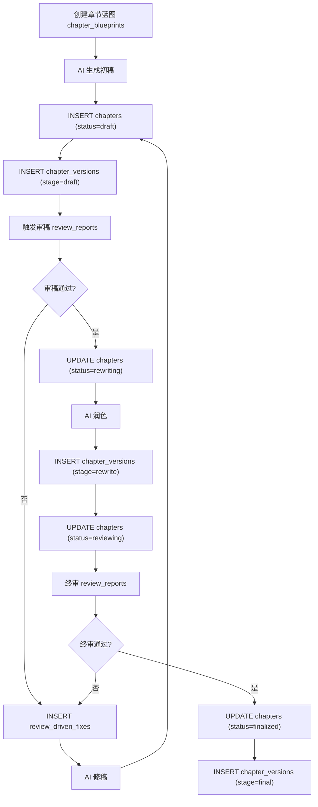
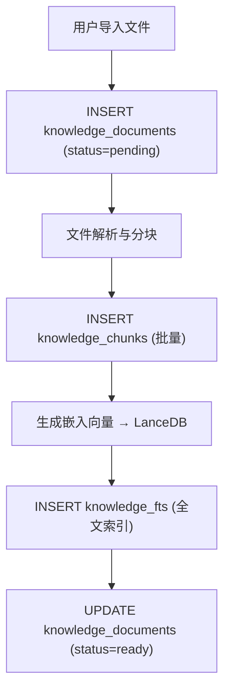
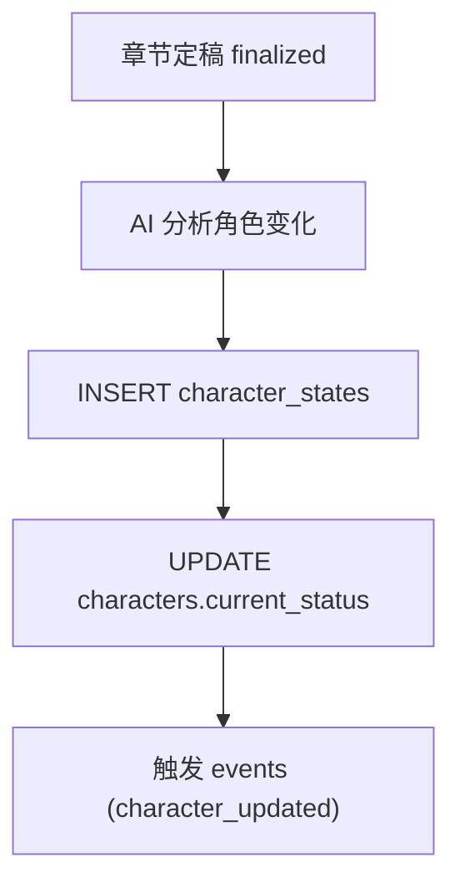
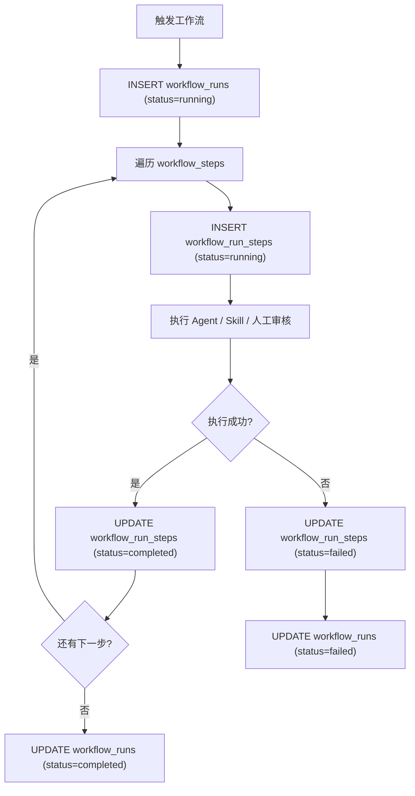
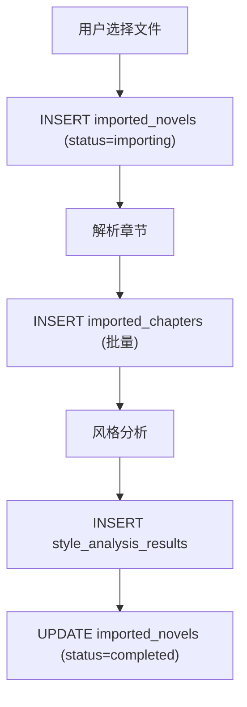

# 数据库设计文档

> Novel IDE 数据库设计。按功能模块分组组织表结构。

**生成日期**：2026-07-08
**关联技术栈**：Rust 1.90+ / Tauri 2 / SQLite + SQLx / LanceDB / SQLite FTS5

---

## 1. 概述

- **数据库类型**：SQLite 3.x（主库） + LanceDB（向量存储） + SQLite FTS5（全文检索）
- **ORM / 驱动**：SQLx（编译时类型安全查询）
- **字符集**：UTF-8（SQLite 原生）
- **排序规则**：Unicode
- **项目隔离**：每个项目一个独立 SQLite 文件（`novel.db`），存储在项目根目录下
- **向量存储**：LanceDB 嵌入式数据库，每个项目一个 `lance/` 目录
- **全文检索**：SQLite FTS5 虚拟表，与主库同一文件

### 1.1 存储策略

| 存储层 | 技术 | 用途 | 隔离方式 |
|--------|------|------|---------|
| 结构化数据 | SQLite + SQLx | 项目配置、角色、章节、工作流等 | 每项目一个 `novel.db` |
| 向量数据 | LanceDB | 知识库文档嵌入、语义检索 | 每项目一个 `lance/` 目录 |
| 全文检索 | SQLite FTS5 | 知识库全文搜索、章节内容搜索 | 与主库同一 SQLite 文件 |

---

## 2. 实体关系图

```mermaid
erDiagram
    %% ===== 项目管理模块 =====
    PROJECTS {
        TEXT id PK
        TEXT name
        TEXT genre
        TEXT target_readers
        INTEGER total_chapters
        TEXT narrative_pov
        TEXT story_structure
        TEXT core_outline
        TEXT world_settings
        TEXT character_profiles
        TEXT golden_finger
        TEXT writing_constraints
        TEXT style_constraints
        TEXT created_at
        TEXT updated_at
    }
    PROJECT_SETTINGS {
        TEXT id PK
        TEXT project_id FK
        TEXT key
        TEXT value
        TEXT category
        TEXT created_at
        TEXT updated_at
    }

    %% ===== 世界观模块 =====
    WORLD_ELEMENTS {
        TEXT id PK
        TEXT project_id FK
        TEXT type
        TEXT name
        TEXT description
        TEXT parent_id FK
        INTEGER sort_order
        TEXT metadata_json
        TEXT created_at
        TEXT updated_at
    }
    WORLD_ELEMENT_RELATIONS {
        TEXT id PK
        TEXT project_id FK
        TEXT source_element_id FK
        TEXT target_element_id FK
        TEXT relation_type
        TEXT description
        TEXT created_at
    }
    WORLD_ELEMENT_TAGS {
        TEXT id PK
        TEXT project_id FK
        TEXT element_id FK
        TEXT tag
        TEXT created_at
    }

    %% ===== 角色模块 =====
    CHARACTERS {
        TEXT id PK
        TEXT project_id FK
        TEXT name
        TEXT avatar_url
        TEXT age
        TEXT identity
        TEXT personality
        TEXT abilities
        TEXT faction
        TEXT growth_arc
        TEXT psychology
        TEXT language_style
        TEXT current_status
        TEXT equipment
        TEXT goals
        TEXT secrets
        TEXT foreshadowing
        TEXT death_mark
        TEXT ai_summary
        TEXT metadata_json
        TEXT created_at
        TEXT updated_at
    }
    CHARACTER_STATES {
        TEXT id PK
        TEXT project_id FK
        TEXT character_id FK
        INTEGER chapter_number
        TEXT state_snapshot
        TEXT diff_from_previous
        TEXT created_at
    }
    CHARACTER_RELATIONS {
        TEXT id PK
        TEXT project_id FK
        TEXT source_character_id FK
        TEXT target_character_id FK
        TEXT relation_type
        TEXT description
        TEXT strength
        INTEGER chapter_introduced
        TEXT created_at
        TEXT updated_at
    }

    %% ===== 故事架构模块 =====
    STORY_PREMISES {
        TEXT id PK
        TEXT project_id FK
        TEXT premise_type
        TEXT title
        TEXT content
        TEXT metadata_json
        INTEGER sort_order
        TEXT created_at
        TEXT updated_at
    }
    PLOT_OUTLINES {
        TEXT id PK
        TEXT project_id FK
        TEXT parent_id FK
        TEXT level
        TEXT title
        TEXT summary
        TEXT status
        INTEGER sort_order
        TEXT metadata_json
        TEXT created_at
        TEXT updated_at
    }
    CHAPTER_BLUEPRINTS {
        TEXT id PK
        TEXT project_id FK
        TEXT plot_outline_id FK
        INTEGER chapter_number
        TEXT title
        TEXT purpose
        TEXT narrative_function
        TEXT characters_json
        TEXT key_events
        TEXT suspense_hooks
        TEXT pacing
        TEXT emotion
        TEXT metadata_json
        TEXT created_at
        TEXT updated_at
    }

    %% ===== 写作流水线模块 =====
    CHAPTERS {
        TEXT id PK
        TEXT project_id FK
        TEXT chapter_blueprint_id FK
        INTEGER chapter_number
        TEXT title
        TEXT content
        TEXT status
        INTEGER word_count
        TEXT metadata_json
        TEXT created_at
        TEXT updated_at
    }
    CHAPTER_VERSIONS {
        TEXT id PK
        TEXT project_id FK
        TEXT chapter_id FK
        INTEGER version_number
        TEXT stage
        TEXT content
        INTEGER word_count
        TEXT diff_from_previous
        TEXT metadata_json
        TEXT created_at
    }
    REVIEW_REPORTS {
        TEXT id PK
        TEXT project_id FK
        TEXT chapter_id FK
        TEXT chapter_version_id FK
        TEXT reviewer_type
        TEXT overall_score
        TEXT summary
        TEXT strengths_json
        TEXT issues_json
        TEXT suggestions_json
        TEXT raw_report
        TEXT created_at
    }
    REVIEW_DRIVEN_FIXES {
        TEXT id PK
        TEXT project_id FK
        TEXT chapter_id FK
        TEXT review_report_id FK
        TEXT issue_type
        TEXT issue_description
        TEXT fix_status
        TEXT fix_content
        TEXT fixed_at
        TEXT created_at
    }

    %% ===== 知识库模块 =====
    KNOWLEDGE_DOCUMENTS {
        TEXT id PK
        TEXT project_id FK
        TEXT title
        TEXT file_path
        TEXT file_type
        INTEGER file_size
        TEXT content_hash
        INTEGER chunk_count
        TEXT status
        TEXT metadata_json
        TEXT created_at
        TEXT updated_at
    }
    KNOWLEDGE_CHUNKS {
        TEXT id PK
        TEXT project_id FK
        TEXT document_id FK
        INTEGER chunk_index
        TEXT content
        TEXT metadata_json
        INTEGER token_count
        TEXT created_at
    }

    %% ===== AI 系统模块 =====
    AGENTS {
        TEXT id PK
        TEXT project_id FK
        TEXT name
        TEXT display_name
        TEXT description
        TEXT system_prompt
        TEXT skills_json
        TEXT model_config_id FK
        TEXT icon
        INTEGER is_enabled
        INTEGER priority
        TEXT metadata_json
        TEXT created_at
        TEXT updated_at
    }
    SKILLS {
        TEXT id PK
        TEXT project_id FK
        TEXT name
        TEXT display_name
        TEXT description
        TEXT prompt_template
        TEXT parameters_schema
        TEXT category
        INTEGER is_enabled
        INTEGER priority
        TEXT metadata_json
        TEXT created_at
        TEXT updated_at
    }
    PROMPTS {
        TEXT id PK
        TEXT project_id FK
        TEXT parent_id FK
        TEXT scope
        TEXT name
        TEXT role
        TEXT content
        TEXT variables_json
        TEXT metadata_json
        INTEGER is_enabled
        TEXT created_at
        TEXT updated_at
    }
    MODEL_CONFIGS {
        TEXT id PK
        TEXT project_id FK
        TEXT provider
        TEXT model_name
        TEXT display_name
        TEXT api_endpoint
        TEXT api_key_encrypted
        TEXT default_params_json
        INTEGER is_enabled
        INTEGER priority
        TEXT metadata_json
        TEXT created_at
        TEXT updated_at
    }
    USAGE_LOGS {
        TEXT id PK
        TEXT project_id FK
        TEXT agent_id FK
        TEXT model_config_id FK
        TEXT operation_type
        TEXT prompt_tokens
        TEXT completion_tokens
        TEXT total_tokens
        TEXT latency_ms
        TEXT status
        TEXT error_message
        TEXT metadata_json
        TEXT created_at
    }

    %% ===== Hooks 与事件模块 =====
    HOOKS {
        TEXT id PK
        TEXT project_id FK
        TEXT name
        TEXT event_type
        TEXT handler_type
        TEXT handler_content
        TEXT description
        INTEGER is_enabled
        INTEGER priority
        TEXT conditions_json
        TEXT metadata_json
        TEXT created_at
        TEXT updated_at
    }
    HOOK_LOGS {
        TEXT id PK
        TEXT project_id FK
        TEXT hook_id FK
        TEXT event_type
        TEXT status
        TEXT input_snapshot
        TEXT output_snapshot
        TEXT error_message
        TEXT duration_ms
        TEXT created_at
    }
    EVENTS {
        TEXT id PK
        TEXT project_id FK
        TEXT event_type
        TEXT source
        TEXT payload_json
        TEXT status
        TEXT created_at
    }

    %% ===== 工作流模块 =====
    WORKFLOWS {
        TEXT id PK
        TEXT project_id FK
        TEXT name
        TEXT description
        TEXT trigger_type
        TEXT status
        TEXT metadata_json
        TEXT created_at
        TEXT updated_at
    }
    WORKFLOW_STEPS {
        TEXT id PK
        TEXT project_id FK
        TEXT workflow_id FK
        TEXT name
        TEXT step_type
        TEXT agent_id FK
        TEXT skill_id FK
        TEXT prompt_id FK
        TEXT model_config_id FK
        TEXT parameters_json
        INTEGER sort_order
        TEXT next_step_id FK
        TEXT metadata_json
        TEXT created_at
        TEXT updated_at
    }
    WORKFLOW_RUNS {
        TEXT id PK
        TEXT project_id FK
        TEXT workflow_id FK
        TEXT status
        TEXT trigger_source
        TEXT input_json
        TEXT output_json
        TEXT error_message
        TEXT started_at
        TEXT completed_at
        TEXT duration_ms
    }
    WORKFLOW_RUN_STEPS {
        TEXT id PK
        TEXT project_id FK
        TEXT workflow_run_id FK
        TEXT workflow_step_id FK
        TEXT status
        TEXT input_json
        TEXT output_json
        TEXT error_message
        TEXT started_at
        TEXT completed_at
        TEXT duration_ms
    }

    %% ===== 小说导入模块 =====
    IMPORTED_NOVELS {
        TEXT id PK
        TEXT project_id FK
        TEXT title
        TEXT author
        TEXT source_file_path
        TEXT source_format
        TEXT total_chapters
        TEXT total_word_count
        TEXT status
        TEXT metadata_json
        TEXT created_at
        TEXT updated_at
    }
    IMPORTED_CHAPTERS {
        TEXT id PK
        TEXT project_id FK
        TEXT imported_novel_id FK
        INTEGER chapter_number
        TEXT title
        TEXT content
        INTEGER word_count
        TEXT metadata_json
        TEXT created_at
    }
    STYLE_ANALYSIS_RESULTS {
        TEXT id PK
        TEXT project_id FK
        TEXT imported_novel_id FK
        TEXT analysis_type
        TEXT result_json
        TEXT confidence_score
        TEXT created_at
    }

    %% ===== 导出模块 =====
    EXPORT_CONFIGS {
        TEXT id PK
        TEXT project_id FK
        TEXT name
        TEXT format
        TEXT template
        TEXT options_json
        INTEGER is_default
        TEXT created_at
        TEXT updated_at
    }
    EXPORT_HISTORY {
        TEXT id PK
        TEXT project_id FK
        TEXT export_config_id FK
        TEXT output_file_path
        TEXT output_format
        INTEGER file_size
        TEXT status
        TEXT error_message
        TEXT metadata_json
        TEXT created_at
    }

    %% ===== 关系定义 =====
    PROJECTS ||--o{ PROJECT_SETTINGS : "has config"
    PROJECTS ||--o{ WORLD_ELEMENTS : "contains"
    PROJECTS ||--o{ CHARACTERS : "contains"
    PROJECTS ||--o{ STORY_PREMISES : "has premises"
    PROJECTS ||--o{ PLOT_OUTLINES : "has outlines"
    PROJECTS ||--o{ CHAPTERS : "has chapters"
    PROJECTS ||--o{ KNOWLEDGE_DOCUMENTS : "has knowledge"
    PROJECTS ||--o{ AGENTS : "has agents"
    PROJECTS ||--o{ SKILLS : "has skills"
    PROJECTS ||--o{ PROMPTS : "has prompts"
    PROJECTS ||--o{ MODEL_CONFIGS : "has models"
    PROJECTS ||--o{ HOOKS : "has hooks"
    PROJECTS ||--o{ WORKFLOWS : "has workflows"
    PROJECTS ||--o{ IMPORTED_NOVELS : "has imports"
    PROJECTS ||--o{ EXPORT_CONFIGS : "has export configs"

    WORLD_ELEMENTS ||--o{ WORLD_ELEMENTS : "parent-child"
    WORLD_ELEMENTS ||--o{ WORLD_ELEMENT_RELATIONS : "source of"
    WORLD_ELEMENTS ||--o{ WORLD_ELEMENT_TAGS : "tagged with"

    CHARACTERS ||--o{ CHARACTER_STATES : "tracked in"
    CHARACTERS ||--o{ CHARACTER_RELATIONS : "related to"

    PLOT_OUTLINES ||--o{ PLOT_OUTLINES : "parent-child"
    PLOT_OUTLINES ||--o{ CHAPTER_BLUEPRINTS : "defines"

    CHAPTERS ||--o{ CHAPTER_VERSIONS : "versioned as"
    CHAPTERS ||--o{ REVIEW_REPORTS : "reviewed by"
    CHAPTERS ||--o{ REVIEW_DRIVEN_FIXES : "fixed via"

    KNOWLEDGE_DOCUMENTS ||--o{ KNOWLEDGE_CHUNKS : "chunked into"

    AGENTS ||--o{ USAGE_LOGS : "uses"
    MODEL_CONFIGS ||--o{ USAGE_LOGS : "consumed by"

    HOOKS ||--o{ HOOK_LOGS : "logged as"

    WORKFLOWS ||--o{ WORKFLOW_STEPS : "composed of"
    WORKFLOWS ||--o{ WORKFLOW_RUNS : "executed as"
    WORKFLOW_RUNS ||--o{ WORKFLOW_RUN_STEPS : "steps in"

    IMPORTED_NOVELS ||--o{ IMPORTED_CHAPTERS : "contains chapters"
    IMPORTED_NOVELS ||--o{ STYLE_ANALYSIS_RESULTS : "analyzed as"

    EXPORT_CONFIGS ||--o{ EXPORT_HISTORY : "produced in"
```



---

## 3. 表设计（按模块分组）

> **约定**：所有表使用 `TEXT` 类型存储 UUID 主键；时间字段使用 `TEXT` 存储 ISO 8601 格式（`2026-01-01T00:00:00Z`）；JSON 数据使用 `TEXT` 存储序列化后的 JSON 字符串。

---

### 3.1 项目管理模块

#### 表名：`projects`

**说明**：小说项目主表，存储项目核心配置和创作约束

| 字段 | 类型 | 约束 | 默认值 | 说明 |
|------|------|------|--------|------|
| id | TEXT | PK | — | UUID 主键 |
| name | TEXT | NOT NULL | — | 项目名称 |
| genre | TEXT | | | 题材类型（如：玄幻、都市、科幻） |
| target_readers | TEXT | | | 目标读者画像 |
| total_chapters | INTEGER | | 0 | 预计总章节数 |
| narrative_pov | TEXT | | 'first_person' | 叙事视角：first_person / third_person / omniscient |
| story_structure | TEXT | | | 故事结构设定（如：三幕式、英雄之旅） |
| core_outline | TEXT | | | 核心大纲 |
| world_settings | TEXT | | | 世界观设定摘要 |
| character_profiles | TEXT | | | 角色设定摘要 |
| golden_finger | TEXT | | | 金手指 / 系统设定 |
| writing_constraints | TEXT | | | 写作约束（禁词、禁忌、节奏要求） |
| style_constraints | TEXT | | | 风格约束（语体、用词、句式偏好） |
| created_at | TEXT | NOT NULL | CURRENT_TIMESTAMP | 创建时间 |
| updated_at | TEXT | NOT NULL | CURRENT_TIMESTAMP | 更新时间 |

**索引**：

| 索引名 | 字段 | 类型 | 用途 |
|--------|------|------|------|
| idx_projects_name | name | NORMAL | 按名称查找项目 |

---

#### 表名：`project_settings`

**说明**：项目键值配置表，存储编辑器、工作流、AI 等细粒度设置

| 字段 | 类型 | 约束 | 默认值 | 说明 |
|------|------|------|--------|------|
| id | TEXT | PK | — | UUID 主键 |
| project_id | TEXT | NOT NULL, FK → projects(id) | — | 所属项目 |
| key | TEXT | NOT NULL | — | 配置键名（如：`editor.font_size`） |
| value | TEXT | | | 配置值（JSON 字符串） |
| category | TEXT | | 'general' | 配置分类：editor / workflow / ai / export / general |
| created_at | TEXT | NOT NULL | CURRENT_TIMESTAMP | 创建时间 |
| updated_at | TEXT | NOT NULL | CURRENT_TIMESTAMP | 更新时间 |

**索引**：

| 索引名 | 字段 | 类型 | 用途 |
|--------|------|------|------|
| idx_settings_project_key | project_id, key | UNIQUE | 按项目+键名唯一查询 |

**外键关系**：

| 关联 | 级联规则 |
|------|---------|
| project_id → projects.id | CASCADE |

---

### 3.2 世界观模块

#### 表名：`world_elements`

**说明**：世界观元素表，统一存储国家、城市、宗门、组织、势力、历史、文化、货币、职业、技能、等级、科技、规则、法则等

| 字段 | 类型 | 约束 | 默认值 | 说明 |
|------|------|------|--------|------|
| id | TEXT | PK | — | UUID 主键 |
| project_id | TEXT | NOT NULL, FK → projects(id) | — | 所属项目 |
| type | TEXT | NOT NULL | — | 元素类型：country / city / sect / organization / force / history / culture / currency / profession / skill / level / technology / rule / law / other |
| name | TEXT | NOT NULL | — | 元素名称 |
| description | TEXT | | | 元素描述 |
| parent_id | TEXT | FK → world_elements(id) | | 父级元素 ID（用于层级关系） |
| sort_order | INTEGER | | 0 | 排序序号 |
| metadata_json | TEXT | | '{}' | 扩展属性（JSON） |
| created_at | TEXT | NOT NULL | CURRENT_TIMESTAMP | 创建时间 |
| updated_at | TEXT | NOT NULL | CURRENT_TIMESTAMP | 更新时间 |

**索引**：

| 索引名 | 字段 | 类型 | 用途 |
|--------|------|------|------|
| idx_world_elements_project_type | project_id, type | NORMAL | 按项目和类型筛选 |
| idx_world_elements_project_name | project_id, name | NORMAL | 按名称搜索 |
| idx_world_elements_parent | parent_id | NORMAL | 层级查询 |

**外键关系**：

| 关联 | 级联规则 |
|------|---------|
| project_id → projects.id | CASCADE |
| parent_id → world_elements.id | SET NULL |

---

#### 表名：`world_element_relations`

**说明**：世界观元素关系表，描述元素间的关联（如：宗门-隶属于-国家）

| 字段 | 类型 | 约束 | 默认值 | 说明 |
|------|------|------|--------|------|
| id | TEXT | PK | — | UUID 主键 |
| project_id | TEXT | NOT NULL, FK → projects(id) | — | 所属项目 |
| source_element_id | TEXT | NOT NULL, FK → world_elements(id) | — | 关系源元素 |
| target_element_id | TEXT | NOT NULL, FK → world_elements(id) | — | 关系目标元素 |
| relation_type | TEXT | NOT NULL | — | 关系类型：belongs_to / controls / conflicts / trades / allied / part_of / custom |
| description | TEXT | | | 关系描述 |
| created_at | TEXT | NOT NULL | CURRENT_TIMESTAMP | 创建时间 |

**索引**：

| 索引名 | 字段 | 类型 | 用途 |
|--------|------|------|------|
| idx_world_rel_source | source_element_id | NORMAL | 查询某元素的所有关系 |
| idx_world_rel_target | target_element_id | NORMAL | 反向关系查询 |
| idx_world_rel_project | project_id | NORMAL | 按项目筛选 |

**外键关系**：

| 关联 | 级联规则 |
|------|---------|
| project_id → projects.id | CASCADE |
| source_element_id → world_elements.id | CASCADE |
| target_element_id → world_elements.id | CASCADE |

---

#### 表名：`world_element_tags`

**说明**：世界观元素标签表，支持自由标签分类

| 字段 | 类型 | 约束 | 默认值 | 说明 |
|------|------|------|--------|------|
| id | TEXT | PK | — | UUID 主键 |
| project_id | TEXT | NOT NULL, FK → projects(id) | — | 所属项目 |
| element_id | TEXT | NOT NULL, FK → world_elements(id) | — | 所属元素 |
| tag | TEXT | NOT NULL | — | 标签名称 |
| created_at | TEXT | NOT NULL | CURRENT_TIMESTAMP | 创建时间 |

**索引**：

| 索引名 | 字段 | 类型 | 用途 |
|--------|------|------|------|
| idx_world_tags_element | element_id | NORMAL | 查询元素的所有标签 |
| idx_world_tags_tag | project_id, tag | NORMAL | 按标签筛选元素 |
| idx_world_tags_unique | element_id, tag | UNIQUE | 避免重复标签 |

**外键关系**：

| 关联 | 级联规则 |
|------|---------|
| project_id → projects.id | CASCADE |
| element_id → world_elements.id | CASCADE |

---

### 3.3 角色管理模块

#### 表名：`characters`

**说明**：角色卡主表，存储角色全部设定信息

| 字段 | 类型 | 约束 | 默认值 | 说明 |
|------|------|------|--------|------|
| id | TEXT | PK | — | UUID 主键 |
| project_id | TEXT | NOT NULL, FK → projects(id) | — | 所属项目 |
| name | TEXT | NOT NULL | — | 角色名称 |
| avatar_url | TEXT | | | 头像路径 |
| age | TEXT | | | 年龄（支持文本描述如"约二十岁"） |
| identity | TEXT | | | 身份/职业 |
| personality | TEXT | | | 性格描述 |
| abilities | TEXT | | | 能力/技能描述 |
| faction | TEXT | | | 所属阵营 |
| growth_arc | TEXT | | | 成长线设定 |
| psychology | TEXT | | | 心理描写/动机 |
| language_style | TEXT | | | 语言风格/口头禅 |
| current_status | TEXT | | 'active' | 当前状态：active / missing / dead / retired / unknown |
| equipment | TEXT | | | 装备/物品 |
| goals | TEXT | | | 目标/动机 |
| secrets | TEXT | | | 秘密 |
| foreshadowing | TEXT | | | 伏笔设定 |
| death_mark | TEXT | | | 死亡标记/死亡伏笔 |
| ai_summary | TEXT | | | AI 自动生成的角色摘要 |
| metadata_json | TEXT | | '{}' | 扩展属性（JSON） |
| created_at | TEXT | NOT NULL | CURRENT_TIMESTAMP | 创建时间 |
| updated_at | TEXT | NOT NULL | CURRENT_TIMESTAMP | 更新时间 |

**索引**：

| 索引名 | 字段 | 类型 | 用途 |
|--------|------|------|------|
| idx_characters_project | project_id | NORMAL | 按项目筛选角色 |
| idx_characters_project_name | project_id, name | UNIQUE | 同项目角色名唯一 |
| idx_characters_status | project_id, current_status | NORMAL | 按状态筛选 |

**外键关系**：

| 关联 | 级联规则 |
|------|---------|
| project_id → projects.id | CASCADE |

---

#### 表名：`character_states`

**说明**：角色跨章节动态状态跟踪表，记录角色在每个章节结束时的状态快照

| 字段 | 类型 | 约束 | 默认值 | 说明 |
|------|------|------|--------|------|
| id | TEXT | PK | — | UUID 主键 |
| project_id | TEXT | NOT NULL, FK → projects(id) | — | 所属项目 |
| character_id | TEXT | NOT NULL, FK → characters(id) | — | 所属角色 |
| chapter_number | INTEGER | NOT NULL | — | 章节编号 |
| state_snapshot | TEXT | | | 该章节结束时角色状态快照（JSON） |
| diff_from_previous | TEXT | | | 与上一状态的差异描述 |
| created_at | TEXT | NOT NULL | CURRENT_TIMESTAMP | 创建时间 |

**索引**：

| 索引名 | 字段 | 类型 | 用途 |
|--------|------|------|------|
| idx_char_states_character | character_id | NORMAL | 查角色所有状态 |
| idx_char_states_chapter | project_id, chapter_number | NORMAL | 查某章节所有角色状态 |
| idx_char_states_unique | character_id, chapter_number | UNIQUE | 每章每角色唯一 |

**外键关系**：

| 关联 | 级联规则 |
|------|---------|
| project_id → projects.id | CASCADE |
| character_id → characters.id | CASCADE |

---

#### 表名：`character_relations`

**说明**：角色关系图谱表，存储角色间的关系

| 字段 | 类型 | 约束 | 默认值 | 说明 |
|------|------|------|--------|------|
| id | TEXT | PK | — | UUID 主键 |
| project_id | TEXT | NOT NULL, FK → projects(id) | — | 所属项目 |
| source_character_id | TEXT | NOT NULL, FK → characters(id) | — | 关系发起角色 |
| target_character_id | TEXT | NOT NULL, FK → characters(id) | — | 关系目标角色 |
| relation_type | TEXT | NOT NULL | — | 关系类型：master / apprentice / lover / enemy / sibling / parent / child / ally / rival / custom |
| description | TEXT | | | 关系描述 |
| strength | TEXT | | 'normal' | 关系强度：weak / normal / strong / bond |
| chapter_introduced | INTEGER | | | 关系首次出现章节 |
| created_at | TEXT | NOT NULL | CURRENT_TIMESTAMP | 创建时间 |
| updated_at | TEXT | NOT NULL | CURRENT_TIMESTAMP | 更新时间 |

**索引**：

| 索引名 | 字段 | 类型 | 用途 |
|--------|------|------|------|
| idx_char_rel_source | source_character_id | NORMAL | 查某角色的所有关系 |
| idx_char_rel_target | target_character_id | NORMAL | 反向关系查询 |
| idx_char_rel_project | project_id | NORMAL | 按项目筛选 |
| idx_char_rel_unique | source_character_id, target_character_id, relation_type | UNIQUE | 避免重复关系 |

**外键关系**：

| 关联 | 级联规则 |
|------|---------|
| project_id → projects.id | CASCADE |
| source_character_id → characters.id | CASCADE |
| target_character_id → characters.id | CASCADE |

---

### 3.4 故事架构模块

#### 表名：`story_premises`

**说明**：故事前提/设定表，存储核心故事概念

| 字段 | 类型 | 约束 | 默认值 | 说明 |
|------|------|------|--------|------|
| id | TEXT | PK | — | UUID 主键 |
| project_id | TEXT | NOT NULL, FK → projects(id) | — | 所属项目 |
| premise_type | TEXT | NOT NULL | — | 类型：theme / conflict / hook / setting / premise / question |
| title | TEXT | NOT NULL | — | 标题 |
| content | TEXT | | | 详细内容 |
| metadata_json | TEXT | | '{}' | 扩展属性（JSON） |
| sort_order | INTEGER | | 0 | 排序序号 |
| created_at | TEXT | NOT NULL | CURRENT_TIMESTAMP | 创建时间 |
| updated_at | TEXT | NOT NULL | CURRENT_TIMESTAMP | 更新时间 |

**索引**：

| 索引名 | 字段 | 类型 | 用途 |
|--------|------|------|------|
| idx_premises_project | project_id | NORMAL | 按项目筛选 |
| idx_premises_type | project_id, premise_type | NORMAL | 按类型筛选 |

**外键关系**：

| 关联 | 级联规则 |
|------|---------|
| project_id → projects.id | CASCADE |

---

#### 表名：`plot_outlines`

**说明**：剧情大纲表，层级结构：卷 → 篇章 → 章节大纲

| 字段 | 类型 | 约束 | 默认值 | 说明 |
|------|------|------|--------|------|
| id | TEXT | PK | — | UUID 主键 |
| project_id | TEXT | NOT NULL, FK → projects(id) | — | 所属项目 |
| parent_id | TEXT | FK → plot_outlines(id) | | 父级大纲 ID（支持多级嵌套） |
| level | TEXT | NOT NULL | — | 层级：volume / arc / chapter |
| title | TEXT | NOT NULL | — | 标题 |
| summary | TEXT | | | 摘要 |
| status | TEXT | | 'draft' | 状态：draft / finalized / active |
| sort_order | INTEGER | | 0 | 排序序号 |
| metadata_json | TEXT | | '{}' | 扩展属性（JSON） |
| created_at | TEXT | NOT NULL | CURRENT_TIMESTAMP | 创建时间 |
| updated_at | TEXT | NOT NULL | CURRENT_TIMESTAMP | 更新时间 |

**索引**：

| 索引名 | 字段 | 类型 | 用途 |
|--------|------|------|------|
| idx_outlines_project | project_id | NORMAL | 按项目筛选 |
| idx_outlines_parent | parent_id | NORMAL | 层级查询 |
| idx_outlines_level | project_id, level | NORMAL | 按层级筛选 |

**外键关系**：

| 关联 | 级联规则 |
|------|---------|
| project_id → projects.id | CASCADE |
| parent_id → plot_outlines.id | SET NULL |

---

#### 表名：`chapter_blueprints`

**说明**：章节蓝图/设计表，每章写作前的执行计划

| 字段 | 类型 | 约束 | 默认值 | 说明 |
|------|------|------|--------|------|
| id | TEXT | PK | — | UUID 主键 |
| project_id | TEXT | NOT NULL, FK → projects(id) | — | 所属项目 |
| plot_outline_id | TEXT | FK → plot_outlines(id) | | 关联剧情大纲 |
| chapter_number | INTEGER | NOT NULL | — | 章节编号 |
| title | TEXT | | | 章节标题 |
| purpose | TEXT | | | 本章目的 |
| narrative_function | TEXT | | | 叙事功能（如：转折、铺垫、高潮） |
| characters_json | TEXT | | '[]' | 出场角色 ID 列表（JSON 数组） |
| key_events | TEXT | | | 关键事件 |
| suspense_hooks | TEXT | | | 悬念/钩子 |
| pacing | TEXT | | | 节奏：fast / slow / medium |
| emotion | TEXT | | | 情绪基调 |
| metadata_json | TEXT | | '{}' | 扩展属性（JSON） |
| created_at | TEXT | NOT NULL | CURRENT_TIMESTAMP | 创建时间 |
| updated_at | TEXT | NOT NULL | CURRENT_TIMESTAMP | 更新时间 |

**索引**：

| 索引名 | 字段 | 类型 | 用途 |
|--------|------|------|------|
| idx_blueprint_project_chapter | project_id, chapter_number | UNIQUE | 同项目章节编号唯一 |
| idx_blueprint_outline | plot_outline_id | NORMAL | 按大纲筛选 |

**外键关系**：

| 关联 | 级联规则 |
|------|---------|
| project_id → projects.id | CASCADE |
| plot_outline_id → plot_outlines.id | SET NULL |

---

### 3.5 写作流水线模块

#### 表名：`chapters`

**说明**：章节内容主表，存储当前最终版本

| 字段 | 类型 | 约束 | 默认值 | 说明 |
|------|------|------|--------|------|
| id | TEXT | PK | — | UUID 主键 |
| project_id | TEXT | NOT NULL, FK → projects(id) | — | 所属项目 |
| chapter_blueprint_id | TEXT | FK → chapter_blueprints(id) | | 关联蓝图 |
| chapter_number | INTEGER | NOT NULL | — | 章节编号 |
| title | TEXT | | | 章节标题 |
| content | TEXT | | | 章节正文内容 |
| status | TEXT | NOT NULL | 'draft' | 状态：draft / rewriting / reviewing / finalized |
| word_count | INTEGER | | 0 | 字数统计 |
| metadata_json | TEXT | | '{}' | 扩展属性（JSON） |
| created_at | TEXT | NOT NULL | CURRENT_TIMESTAMP | 创建时间 |
| updated_at | TEXT | NOT NULL | CURRENT_TIMESTAMP | 更新时间 |

**索引**：

| 索引名 | 字段 | 类型 | 用途 |
|--------|------|------|------|
| idx_chapters_project_number | project_id, chapter_number | UNIQUE | 同项目章节编号唯一 |
| idx_chapters_project_status | project_id, status | NORMAL | 按状态筛选章节 |
| idx_chapters_blueprint | chapter_blueprint_id | NORMAL | 按蓝图关联查询 |

**外键关系**：

| 关联 | 级联规则 |
|------|---------|
| project_id → projects.id | CASCADE |
| chapter_blueprint_id → chapter_blueprints.id | SET NULL |

---

#### 表名：`chapter_versions`

**说明**：章节版本历史表，记录每个阶段的版本

| 字段 | 类型 | 约束 | 默认值 | 说明 |
|------|------|------|--------|------|
| id | TEXT | PK | — | UUID 主键 |
| project_id | TEXT | NOT NULL, FK → projects(id) | — | 所属项目 |
| chapter_id | TEXT | NOT NULL, FK → chapters(id) | — | 所属章节 |
| version_number | INTEGER | NOT NULL | — | 版本号（递增） |
| stage | TEXT | NOT NULL | — | 阶段：draft / rewrite / review / final |
| content | TEXT | | | 该版本内容快照 |
| word_count | INTEGER | | 0 | 字数 |
| diff_from_previous | TEXT | | | 与上一版本的差异描述 |
| metadata_json | TEXT | | '{}' | 扩展属性（JSON） |
| created_at | TEXT | NOT NULL | CURRENT_TIMESTAMP | 创建时间 |

**索引**：

| 索引名 | 字段 | 类型 | 用途 |
|--------|------|------|------|
| idx_chapter_ver_chapter | chapter_id | NORMAL | 查某章节所有版本 |
| idx_chapter_ver_stage | chapter_id, stage | NORMAL | 按阶段筛选版本 |

**外键关系**：

| 关联 | 级联规则 |
|------|---------|
| project_id → projects.id | CASCADE |
| chapter_id → chapters.id | CASCADE |

---

#### 表名：`review_reports`

**说明**：审稿报告表，存储结构化审稿结果

| 字段 | 类型 | 约束 | 默认值 | 说明 |
|------|------|------|--------|------|
| id | TEXT | PK | — | UUID 主键 |
| project_id | TEXT | NOT NULL, FK → projects(id) | — | 所属项目 |
| chapter_id | TEXT | NOT NULL, FK → chapters(id) | — | 被审章节 |
| chapter_version_id | TEXT | FK → chapter_versions(id) | | 被审版本 |
| reviewer_type | TEXT | NOT NULL | — | 审稿人类型：agent / human / ai_quick |
| overall_score | TEXT | | | 综合评分（如：8.5/10） |
| summary | TEXT | | | 审稿总结 |
| strengths_json | TEXT | | '[]' | 优点列表（JSON 数组） |
| issues_json | TEXT | | '[]' | 问题列表（JSON 数组） |
| suggestions_json | TEXT | | '[]' | 建议列表（JSON 数组） |
| raw_report | TEXT | | | 原始审稿报告（Markdown） |
| created_at | TEXT | NOT NULL | CURRENT_TIMESTAMP | 创建时间 |

**索引**：

| 索引名 | 字段 | 类型 | 用途 |
|--------|------|------|------|
| idx_review_chapter | chapter_id | NORMAL | 查某章节所有审稿报告 |
| idx_review_project | project_id | NORMAL | 按项目筛选 |

**外键关系**：

| 关联 | 级联规则 |
|------|---------|
| project_id → projects.id | CASCADE |
| chapter_id → chapters.id | CASCADE |
| chapter_version_id → chapter_versions.id | SET NULL |

---

#### 表名：`review_driven_fixes`

**说明**：审稿驱动修稿表，跟踪问题修复状态

| 字段 | 类型 | 约束 | 默认值 | 说明 |
|------|------|------|--------|------|
| id | TEXT | PK | — | UUID 主键 |
| project_id | TEXT | NOT NULL, FK → projects(id) | — | 所属项目 |
| chapter_id | TEXT | NOT NULL, FK → chapters(id) | — | 所属章节 |
| review_report_id | TEXT | FK → review_reports(id) | | 关联审稿报告 |
| issue_type | TEXT | NOT NULL | — | 问题类型：plot_hole / character_inconsistency / pacing / style / logic / other |
| issue_description | TEXT | NOT NULL | | 问题描述 |
| fix_status | TEXT | NOT NULL | 'pending' | 状态：pending / in_progress / fixed / wont_fix |
| fix_content | TEXT | | | 修复内容描述 |
| fixed_at | TEXT | | | 修复完成时间 |
| created_at | TEXT | NOT NULL | CURRENT_TIMESTAMP | 创建时间 |

**索引**：

| 索引名 | 字段 | 类型 | 用途 |
|--------|------|------|------|
| idx_fix_chapter | chapter_id | NORMAL | 查某章节所有修复项 |
| idx_fix_status | project_id, fix_status | NORMAL | 按状态筛选 |

**外键关系**：

| 关联 | 级联规则 |
|------|---------|
| project_id → projects.id | CASCADE |
| chapter_id → chapters.id | CASCADE |
| review_report_id → review_reports.id | SET NULL |

---

### 3.6 知识库模块（RAG）

#### 表名：`knowledge_documents`

**说明**：知识库文档主表，记录导入的参考文件

| 字段 | 类型 | 约束 | 默认值 | 说明 |
|------|------|------|--------|------|
| id | TEXT | PK | — | UUID 主键 |
| project_id | TEXT | NOT NULL, FK → projects(id) | — | 所属项目 |
| title | TEXT | NOT NULL | — | 文档标题 |
| file_path | TEXT | NOT NULL | — | 文件路径（项目相对路径） |
| file_type | TEXT | NOT NULL | — | 文件类型：txt / md / docx / pdf / html / epub / zip |
| file_size | INTEGER | | 0 | 文件大小（字节） |
| content_hash | TEXT | | | 内容哈希（用于去重） |
| chunk_count | INTEGER | | 0 | 分块数量 |
| status | TEXT | NOT NULL | 'pending' | 状态：pending / indexing / ready / error |
| metadata_json | TEXT | | '{}' | 扩展属性（JSON） |
| created_at | TEXT | NOT NULL | CURRENT_TIMESTAMP | 创建时间 |
| updated_at | TEXT | NOT NULL | CURRENT_TIMESTAMP | 更新时间 |

**索引**：

| 索引名 | 字段 | 类型 | 用途 |
|--------|------|------|------|
| idx_knowledge_doc_project | project_id | NORMAL | 按项目筛选 |
| idx_knowledge_doc_hash | project_id, content_hash | UNIQUE | 内容去重 |

**外键关系**：

| 关联 | 级联规则 |
|------|---------|
| project_id → projects.id | CASCADE |

---

#### 表名：`knowledge_chunks`

**说明**：知识库文档分块表，存储文本块和嵌入向量引用

| 字段 | 类型 | 约束 | 默认值 | 说明 |
|------|------|------|--------|------|
| id | TEXT | PK | — | UUID 主键 |
| project_id | TEXT | NOT NULL, FK → projects(id) | — | 所属项目 |
| document_id | TEXT | NOT NULL, FK → knowledge_documents(id) | — | 所属文档 |
| chunk_index | INTEGER | NOT NULL | — | 分块序号（从 0 开始） |
| content | TEXT | NOT NULL | — | 文本内容 |
| metadata_json | TEXT | | '{}' | 扩展属性（页码、段落范围等） |
| token_count | INTEGER | | 0 | Token 数量 |
| created_at | TEXT | NOT NULL | CURRENT_TIMESTAMP | 创建时间 |

**索引**：

| 索引名 | 字段 | 类型 | 用途 |
|--------|------|------|------|
| idx_knowledge_chunk_doc | document_id | NORMAL | 查某文档所有分块 |
| idx_knowledge_chunk_project | project_id | NORMAL | 按项目筛选 |

**外键关系**：

| 关联 | 级联规则 |
|------|---------|
| project_id → projects.id | CASCADE |
| document_id → knowledge_documents.id | CASCADE |

---

#### 表名：`knowledge_fts`（FTS5 虚拟表）

**说明**：全文检索虚拟表，用于知识库文本搜索

```sql
CREATE VIRTUAL TABLE knowledge_fts USING fts5(
    chunk_id UNINDEXED,
    project_id UNINDEXED,
    content,
    tokenize='unicode61'
);
```

| 字段 | 类型 | 说明 |
|------|------|------|
| chunk_id | TEXT | 关联 knowledge_chunks.id |
| project_id | TEXT | 项目 ID |
| content | TEXT | 待检索文本内容 |

**触发器**：通过 INSERT/UPDATE/DELETE 触发器同步 `knowledge_chunks` 表数据

---

### 3.7 AI 系统模块

#### 表名：`agents`

**说明**：AI Agent 定义表

| 字段 | 类型 | 约束 | 默认值 | 说明 |
|------|------|------|--------|------|
| id | TEXT | PK | — | UUID 主键 |
| project_id | TEXT | NOT NULL, FK → projects(id) | — | 所属项目 |
| name | TEXT | NOT NULL | — | Agent 标识名（如：story-architect） |
| display_name | TEXT | | | 显示名称 |
| description | TEXT | | | Agent 描述 |
| system_prompt | TEXT | | | 系统提示词 |
| skills_json | TEXT | | '[]' | 绑定的 Skill ID 列表（JSON 数组） |
| model_config_id | TEXT | FK → model_configs(id) | | 默认模型配置 |
| icon | TEXT | | | 图标路径 |
| is_enabled | INTEGER | | 1 | 是否启用 |
| priority | INTEGER | | 0 | 优先级 |
| metadata_json | TEXT | | '{}' | 扩展属性（JSON） |
| created_at | TEXT | NOT NULL | CURRENT_TIMESTAMP | 创建时间 |
| updated_at | TEXT | NOT NULL | CURRENT_TIMESTAMP | 更新时间 |

**索引**：

| 索引名 | 字段 | 类型 | 用途 |
|--------|------|------|------|
| idx_agents_project | project_id | NORMAL | 按项目筛选 |
| idx_agents_project_name | project_id, name | UNIQUE | 同项目 Agent 名唯一 |

**外键关系**：

| 关联 | 级联规则 |
|------|---------|
| project_id → projects.id | CASCADE |
| model_config_id → model_configs(id) | SET NULL |

---

#### 表名：`skills`

**说明**：AI Skill 定义表

| 字段 | 类型 | 约束 | 默认值 | 说明 |
|------|------|------|--------|------|
| id | TEXT | PK | — | UUID 主键 |
| project_id | TEXT | NOT NULL, FK → projects(id) | — | 所属项目 |
| name | TEXT | NOT NULL | — | Skill 标识名 |
| display_name | TEXT | | | 显示名称 |
| description | TEXT | | | Skill 描述 |
| prompt_template | TEXT | | | Prompt 模板内容 |
| parameters_schema | TEXT | | '{}' | 参数 JSON Schema |
| category | TEXT | | 'general' | 分类：rewrite / summarize / emotion / dialogue / style / outline / review / character / rag / export / general |
| is_enabled | INTEGER | | 1 | 是否启用 |
| priority | INTEGER | | 0 | 优先级 |
| metadata_json | TEXT | | '{}' | 扩展属性（JSON） |
| created_at | TEXT | NOT NULL | CURRENT_TIMESTAMP | 创建时间 |
| updated_at | TEXT | NOT NULL | CURRENT_TIMESTAMP | 更新时间 |

**索引**：

| 索引名 | 字段 | 类型 | 用途 |
|--------|------|------|------|
| idx_skills_project | project_id | NORMAL | 按项目筛选 |
| idx_skills_project_name | project_id, name | UNIQUE | 同项目 Skill 名唯一 |

**外键关系**：

| 关联 | 级联规则 |
|------|---------|
| project_id → projects.id | CASCADE |

---

#### 表名：`prompts`

**说明**：Prompt 模板表，支持继承链：Global → Project → Workflow → Agent → Skill → Runtime

| 字段 | 类型 | 约束 | 默认值 | 说明 |
|------|------|------|--------|------|
| id | TEXT | PK | — | UUID 主键 |
| project_id | TEXT | NOT NULL, FK → projects(id) | — | 所属项目 |
| parent_id | TEXT | FK → prompts(id) | | 父级 Prompt ID（继承关系） |
| scope | TEXT | NOT NULL | — | 作用域：global / project / workflow / agent / skill / runtime |
| name | TEXT | NOT NULL | — | Prompt 名称 |
| role | TEXT | NOT NULL | 'user' | 角色：system / user / assistant |
| content | TEXT | | | Prompt 模板内容（支持 {{variable}} 变量） |
| variables_json | TEXT | | '[]' | 变量定义列表（JSON 数组） |
| metadata_json | TEXT | | '{}' | 扩展属性（JSON） |
| is_enabled | INTEGER | | 1 | 是否启用 |
| created_at | TEXT | NOT NULL | CURRENT_TIMESTAMP | 创建时间 |
| updated_at | TEXT | NOT NULL | CURRENT_TIMESTAMP | 更新时间 |

**索引**：

| 索引名 | 字段 | 类型 | 用途 |
|--------|------|------|------|
| idx_prompts_project | project_id | NORMAL | 按项目筛选 |
| idx_prompts_parent | parent_id | NORMAL | 继承链查询 |
| idx_prompts_scope | project_id, scope | NORMAL | 按作用域筛选 |

**外键关系**：

| 关联 | 级联规则 |
|------|---------|
| project_id → projects.id | CASCADE |
| parent_id → prompts.id | SET NULL |

---

#### 表名：`model_configs`

**说明**：模型提供商配置表

| 字段 | 类型 | 约束 | 默认值 | 说明 |
|------|------|------|--------|------|
| id | TEXT | PK | — | UUID 主键 |
| project_id | TEXT | NOT NULL, FK → projects(id) | — | 所属项目 |
| provider | TEXT | NOT NULL | — | 提供商：openai / gemini / claude / deepseek / qwen / glm / ollama / lmstudio / vllm / custom |
| model_name | TEXT | NOT NULL | — | 模型名称（如：gpt-4o） |
| display_name | TEXT | | | 显示名称 |
| api_endpoint | TEXT | | | API 端点 URL |
| api_key_encrypted | TEXT | | | 加密的 API Key |
| default_params_json | TEXT | | '{}' | 默认参数（temperature, max_tokens 等） |
| is_enabled | INTEGER | | 1 | 是否启用 |
| priority | INTEGER | | 0 | 优先级 |
| metadata_json | TEXT | | '{}' | 扩展属性（JSON） |
| created_at | TEXT | NOT NULL | CURRENT_TIMESTAMP | 创建时间 |
| updated_at | TEXT | NOT NULL | CURRENT_TIMESTAMP | 更新时间 |

**索引**：

| 索引名 | 字段 | 类型 | 用途 |
|--------|------|------|------|
| idx_model_configs_project | project_id | NORMAL | 按项目筛选 |
| idx_model_configs_provider | project_id, provider | NORMAL | 按提供商筛选 |

**外键关系**：

| 关联 | 级联规则 |
|------|---------|
| project_id → projects.id | CASCADE |

---

#### 表名：`usage_logs`

**说明**：LLM 调用日志表，记录每次模型调用的 Token 消耗和延迟

| 字段 | 类型 | 约束 | 默认值 | 说明 |
|------|------|------|--------|------|
| id | TEXT | PK | — | UUID 主键 |
| project_id | TEXT | NOT NULL, FK → projects(id) | — | 所属项目 |
| agent_id | TEXT | FK → agents(id) | | 调用的 Agent |
| model_config_id | TEXT | FK → model_configs(id) | | 使用的模型配置 |
| operation_type | TEXT | NOT NULL | — | 操作类型：generate / rewrite / review / summarize / embed / chat |
| prompt_tokens | INTEGER | | 0 | Prompt Token 数 |
| completion_tokens | INTEGER | | 0 | Completion Token 数 |
| total_tokens | INTEGER | | 0 | 总 Token 数 |
| latency_ms | INTEGER | | 0 | 响应延迟（毫秒） |
| status | TEXT | NOT NULL | 'success' | 状态：success / error / timeout / cancelled |
| error_message | TEXT | | | 错误信息 |
| metadata_json | TEXT | | '{}' | 扩展属性（JSON） |
| created_at | TEXT | NOT NULL | CURRENT_TIMESTAMP | 创建时间 |

**索引**：

| 索引名 | 字段 | 类型 | 用途 |
|--------|------|------|------|
| idx_usage_logs_project | project_id | NORMAL | 按项目筛选 |
| idx_usage_logs_agent | agent_id | NORMAL | 按 Agent 筛选 |
| idx_usage_logs_created | created_at | NORMAL | 按时间范围查询 |

**外键关系**：

| 关联 | 级联规则 |
|------|---------|
| project_id → projects.id | CASCADE |
| agent_id → agents.id | SET NULL |
| model_config_id → model_configs(id) | SET NULL |

---

### 3.8 Hooks 与事件模块

#### 表名：`hooks`

**说明**：Hook 定义表，绑定生命周期事件

| 字段 | 类型 | 约束 | 默认值 | 说明 |
|------|------|------|--------|------|
| id | TEXT | PK | — | UUID 主键 |
| project_id | TEXT | NOT NULL, FK → projects(id) | — | 所属项目 |
| name | TEXT | NOT NULL | — | Hook 名称 |
| event_type | TEXT | NOT NULL | — | 事件类型：app_start / project_open / project_close / session_start / session_end / before_prompt / after_prompt / before_generate / after_generate / before_rewrite / after_rewrite / before_review / after_review / before_save / after_save / git_commit / export / plugin_install / plugin_remove |
| handler_type | TEXT | NOT NULL | — | 处理器类型：shell / rust / lua / javascript |
| handler_content | TEXT | | | 处理器内容（脚本代码或命令） |
| description | TEXT | | | Hook 描述 |
| is_enabled | INTEGER | | 1 | 是否启用 |
| priority | INTEGER | | 0 | 执行优先级 |
| conditions_json | TEXT | | '{}' | 触发条件（JSON） |
| metadata_json | TEXT | | '{}' | 扩展属性（JSON） |
| created_at | TEXT | NOT NULL | CURRENT_TIMESTAMP | 创建时间 |
| updated_at | TEXT | NOT NULL | CURRENT_TIMESTAMP | 更新时间 |

**索引**：

| 索引名 | 字段 | 类型 | 用途 |
|--------|------|------|------|
| idx_hooks_project | project_id | NORMAL | 按项目筛选 |
| idx_hooks_event | project_id, event_type | NORMAL | 按事件类型查找 Hooks |

**外键关系**：

| 关联 | 级联规则 |
|------|---------|
| project_id → projects.id | CASCADE |

---

#### 表名：`hook_logs`

**说明**：Hook 执行日志表

| 字段 | 类型 | 约束 | 默认值 | 说明 |
|------|------|------|--------|------|
| id | TEXT | PK | — | UUID 主键 |
| project_id | TEXT | NOT NULL, FK → projects(id) | — | 所属项目 |
| hook_id | TEXT | NOT NULL, FK → hooks(id) | — | 所属 Hook |
| event_type | TEXT | NOT NULL | — | 触发的事件类型 |
| status | TEXT | NOT NULL | 'success' | 状态：success / error / timeout |
| input_snapshot | TEXT | | | 输入快照（JSON） |
| output_snapshot | TEXT | | | 输出快照（JSON） |
| error_message | TEXT | | | 错误信息 |
| duration_ms | INTEGER | | 0 | 执行耗时（毫秒） |
| created_at | TEXT | NOT NULL | CURRENT_TIMESTAMP | 创建时间 |

**索引**：

| 索引名 | 字段 | 类型 | 用途 |
|--------|------|------|------|
| idx_hook_logs_hook | hook_id | NORMAL | 查某 Hook 的执行记录 |
| idx_hook_logs_created | created_at | NORMAL | 按时间范围查询 |

**外键关系**：

| 关联 | 级联规则 |
|------|---------|
| project_id → projects.id | CASCADE |
| hook_id → hooks.id | CASCADE |

---

#### 表名：`events`

**说明**：事件总线记录表，存储系统产生的事件

| 字段 | 类型 | 约束 | 默认值 | 说明 |
|------|------|------|--------|------|
| id | TEXT | PK | — | UUID 主键 |
| project_id | TEXT | NOT NULL, FK → projects(id) | — | 所属项目 |
| event_type | TEXT | NOT NULL | — | 事件类型：project_opened / chapter_generated / review_completed / export_done / workflow_completed 等 |
| source | TEXT | | | 事件来源（Agent ID / Hook ID / UI） |
| payload_json | TEXT | | '{}' | 事件负载（JSON） |
| status | TEXT | NOT NULL | 'pending' | 状态：pending / processed / failed |
| created_at | TEXT | NOT NULL | CURRENT_TIMESTAMP | 创建时间 |

**索引**：

| 索引名 | 字段 | 类型 | 用途 |
|--------|------|------|------|
| idx_events_project | project_id | NORMAL | 按项目筛选 |
| idx_events_type | project_id, event_type | NORMAL | 按事件类型筛选 |
| idx_events_created | created_at | NORMAL | 按时间范围查询 |

**外键关系**：

| 关联 | 级联规则 |
|------|---------|
| project_id → projects.id | CASCADE |

---

### 3.9 工作流模块

#### 表名：`workflows`

**说明**：工作流定义表

| 字段 | 类型 | 约束 | 默认值 | 说明 |
|------|------|------|--------|------|
| id | TEXT | PK | — | UUID 主键 |
| project_id | TEXT | NOT NULL, FK → projects(id) | — | 所属项目 |
| name | TEXT | NOT NULL | — | 工作流名称 |
| description | TEXT | | | 描述 |
| trigger_type | TEXT | NOT NULL | 'manual' | 触发方式：manual / event / schedule |
| status | TEXT | NOT NULL | 'draft' | 状态：draft / active / paused / archived |
| metadata_json | TEXT | | '{}' | 扩展属性（JSON） |
| created_at | TEXT | NOT NULL | CURRENT_TIMESTAMP | 创建时间 |
| updated_at | TEXT | NOT NULL | CURRENT_TIMESTAMP | 更新时间 |

**索引**：

| 索引名 | 字段 | 类型 | 用途 |
|--------|------|------|------|
| idx_workflows_project | project_id | NORMAL | 按项目筛选 |
| idx_workflows_status | project_id, status | NORMAL | 按状态筛选 |

**外键关系**：

| 关联 | 级联规则 |
|------|---------|
| project_id → projects.id | CASCADE |

---

#### 表名：`workflow_steps`

**说明**：工作流步骤配置表

| 字段 | 类型 | 约束 | 默认值 | 说明 |
|------|------|------|--------|------|
| id | TEXT | PK | — | UUID 主键 |
| project_id | TEXT | NOT NULL, FK → projects(id) | — | 所属项目 |
| workflow_id | TEXT | NOT NULL, FK → workflows(id) | — | 所属工作流 |
| name | TEXT | NOT NULL | — | 步骤名称 |
| step_type | TEXT | NOT NULL | — | 步骤类型：agent_call / skill_call / human_review / condition / parallel / transform |
| agent_id | TEXT | FK → agents(id) | | 关联 Agent |
| skill_id | TEXT | FK → skills(id) | | 关联 Skill |
| prompt_id | TEXT | FK → prompts(id) | | 关联 Prompt |
| model_config_id | TEXT | FK → model_configs(id) | | 关联模型配置 |
| parameters_json | TEXT | | '{}' | 步骤参数（JSON） |
| sort_order | INTEGER | | 0 | 执行顺序 |
| next_step_id | TEXT | FK → workflow_steps(id) | | 下一步骤 ID（用于条件分支） |
| metadata_json | TEXT | | '{}' | 扩展属性（JSON） |
| created_at | TEXT | NOT NULL | CURRENT_TIMESTAMP | 创建时间 |
| updated_at | TEXT | NOT NULL | CURRENT_TIMESTAMP | 更新时间 |

**索引**：

| 索引名 | 字段 | 类型 | 用途 |
|--------|------|------|------|
| idx_wf_steps_workflow | workflow_id | NORMAL | 查某工作流所有步骤 |
| idx_wf_steps_sort | workflow_id, sort_order | NORMAL | 按顺序执行 |

**外键关系**：

| 关联 | 级联规则 |
|------|---------|
| project_id → projects.id | CASCADE |
| workflow_id → workflows.id | CASCADE |
| agent_id → agents(id) | SET NULL |
| skill_id → skills(id) | SET NULL |
| prompt_id → prompts(id) | SET NULL |
| model_config_id → model_configs(id) | SET NULL |
| next_step_id → workflow_steps(id) | SET NULL |

---

#### 表名：`workflow_runs`

**说明**：工作流执行历史表

| 字段 | 类型 | 约束 | 默认值 | 说明 |
|------|------|------|--------|------|
| id | TEXT | PK | — | UUID 主键 |
| project_id | TEXT | NOT NULL, FK → projects(id) | — | 所属项目 |
| workflow_id | TEXT | NOT NULL, FK → workflows(id) | — | 所属工作流 |
| status | TEXT | NOT NULL | 'running' | 状态：running / completed / failed / cancelled |
| trigger_source | TEXT | | | 触发来源（manual / event / schedule） |
| input_json | TEXT | | '{}' | 输入参数（JSON） |
| output_json | TEXT | | '{}' | 输出结果（JSON） |
| error_message | TEXT | | | 错误信息 |
| started_at | TEXT | NOT NULL | CURRENT_TIMESTAMP | 开始时间 |
| completed_at | TEXT | | | 完成时间 |
| duration_ms | INTEGER | | 0 | 总耗时（毫秒） |

**索引**：

| 索引名 | 字段 | 类型 | 用途 |
|--------|------|------|------|
| idx_wf_runs_workflow | workflow_id | NORMAL | 查某工作流的执行记录 |
| idx_wf_runs_status | project_id, status | NORMAL | 按状态筛选 |
| idx_wf_runs_started | started_at | NORMAL | 按时间范围查询 |

**外键关系**：

| 关联 | 级联规则 |
|------|---------|
| project_id → projects.id | CASCADE |
| workflow_id → workflows.id | CASCADE |

---

#### 表名：`workflow_run_steps`

**说明**：工作流步骤执行记录表

| 字段 | 类型 | 约束 | 默认值 | 说明 |
|------|------|------|--------|------|
| id | TEXT | PK | — | UUID 主键 |
| project_id | TEXT | NOT NULL, FK → projects(id) | — | 所属项目 |
| workflow_run_id | TEXT | NOT NULL, FK → workflow_runs(id) | — | 所属工作流运行 |
| workflow_step_id | TEXT | NOT NULL, FK → workflow_steps(id) | — | 所属工作流步骤 |
| status | TEXT | NOT NULL | 'pending' | 状态：pending / running / completed / failed / skipped |
| input_json | TEXT | | '{}' | 步骤输入（JSON） |
| output_json | TEXT | | '{}' | 步骤输出（JSON） |
| error_message | TEXT | | | 错误信息 |
| started_at | TEXT | | | 开始时间 |
| completed_at | TEXT | | | 完成时间 |
| duration_ms | INTEGER | | 0 | 耗时（毫秒） |

**索引**：

| 索引名 | 字段 | 类型 | 用途 |
|--------|------|------|------|
| idx_wf_run_steps_run | workflow_run_id | NORMAL | 查某次运行的所有步骤 |
| idx_wf_run_steps_step | workflow_step_id | NORMAL | 查某步骤的所有执行记录 |

**外键关系**：

| 关联 | 级联规则 |
|------|---------|
| project_id → projects.id | CASCADE |
| workflow_run_id → workflow_runs.id | CASCADE |
| workflow_step_id → workflow_steps.id | CASCADE |

---

### 3.10 小说导入模块

#### 表名：`imported_novels`

**说明**：已导入小说主表

| 字段 | 类型 | 约束 | 默认值 | 说明 |
|------|------|------|--------|------|
| id | TEXT | PK | — | UUID 主键 |
| project_id | TEXT | NOT NULL, FK → projects(id) | — | 所属项目 |
| title | TEXT | NOT NULL | — | 小说标题 |
| author | TEXT | | | 作者 |
| source_file_path | TEXT | NOT NULL | — | 源文件路径 |
| source_format | TEXT | NOT NULL | — | 源格式：txt / md / docx / epub |
| total_chapters | INTEGER | | 0 | 总章节数 |
| total_word_count | INTEGER | | 0 | 总字数 |
| status | TEXT | NOT NULL | 'importing' | 状态：importing / completed / error |
| metadata_json | TEXT | | '{}' | 扩展属性（JSON） |
| created_at | TEXT | NOT NULL | CURRENT_TIMESTAMP | 创建时间 |
| updated_at | TEXT | NOT NULL | CURRENT_TIMESTAMP | 更新时间 |

**索引**：

| 索引名 | 字段 | 类型 | 用途 |
|--------|------|------|------|
| idx_import_novel_project | project_id | NORMAL | 按项目筛选 |

**外键关系**：

| 关联 | 级联规则 |
|------|---------|
| project_id → projects.id | CASCADE |

---

#### 表名：`imported_chapters`

**说明**：已导入章节表

| 字段 | 类型 | 约束 | 默认值 | 说明 |
|------|------|------|--------|------|
| id | TEXT | PK | — | UUID 主键 |
| project_id | TEXT | NOT NULL, FK → projects(id) | — | 所属项目 |
| imported_novel_id | TEXT | NOT NULL, FK → imported_novels(id) | — | 所属小说 |
| chapter_number | INTEGER | NOT NULL | — | 章节编号 |
| title | TEXT | | | 章节标题 |
| content | TEXT | | | 章节内容 |
| word_count | INTEGER | | 0 | 字数 |
| metadata_json | TEXT | | '{}' | 扩展属性（JSON） |
| created_at | TEXT | NOT NULL | CURRENT_TIMESTAMP | 创建时间 |

**索引**：

| 索引名 | 字段 | 类型 | 用途 |
|--------|------|------|------|
| idx_import_chapter_novel | imported_novel_id | NORMAL | 查某小说所有章节 |
| idx_import_chapter_project | project_id | NORMAL | 按项目筛选 |

**外键关系**：

| 关联 | 级联规则 |
|------|---------|
| project_id → projects.id | CASCADE |
| imported_novel_id → imported_novels.id | CASCADE |

---

#### 表名：`style_analysis_results`

**说明**：风格分析结果表，存储对导入小说的写作风格分析

| 字段 | 类型 | 约束 | 默认值 | 说明 |
|------|------|------|--------|------|
| id | TEXT | PK | — | UUID 主键 |
| project_id | TEXT | NOT NULL, FK → projects(id) | — | 所属项目 |
| imported_novel_id | TEXT | NOT NULL, FK → imported_novels(id) | — | 所属小说 |
| analysis_type | TEXT | NOT NULL | — | 分析类型：style / pacing / vocabulary / sentence_pattern / emotion / dialogue |
| result_json | TEXT | | '{}' | 分析结果（JSON） |
| confidence_score | TEXT | | | 置信度（0.0-1.0） |
| created_at | TEXT | NOT NULL | CURRENT_TIMESTAMP | 创建时间 |

**索引**：

| 索引名 | 字段 | 类型 | 用途 |
|--------|------|------|------|
| idx_style_analysis_novel | imported_novel_id | NORMAL | 查某小说的分析结果 |
| idx_style_analysis_type | imported_novel_id, analysis_type | NORMAL | 按分析类型筛选 |

**外键关系**：

| 关联 | 级联规则 |
|------|---------|
| project_id → projects.id | CASCADE |
| imported_novel_id → imported_novels.id | CASCADE |

---

### 3.11 导出模块

#### 表名：`export_configs`

**说明**：导出配置表

| 字段 | 类型 | 约束 | 默认值 | 说明 |
|------|------|------|--------|------|
| id | TEXT | PK | — | UUID 主键 |
| project_id | TEXT | NOT NULL, FK → projects(id) | — | 所属项目 |
| name | TEXT | NOT NULL | — | 配置名称 |
| format | TEXT | NOT NULL | — | 导出格式：txt / md / docx / pdf / epub / html / json / zip |
| template | TEXT | | | 使用的模板 |
| options_json | TEXT | | '{}' | 导出选项（JSON） |
| is_default | INTEGER | | 0 | 是否默认配置 |
| created_at | TEXT | NOT NULL | CURRENT_TIMESTAMP | 创建时间 |
| updated_at | TEXT | NOT NULL | CURRENT_TIMESTAMP | 更新时间 |

**索引**：

| 索引名 | 字段 | 类型 | 用途 |
|--------|------|------|------|
| idx_export_config_project | project_id | NORMAL | 按项目筛选 |

**外键关系**：

| 关联 | 级联规则 |
|------|---------|
| project_id → projects.id | CASCADE |

---

#### 表名：`export_history`

**说明**：导出历史表

| 字段 | 类型 | 约束 | 默认值 | 说明 |
|------|------|------|--------|------|
| id | TEXT | PK | — | UUID 主键 |
| project_id | TEXT | NOT NULL, FK → projects(id) | — | 所属项目 |
| export_config_id | TEXT | FK → export_configs(id) | | 使用的导出配置 |
| output_file_path | TEXT | NOT NULL | — | 输出文件路径 |
| output_format | TEXT | NOT NULL | — | 输出格式 |
| file_size | INTEGER | | 0 | 文件大小（字节） |
| status | TEXT | NOT NULL | 'success' | 状态：success / error |
| error_message | TEXT | | | 错误信息 |
| metadata_json | TEXT | | '{}' | 扩展属性（JSON） |
| created_at | TEXT | NOT NULL | CURRENT_TIMESTAMP | 创建时间 |

**索引**：

| 索引名 | 字段 | 类型 | 用途 |
|--------|------|------|------|
| idx_export_history_project | project_id | NORMAL | 按项目筛选 |
| idx_export_history_created | created_at | NORMAL | 按时间范围查询 |

**外键关系**：

| 关联 | 级联规则 |
|------|---------|
| project_id → projects.id | CASCADE |
| export_config_id → export_configs(id) | SET NULL |

---

### 3.12 Token 计划模块

#### 表名：`token_plans`

**说明**：Token 计划管理表，跟踪各厂商 API 用量和费用

| 字段 | 类型 | 约束 | 默认值 | 说明 |
|------|------|------|--------|------|
| id | TEXT | PK | — | UUID 主键 |
| name | TEXT | NOT NULL | — | 计划名称，如 "OpenAI 月度计划" |
| provider | TEXT | NOT NULL | — | 厂商标识：openai / anthropic / google / deepseek / qwen / glm / baidu / xunfei / moonshot / custom |
| plan_type | TEXT | NOT NULL | 'pay_as_go' | 计划类型：pay_as_go / monthly / yearly / free_tier |
| token_limit | INTEGER | | 0 | Token 上限（0=无限） |
| tokens_used | INTEGER | | 0 | 已用 Token 数量 |
| cost_limit | REAL | | 0 | 费用上限（0=无限），单位：美元 |
| cost_used | REAL | | 0.0 | 已产生费用，单位：美元 |
| reset_cycle | TEXT | | 'none' | 重置周期：monthly / quarterly / yearly / none |
| reset_date | TEXT | | | 下次额度重置日期 |
| model_config_id | TEXT | FK → model_configs(id) | | 关联的模型配置 |
| created_at | TEXT | NOT NULL | CURRENT_TIMESTAMP | 创建时间 |
| updated_at | TEXT | NOT NULL | CURRENT_TIMESTAMP | 更新时间 |

**索引**：

| 索引名 | 字段 | 类型 | 用途 |
|--------|------|------|------|
| idx_token_plans_provider | provider | NORMAL | 按厂商筛选 |
| idx_token_plans_model | model_config_id | NORMAL | 按模型配置查询 |

**外键关系**：

| 关联 | 级联规则 |
|------|---------|
| model_config_id → model_configs(id) | SET NULL |

---

### 3.13 云端同步模块

#### 表名：`cloud_sync_configs`

**说明**：云端同步配置表

| 字段 | 类型 | 约束 | 默认值 | 说明 |
|------|------|------|--------|------|
| id | TEXT | PK | — | UUID 主键 |
| name | TEXT | NOT NULL | — | 配置名称，如 "坚果云备份" |
| protocol | TEXT | NOT NULL | — | 协议：webdav / oss / s3 |
| server_url | TEXT | NOT NULL | — | 服务器地址 |
| bucket | TEXT | | | 存储桶名称（OSS/S3） |
| region | TEXT | | | 区域（OSS/S3） |
| access_key_encrypted | TEXT | NOT NULL | — | Access Key（AES-256 加密） |
| secret_key_encrypted | TEXT | NOT NULL | — | Secret Key（AES-256 加密） |
| sync_password_hash | TEXT | NOT NULL | — | 同步密码哈希（用于加密同步数据） |
| sync_scope | TEXT | NOT NULL | 'all' | 同步范围：config / project / all |
| auto_sync | INTEGER | | 0 | 是否自动同步 |
| sync_interval_minutes | INTEGER | | 60 | 自动同步间隔（分钟） |
| is_active | INTEGER | | 1 | 是否启用 |
| last_sync_at | TEXT | | | 最后同步时间 |
| last_sync_status | TEXT | | | 最后同步状态：success / error / conflict |
| created_at | TEXT | NOT NULL | CURRENT_TIMESTAMP | 创建时间 |
| updated_at | TEXT | NOT NULL | CURRENT_TIMESTAMP | 更新时间 |

**索引**：

| 索引名 | 字段 | 类型 | 用途 |
|--------|------|------|------|
| idx_cloud_sync_protocol | protocol | NORMAL | 按协议筛选 |

---

#### 表名：`cloud_sync_history`

**说明**：云端同步历史表

| 字段 | 类型 | 约束 | 默认值 | 说明 |
|------|------|------|--------|------|
| id | TEXT | PK | — | UUID 主键 |
| config_id | TEXT | NOT NULL, FK → cloud_sync_configs(id) | — | 同步配置 |
| direction | TEXT | NOT NULL | — | 方向：upload / download |
| scope | TEXT | NOT NULL | — | 同步范围：config / project / all |
| files_synced | INTEGER | | 0 | 同步文件数 |
| bytes_synced | INTEGER | | 0 | 同步字节数 |
| status | TEXT | NOT NULL | 'success' | 状态：success / error / conflict |
| error_message | TEXT | | | 错误信息 |
| conflict_details | TEXT | | | 冲突详情（JSON） |
| duration_ms | INTEGER | | | 同步耗时（毫秒） |
| created_at | TEXT | NOT NULL | CURRENT_TIMESTAMP | 创建时间 |

**索引**：

| 索引名 | 字段 | 类型 | 用途 |
|--------|------|------|------|
| idx_sync_history_config | config_id | NORMAL | 按配置筛选 |
| idx_sync_history_created | created_at | NORMAL | 按时间范围查询 |

**外键关系**：

| 关联 | 级联规则 |
|------|---------|
| config_id → cloud_sync_configs.id | CASCADE |

---

### 3.14 文字校对模块

#### 表名：`proofreading_results`

**说明**：文字校对结果表（每章一次校对）

| 字段 | 类型 | 约束 | 默认值 | 说明 |
|------|------|------|--------|------|
| id | TEXT | PK | — | UUID 主键 |
| project_id | TEXT | NOT NULL, FK → projects(id) | — | 所属项目 |
| chapter_id | TEXT | NOT NULL, FK → chapters(id) | — | 所属章节 |
| total_chars | INTEGER | | 0 | 总字数 |
| total_errors | INTEGER | | 0 | 错误总数 |
| error_rate | REAL | | 0.0 | 错误率 |
| dimensions_json | TEXT | | '[]' | 校对维度（JSON 数组） |
| status | TEXT | NOT NULL | 'pending' | 状态：pending / completed / error |
| model_used | TEXT | | | 使用的模型 |
| created_at | TEXT | NOT NULL | CURRENT_TIMESTAMP | 创建时间 |

**索引**：

| 索引名 | 字段 | 类型 | 用途 |
|--------|------|------|------|
| idx_proofread_chapter | chapter_id | NORMAL | 按章节查询 |
| idx_proofread_project | project_id | NORMAL | 按项目筛选 |

**外键关系**：

| 关联 | 级联规则 |
|------|---------|
| project_id → projects.id | CASCADE |
| chapter_id → chapters.id | CASCADE |

---

#### 表名：`proofreading_errors`

**说明**：文字校对错误明细表

| 字段 | 类型 | 约束 | 默认值 | 说明 |
|------|------|------|--------|------|
| id | TEXT | PK | — | UUID 主键 |
| result_id | TEXT | NOT NULL, FK → proofreading_results(id) | — | 所属校对结果 |
| error_type | TEXT | NOT NULL | — | 错误类型：typo / grammar / punctuation / word_choice / logic |
| original_text | TEXT | NOT NULL | — | 原文内容 |
| suggested_text | TEXT | NOT NULL | — | 建议修改 |
| start_offset | INTEGER | NOT NULL | — | 在章节中的起始偏移量 |
| end_offset | INTEGER | NOT NULL | — | 在章节中的结束偏移量 |
| confidence | REAL | | 0.8 | 置信度（0-1） |
| is_resolved | INTEGER | | 0 | 是否已修复 |
| is_ignored | INTEGER | | 0 | 是否已忽略 |
| created_at | TEXT | NOT NULL | CURRENT_TIMESTAMP | 创建时间 |

**索引**：

| 索引名 | 字段 | 类型 | 用途 |
|--------|------|------|------|
| idx_proofread_err_result | result_id | NORMAL | 按校对结果查询 |
| idx_proofread_err_type | error_type | NORMAL | 按错误类型筛选 |

**外键关系**：

| 关联 | 级联规则 |
|------|---------|
| result_id → proofreading_results.id | CASCADE |

---

### 3.15 配置备份模块

#### 表名：`config_backups`

**说明**：配置备份记录表

| 字段 | 类型 | 约束 | 默认值 | 说明 |
|------|------|------|--------|------|
| id | TEXT | PK | — | UUID 主键 |
| name | TEXT | NOT NULL | — | 备份名称 |
| backup_scope | TEXT | NOT NULL | 'all' | 备份范围：global / project / model / all |
| is_encrypted | INTEGER | | 0 | 是否加密 |
| password_hash | TEXT | | | 密码哈希（如加密） |
| file_path | TEXT | NOT NULL | — | 备份文件路径 |
| file_size | INTEGER | | 0 | 文件大小（字节） |
| is_auto | INTEGER | | 0 | 是否自动备份 |
| version | TEXT | | '1.0' | 备份版本 |
| created_at | TEXT | NOT NULL | CURRENT_TIMESTAMP | 创建时间 |

**索引**：

| 索引名 | 字段 | 类型 | 用途 |
|--------|------|------|------|
| idx_backup_scope | backup_scope | NORMAL | 按范围筛选 |
| idx_backup_created | created_at | NORMAL | 按时间范围查询 |

---

## 4. 表关系说明

### 4.1 模块内关系

| 模块 | 关系 | 关联字段 | 级联规则 |
|------|------|---------|---------|
| 世界观 | world_elements 自引用 | parent_id → id | SET NULL |
| 世界观 | world_element_relations 双向引用 | source_element_id / target_element_id → id | CASCADE |
| 角色 | character_relations 双向引用 | source_character_id / target_character_id → id | CASCADE |
| 故事架构 | plot_outlines 自引用 | parent_id → id | SET NULL |
| 工作流 | workflow_steps 自引用 | next_step_id → id | SET NULL |
| Prompt | prompts 自引用（继承） | parent_id → id | SET NULL |

### 4.2 跨模块关系

| 关系 | 关联字段 | 级联规则 | 说明 |
|------|---------|---------|------|
| projects → 所有子表 | project_id → projects.id | CASCADE | 删除项目级联删除所有数据 |
| chapters → chapter_blueprints | chapter_blueprint_id → id | SET NULL | 章节可选关联蓝图 |
| chapters → chapter_versions | chapter_id → id | CASCADE | 删除章节级联删除版本 |
| chapters → review_reports | chapter_id → id | CASCADE | 删除章节级联删除审稿报告 |
| agents → model_configs | model_config_id → id | SET NULL | Agent 可选绑定模型 |
| agents → usage_logs | agent_id → id | SET NULL | 日志保留 |
| workflows → workflow_steps | workflow_id → id | CASCADE | 删除工作流级联删除步骤 |
| workflows → workflow_runs | workflow_id → id | CASCADE | 删除工作流级联删除运行记录 |
| knowledge_documents → knowledge_chunks | document_id → id | CASCADE | 删除文档级联删除分块 |

### 4.3 全局项目隔离

所有表均包含 `project_id` 字段，通过外键关联到 `projects.id`。删除项目时 CASCADE 级联删除所有关联数据，确保项目间完全隔离。

---

## 5. 数据流转

### 5.1 章节创作主流程



### 5.2 知识库索引流程



### 5.3 角色状态追踪流程



### 5.4 工作流执行流程



### 5.5 小说导入流程



---

## 6. 索引策略

### 6.1 索引设计原则

1. **项目级隔离**：所有查询默认带 `project_id`，复合索引以 `project_id` 为首列
2. **高频查询覆盖**：章节列表、角色列表、知识库搜索等高频操作确保索引覆盖
3. **避免过度索引**：单表索引不超过 5 个，写入密集型表（如 usage_logs）仅保留必要索引

### 6.2 索引汇总

| 表名 | 索引名 | 字段 | 类型 | 用途 | 慢查询预判 |
|------|--------|------|------|------|-----------|
| projects | idx_projects_name | name | NORMAL | 按名称查找 | < 1ms |
| project_settings | idx_settings_project_key | project_id, key | UNIQUE | 项目配置读取 | < 1ms |
| world_elements | idx_world_elements_project_type | project_id, type | NORMAL | 按类型筛选 | < 2ms |
| world_elements | idx_world_elements_project_name | project_id, name | NORMAL | 按名称搜索 | < 2ms |
| characters | idx_characters_project_name | project_id, name | UNIQUE | 角色名唯一 | < 1ms |
| character_states | idx_char_states_chapter | project_id, chapter_number | NORMAL | 章节状态查询 | < 5ms |
| chapter_blueprints | idx_blueprint_project_chapter | project_id, chapter_number | UNIQUE | 蓝图章节唯一 | < 1ms |
| chapters | idx_chapters_project_number | project_id, chapter_number | UNIQUE | 章节编号唯一 | < 1ms |
| chapters | idx_chapters_project_status | project_id, status | NORMAL | 按状态筛选 | < 2ms |
| chapter_versions | idx_chapter_ver_chapter | chapter_id | NORMAL | 版本历史查询 | < 2ms |
| review_reports | idx_review_chapter | chapter_id | NORMAL | 审稿报告查询 | < 2ms |
| knowledge_documents | idx_knowledge_doc_project | project_id | NORMAL | 知识库文档列表 | < 2ms |
| knowledge_chunks | idx_knowledge_chunk_doc | document_id | NORMAL | 文档分块查询 | < 2ms |
| agents | idx_agents_project_name | project_id, name | UNIQUE | Agent 名唯一 | < 1ms |
| usage_logs | idx_usage_logs_project | project_id | NORMAL | 用量统计 | < 5ms |
| usage_logs | idx_usage_logs_created | created_at | NORMAL | 时间范围查询 | < 5ms |
| hooks | idx_hooks_event | project_id, event_type | NORMAL | 事件 Hook 查找 | < 2ms |
| hook_logs | idx_hook_logs_created | created_at | NORMAL | 日志时间查询 | < 5ms |
| events | idx_events_type | project_id, event_type | NORMAL | 事件类型筛选 | < 2ms |
| workflows | idx_workflows_project | project_id | NORMAL | 工作流列表 | < 2ms |
| workflow_steps | idx_wf_steps_workflow | workflow_id | NORMAL | 步骤列表 | < 1ms |
| workflow_runs | idx_wf_runs_workflow | workflow_id | NORMAL | 运行记录查询 | < 2ms |
| imported_novels | idx_import_novel_project | project_id | NORMAL | 导入列表 | < 2ms |
| export_history | idx_export_history_project | project_id | NORMAL | 导出历史 | < 2ms |
| token_plans | idx_token_plans_provider | provider | NORMAL | 按厂商筛选 | < 2ms |
| token_plans | idx_token_plans_model | model_config_id | NORMAL | 按模型配置查询 | < 2ms |
| cloud_sync_configs | idx_cloud_sync_protocol | protocol | NORMAL | 按协议筛选 | < 1ms |
| cloud_sync_history | idx_sync_history_config | config_id | NORMAL | 按配置筛选 | < 2ms |
| cloud_sync_history | idx_sync_history_created | created_at | NORMAL | 按时间范围查询 | < 5ms |
| proofreading_results | idx_proofread_chapter | chapter_id | NORMAL | 按章节查询 | < 2ms |
| proofreading_results | idx_proofread_project | project_id | NORMAL | 按项目筛选 | < 2ms |
| proofreading_errors | idx_proofread_err_result | result_id | NORMAL | 按校对结果查询 | < 1ms |
| proofreading_errors | idx_proofread_err_type | error_type | NORMAL | 按错误类型筛选 | < 2ms |
| config_backups | idx_backup_scope | backup_scope | NORMAL | 按范围筛选 | < 1ms |
| config_backups | idx_backup_created | created_at | NORMAL | 按时间范围查询 | < 2ms |

### 6.3 FTS5 全文检索策略

- `knowledge_fts` 虚拟表用于知识库全文搜索
- 使用 `unicode61` 分词器支持中文
- 通过触发器与 `knowledge_chunks` 表同步
- 向量检索使用 LanceDB，不在 SQLite 中存储向量

### 6.4 向量检索策略

- 嵌入向量存储在 LanceDB 中（每项目一个 `lance/` 目录）
- 支持 cosine similarity / L2 distance 检索
- 与 SQLite 中的 `knowledge_chunks` 通过 `chunk_id` 关联
- 检索流程：向量相似度 → 获取 chunk_id → SQLite 查询完整内容

---

## 7. 自检清单

- [ ] 所有表使用 TEXT 类型 UUID 主键，确保分布式唯一
- [ ] 所有表包含 `project_id` 外键，实现项目级隔离
- [ ] 所有表包含 `created_at` 和 `updated_at` 时间字段
- [ ] 外键级联规则正确：主表删除 CASCADE，可选关联 SET NULL
- [ ] 唯一约束覆盖业务唯一键（项目+名称、章节编号等）
- [ ] JSON 字段使用 TEXT 类型存储，应用层序列化/反序列化
- [ ] FTS5 虚拟表设计完整，包含同步触发器
- [ ] 向量存储使用独立的 LanceDB，不在 SQLite 中存储二进制向量
- [ ] 索引覆盖高频查询场景（列表、筛选、搜索）
- [ ] 写入密集型表（usage_logs、hook_logs）索引精简
- [ ] 敏感字段（api_key_encrypted）已标记加密存储
- [ ] 状态字段使用枚举字符串，便于扩展和可读性
- [ ] Mermaid ER 图语法正确，中文标签加引号
- [ ] 表设计覆盖需求文档中全部 15 个模块（含 Token 计划、云端同步、文字校对、配置备份）
