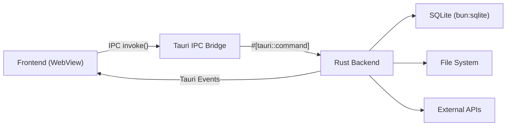

# Novel IDE 接口设计文档

> 基于 Tauri 2 IPC 架构的完整 API 参考文档。所有接口为 Rust `#[tauri::command]` 函数，通过 IPC 暴露给前端。
>
> 生成日期：2026-07-08
> 技术栈：Rust 1.90+ / Tauri 2 / SQLite (bun:sqlite)

---

## 1. 概述

### 1.1 Tauri 2 IPC 架构

Novel IDE 采用 Tauri 2 桌面应用架构，前后端通过 IPC（进程间通信）交互：



**核心机制**：
- 前端通过 `invoke("command_name", { args })` 调用 Rust 函数
- Rust 函数使用 `#[tauri::command]` 标注，自动序列化/反序列化参数和返回值
- 后端向前端推送实时事件使用 `app.emit("event_name", payload)`
- 前端通过 `listen("event_name", callback)` 监听事件

### 1.2 Command 注册模式

```rust
// src-tauri/src/main.rs
#[cfg_attr(mobile, tauri::mobile_entry_point)]
pub fn run() {
    tauri::Builder::default()
        .invoke_handler(tauri::generate_handler![
            // 项目管理
            create_project,
            open_project,
            close_project,
            // ... 其他 commands
        ])
        .run(tauri::generate_context!())
        .expect("error while running tauri application");
}
```

### 1.3 统一错误处理

所有 command 返回 `Result<T, AppError>`，`AppError` 实现 `Serialize`：

```rust
#[derive(Debug, Serialize)]
pub struct AppError {
    pub code: u32,
    pub message: String,
    pub module: String,
}

impl Serialize for AppError {
    fn serialize<S>(&self, serializer: S) -> Result<S::Ok, S::Error> {
        let mut state = serializer.serialize_struct("AppError", 3)?;
        state.serialize_field("code", &self.code)?;
        state.serialize_field("message", &self.message)?;
        state.serialize_field("module", &self.module)?;
        state.end()
    }
}
```

前端接收到的错误响应格式：

```json
{
  "error": {
    "code": 10001,
    "message": "项目不存在",
    "module": "project"
  }
}
```

### 1.4 事件系统（实时更新）

Tauri 2 支持后端向前端推送事件：

```rust
// 后端发射事件
app.emit("draft:streaming", StreamPayload { content: chunk })?;

// 前端监听事件
import { listen } from '@tauri-apps/api/event';
const unlisten = await listen('draft:streaming', (event) => {
  console.log(event.payload);
});
```

---

## 2. 接口清单（按模块分组）

### 2.1 项目管理模块 (Project Management)

| Command | 描述 | 流式 | 事件 |
|---------|------|------|------|
| `create_project` | 创建新项目 | 否 | — |
| `open_project` | 打开项目 | 否 | — |
| `close_project` | 关闭当前项目 | 否 | `project:closed` |
| `delete_project` | 删除项目 | 否 | — |
| `list_projects` | 列出所有项目 | 否 | — |
| `get_project_config` | 获取项目配置 | 否 | — |
| `update_project_config` | 更新项目配置 | 否 | `project:config:updated` |
| `import_novel` | 导入已有小说 | 否 | `import:progress` |
| `analyze_novel_style` | 分析小说写作风格 | 否 | — |

### 2.2 世界观模块 (World Building)

| Command | 描述 | 流式 | 事件 |
|---------|------|------|------|
| `create_world_element` | 创建世界观元素 | 否 | `world:element:created` |
| `update_world_element` | 更新世界观元素 | 否 | `world:element:updated` |
| `delete_world_element` | 删除世界观元素 | 否 | `world:element:deleted` |
| `list_world_elements` | 列出世界观元素 | 否 | — |
| `get_world_element_detail` | 获取元素详情 | 否 | — |
| `create_world_relation` | 创建元素关联 | 否 | — |
| `delete_world_relation` | 删除元素关联 | 否 | — |

### 2.3 角色管理模块 (Character Management)

| Command | 描述 | 流式 | 事件 |
|---------|------|------|------|
| `create_character` | 创建角色 | 否 | `character:created` |
| `update_character` | 更新角色 | 否 | `character:updated` |
| `delete_character` | 删除角色 | 否 | `character:deleted` |
| `list_characters` | 列出所有角色 | 否 | — |
| `get_character_detail` | 获取角色详情 | 否 | — |
| `get_character_states` | 获取角色状态变化 | 否 | — |
| `create_character_relation` | 创建角色关系 | 否 | `character:relation:created` |
| `delete_character_relation` | 删除角色关系 | 否 | `character:relation:deleted` |
| `get_character_graph` | 获取角色关系图 | 否 | — |

### 2.4 故事架构模块 (Story Architecture)

| Command | 描述 | 流式 | 事件 |
|---------|------|------|------|
| `create_story_premise` | 创建故事前提 | 否 | `story:premise:created` |
| `update_story_premise` | 更新故事前提 | 否 | `story:premise:updated` |
| `create_plot_outline` | 创建剧情大纲 | 否 | `plot:outline:created` |
| `update_plot_outline` | 更新剧情大纲 | 否 | `plot:outline:updated` |
| `delete_plot_outline` | 删除剧情大纲 | 否 | `plot:outline:deleted` |
| `list_plot_outlines` | 列出所有大纲 | 否 | — |
| `create_chapter_blueprint` | 创建章节蓝图 | 否 | `chapter:blueprint:created` |
| `update_chapter_blueprint` | 更新章节蓝图 | 否 | `chapter:blueprint:updated` |
| `delete_chapter_blueprint` | 删除章节蓝图 | 否 | `chapter:blueprint:deleted` |

### 2.5 编辑器模块 (Editor)

| Command | 描述 | 流式 | 事件 |
|---------|------|------|------|
| `open_chapter` | 打开章节 | 否 | — |
| `save_chapter` | 保存章节 | 否 | `chapter:saved` |
| `get_chapter_content` | 获取章节内容 | 否 | — |
| `get_chapter_versions` | 获取章节版本历史 | 否 | — |
| `restore_chapter_version` | 恢复章节版本 | 否 | `chapter:restored` |

### 2.6 AI 写作模块 (AI Writing)

| Command | 描述 | 流式 | 事件 |
|---------|------|------|------|
| `generate_draft` | 生成草稿 | 是 | `draft:streaming` |
| `generate_outline` | 生成大纲 | 是 | `outline:streaming` |
| `rewrite_chapter` | 重写章节 | 是 | `rewrite:streaming` |
| `refine_chapter` | 润色章节 | 是 | `refine:streaming` |
| `review_chapter` | 审阅章节 | 否 | `review:progress` |
| `apply_review_fixes` | 应用审阅修改 | 否 | — |

### 2.7 知识库模块 (Knowledge Base / RAG)

| Command | 描述 | 流式 | 事件 |
|---------|------|------|------|
| `import_knowledge` | 导入知识库 | 否 | `knowledge:import:progress` |
| `delete_knowledge` | 删除知识条目 | 否 | — |
| `search_knowledge_vector` | 向量搜索 | 否 | — |
| `search_knowledge_fts` | 全文搜索 | 否 | — |
| `search_knowledge_hybrid` | 混合搜索 | 否 | — |
| `get_knowledge_stats` | 获取知识库统计 | 否 | — |

### 2.8 Agent 模块

| Command | 描述 | 流式 | 事件 |
|---------|------|------|------|
| `list_agents` | 列出所有 Agent | 否 | — |
| `get_agent_config` | 获取 Agent 配置 | 否 | — |
| `update_agent_config` | 更新 Agent 配置 | 否 | — |
| `execute_agent_task` | 执行 Agent 任务 | 是 | `agent:task:streaming` |

### 2.9 Skill 模块

| Command | 描述 | 流式 | 事件 |
|---------|------|------|------|
| `list_skills` | 列出所有 Skill | 否 | — |
| `get_skill_config` | 获取 Skill 配置 | 否 | — |
| `enable_skill` | 启用 Skill | 否 | — |
| `disable_skill` | 禁用 Skill | 否 | — |
| `install_skill` | 安装 Skill | 否 | `skill:install:progress` |
| `uninstall_skill` | 卸载 Skill | 否 | — |

### 2.10 Hook 模块

| Command | 描述 | 流式 | 事件 |
|---------|------|------|------|
| `list_hooks` | 列出所有 Hook | 否 | — |
| `enable_hook` | 启用 Hook | 否 | — |
| `disable_hook` | 禁用 Hook | 否 | — |
| `get_hook_logs` | 获取 Hook 日志 | 否 | — |

### 2.11 Prompt 模块

| Command | 描述 | 流式 | 事件 |
|---------|------|------|------|
| `list_prompts` | 列出所有 Prompt | 否 | — |
| `get_prompt` | 获取 Prompt 内容 | 否 | — |
| `create_prompt` | 创建 Prompt | 否 | — |
| `update_prompt` | 更新 Prompt | 否 | — |
| `delete_prompt` | 删除 Prompt | 否 | — |
| `get_prompt_chain` | 获取 Prompt 链（继承关系） | 否 | — |

### 2.12 模型管理模块

| Command | 描述 | 流式 | 事件 |
|---------|------|------|------|
| `list_model_providers` | 列出模型提供商 | 否 | — |
| `add_model_provider` | 添加模型提供商 | 否 | — |
| `update_model_provider` | 更新模型提供商 | 否 | — |
| `delete_model_provider` | 删除模型提供商 | 否 | — |
| `test_model_connection` | 测试模型连接 | 否 | — |
| `set_default_model` | 设置默认模型 | 否 | — |
| `list_models` | 列出可用模型 | 否 | — |
| `update_model_config` | 更新模型配置 | 否 | — |

### 2.13 MCP 模块

| Command | 描述 | 流式 | 事件 |
|---------|------|------|------|
| `list_mcp_servers` | 列出 MCP 服务器 | 否 | — |
| `add_mcp_server` | 添加 MCP 服务器 | 否 | — |
| `update_mcp_server` | 更新 MCP 服务器 | 否 | — |
| `delete_mcp_server` | 删除 MCP 服务器 | 否 | — |
| `start_mcp_server` | 启动 MCP 服务器 | 否 | `mcp:server:started` |
| `stop_mcp_server` | 停止 MCP 服务器 | 否 | `mcp:server:stopped` |
| `get_mcp_server_logs` | 获取服务器日志 | 否 | — |
| `get_mcp_tools` | 获取 MCP 工具列表 | 否 | — |

### 2.14 工作流模块

| Command | 描述 | 流式 | 事件 |
|---------|------|------|------|
| `list_workflows` | 列出所有工作流 | 否 | — |
| `get_workflow` | 获取工作流详情 | 否 | — |
| `create_workflow` | 创建工作流 | 否 | — |
| `update_workflow` | 更新工作流 | 否 | — |
| `execute_workflow` | 执行工作流 | 否 | `workflow:step:completed` |
| `get_workflow_status` | 获取工作流状态 | 否 | — |
| `cancel_workflow` | 取消工作流 | 否 | `workflow:cancelled` |
| `retry_workflow_step` | 重试工作流步骤 | 否 | — |

### 2.15 导出模块

| Command | 描述 | 流式 | 事件 |
|---------|------|------|------|
| `export_chapter` | 导出章节 | 否 | `export:progress` |
| `export_project` | 导出整个项目 | 否 | `export:progress` |
| `get_export_formats` | 获取支持的导出格式 | 否 | — |
| `get_export_history` | 获取导出历史 | 否 | — |

### 2.16 设置模块

| Command | 描述 | 流式 | 事件 |
|---------|------|------|------|
| `get_settings` | 获取全局设置 | 否 | — |
| `update_settings` | 更新全局设置 | 否 | `settings:updated` |
| `get_theme` | 获取主题配置 | 否 | — |
| `set_theme` | 设置主题 | 否 | `theme:changed` |
| `get_shortcuts` | 获取快捷键配置 | 否 | — |
| `update_shortcuts` | 更新快捷键配置 | 否 | — |

### 2.17 云端同步模块

| Command | 描述 | 流式 | 事件 |
|---------|------|------|------|
| `list_cloud_sync_configs` | 获取所有云端同步配置 | 否 | — |
| `add_cloud_sync_config` | 添加云端同步配置 | 否 | — |
| `update_cloud_sync_config` | 更新云端同步配置 | 否 | — |
| `delete_cloud_sync_config` | 删除云端同步配置 | 否 | — |
| `test_cloud_sync_connection` | 测试云端连接 | 否 | — |
| `sync_to_cloud` | 同步到云端 | 否 | `sync:progress` |
| `sync_from_cloud` | 从云端同步 | 否 | `sync:progress` |
| `get_sync_history` | 获取同步历史 | 否 | — |
| `resolve_sync_conflict` | 解决同步冲突 | 否 | — |

### 2.18 文字校对模块

| Command | 描述 | 流式 | 事件 |
|---------|------|------|------|
| `proofread_chapter` | 校对章节（流式） | 是 | `proofread:streaming` |
| `get_proofread_results` | 获取章节校对结果 | 否 | — |
| `get_proofread_errors` | 获取校对错误列表 | 否 | — |
| `resolve_proofread_error` | 修复单个错误 | 否 | — |
| `batch_resolve_errors` | 批量修复错误 | 否 | — |
| `ignore_proofread_error` | 忽略误报 | 否 | — |
| `get_proofread_stats` | 获取校对统计 | 否 | — |

### 2.19 配置备份模块

| Command | 描述 | 流式 | 事件 |
|---------|------|------|------|
| `create_backup` | 创建配置备份 | 否 | — |
| `list_backups` | 获取备份列表 | 否 | — |
| `restore_backup` | 恢复备份 | 否 | — |
| `delete_backup` | 删除备份 | 否 | — |
| `export_backup_file` | 导出备份文件 | 否 | — |
| `import_backup_file` | 导入备份文件 | 否 | — |

### 2.20 项目导入导出模块

| Command | 描述 | 流式 | 事件 |
|---------|------|------|------|
| `export_project_package` | 导出项目包（ZIP） | 否 | `export:progress` |
| `import_project_package` | 导入项目包 | 否 | `import:progress` |
| `validate_project_package` | 校验项目包完整性 | 否 | — |

### 2.21 Token 计划模块

| Command | 描述 | 流式 | 事件 |
|---------|------|------|------|
| `list_token_plans` | 获取所有 Token 计划 | 否 | — |
| `add_token_plan` | 添加 Token 计划 | 否 | — |
| `update_token_plan` | 更新 Token 计划 | 否 | — |
| `delete_token_plan` | 删除 Token 计划 | 否 | — |
| `get_token_usage_stats` | 获取 Token 用量统计 | 否 | — |

---

## 3. 接口详细设计

### 3.0 通用约定

#### 通用请求/响应格式

**成功响应**：

```json
{
  "success": true,
  "data": { ... }
}
```

**失败响应**：

```json
{
  "success": false,
  "error": {
    "code": 10001,
    "message": "项目不存在",
    "module": "project"
  }
}
```

#### 流式响应

AI 写作模块的流式命令通过 Tauri Events 推送数据块：

```rust
#[tauri::command]
async fn generate_draft(
    app: AppHandle,
    chapter_id: i64,
    prompt: String,
) -> Result<(), AppError> {
    let mut stream = ai_service::generate(&prompt).await;
    while let Some(chunk) = stream.next().await {
        app.emit("draft:streaming", StreamPayload {
            chapter_id,
            content: chunk,
            done: false,
        })?;
    }
    app.emit("draft:streaming", StreamPayload {
        chapter_id,
        content: String::new(),
        done: true,
    })?;
    Ok(())
}
```

---

### 3.1 项目管理模块

#### 3.1.1 create_project

**函数签名**：

```rust
#[tauri::command]
async fn create_project(
    name: String,
    author: Option<String>,
    genre: Option<String>,
    description: Option<String>,
) -> Result<Project, AppError>
```

**参数**：

| 参数 | 类型 | 必填 | 说明 |
|------|------|------|------|
| name | String | 是 | 项目名称，1-100 字符 |
| author | Option\<String\> | 否 | 作者名 |
| genre | Option\<String\> | 否 | 小说类型（玄幻、都市、科幻等） |
| description | Option\<String\> | 否 | 项目描述，≤ 500 字符 |

**返回类型**：

```rust
pub struct Project {
    pub id: i64,
    pub name: String,
    pub author: Option<String>,
    pub genre: Option<String>,
    pub description: Option<String>,
    pub created_at: String,
    pub updated_at: String,
}
```

**示例（前端 TypeScript）**：

```typescript
import { invoke } from '@tauri-apps/api/core';

const project = await invoke<Project>('create_project', {
  name: '我的第一本小说',
  author: '笔名',
  genre: '玄幻',
  description: '一个关于穿越的故事',
});
```

**错误码**：

| code | message | 触发条件 |
|------|---------|---------|
| 10001 | 项目名称已存在 | name 重复 |
| 10002 | 参数校验失败 | name 为空或超长 |

**副作用**：

- 创建项目目录：`~/.novel-ide/projects/{project_id}/`
- 创建 SQLite 数据库文件：`project.db`
- 初始化默认配置

---

#### 3.1.2 open_project

**函数签名**：

```rust
#[tauri::command]
async fn open_project(project_id: i64) -> Result<Project, AppError>
```

**参数**：

| 参数 | 类型 | 必填 | 说明 |
|------|------|------|------|
| project_id | i64 | 是 | 项目 ID |

**返回类型**：`Project`

**副作用**：

- 将项目标记为"已打开"状态
- 加载项目配置到内存

---

#### 3.1.3 close_project

**函数签名**：

```rust
#[tauri::command]
async fn close_project() -> Result<(), AppError>
```

**参数**：无

**副作用**：

- 保存所有未保存的更改
- 释放项目资源
- 发射事件 `project:closed`

---

#### 3.1.4 delete_project

**函数签名**：

```rust
#[tauri::command]
async fn delete_project(project_id: i64, delete_files: Option<bool>) -> Result<(), AppError>
```

**参数**：

| 参数 | 类型 | 必填 | 说明 |
|------|------|------|------|
| project_id | i64 | 是 | 项目 ID |
| delete_files | Option\<bool\> | 否 | 是否删除项目文件，默认 false（仅删除数据库记录） |

**副作用**：

- 删除项目数据库记录
- 若 `delete_files=true`，删除项目目录

---

#### 3.1.5 list_projects

**函数签名**：

```rust
#[tauri::command]
async fn list_projects() -> Result<Vec<Project>, AppError>
```

**参数**：无

**返回类型**：`Vec<Project>` 项目列表

---

#### 3.1.6 get_project_config

**函数签名**：

```rust
#[tauri::command]
async fn get_project_config(project_id: i64) -> Result<ProjectConfig, AppError>
```

**返回类型**：

```rust
pub struct ProjectConfig {
    pub ai_model: Option<String>,
    pub auto_save_interval: u32,
    pub word_count_target: Option<u32>,
    pub custom_settings: serde_json::Value,
}
```

---

#### 3.1.7 update_project_config

**函数签名**：

```rust
#[tauri::command]
async fn update_project_config(
    project_id: i64,
    config: ProjectConfig,
) -> Result<ProjectConfig, AppError>
```

**副作用**：

- 更新项目配置
- 发射事件 `project:config:updated`

---

#### 3.1.8 import_novel

**函数签名**：

```rust
#[tauri::command]
async fn import_novel(
    file_path: String,
    project_name: Option<String>,
) -> Result<Project, AppError>
```

**参数**：

| 参数 | 类型 | 必填 | 说明 |
|------|------|------|------|
| file_path | String | 是 | 小说文件路径（支持 .txt, .docx） |
| project_name | Option\<String\> | 否 | 项目名称，默认使用文件名 |

**副作用**：

- 解析文件内容
- 自动拆分章节
- 发射事件 `import:progress` 推送进度

---

#### 3.1.9 analyze_novel_style

**函数签名**：

```rust
#[tauri::command]
async fn analyze_novel_style(
    project_id: i64,
    sample_chapters: Option<Vec<i64>>,
) -> Result<StyleAnalysis, AppError>
```

**返回类型**：

```rust
pub struct StyleAnalysis {
    pub avg_sentence_length: f64,
    pub vocabulary_richness: f64,
    pub narrative_perspective: String,
    pub dialogue_ratio: f64,
    pub pacing_scores: Vec<f64>,
    pub style_tags: Vec<String>,
}
```

---

### 3.2 世界观模块

#### 3.2.1 create_world_element

**函数签名**：

```rust
#[tauri::command]
async fn create_world_element(
    element_type: WorldElementType,
    name: String,
    description: Option<String>,
    attributes: Option<serde_json::Value>,
) -> Result<WorldElement, AppError>
```

**参数**：

| 参数 | 类型 | 必填 | 说明 |
|------|------|------|------|
| element_type | WorldElementType | 是 | 枚举：Location, Organization, Item, MagicSystem, Technology, Culture, Event |
| name | String | 是 | 元素名称 |
| description | Option\<String\> | 否 | 元素描述 |
| attributes | Option\<serde_json::Value\> | 否 | 自定义属性（JSON） |

**返回类型**：

```rust
pub struct WorldElement {
    pub id: i64,
    pub element_type: WorldElementType,
    pub name: String,
    pub description: Option<String>,
    pub attributes: serde_json::Value,
    pub created_at: String,
    pub updated_at: String,
}
```

**副作用**：

- 发射事件 `world:element:created`

---

#### 3.2.2 update_world_element

**函数签名**：

```rust
#[tauri::command]
async fn update_world_element(
    element_id: i64,
    name: Option<String>,
    description: Option<String>,
    attributes: Option<serde_json::Value>,
) -> Result<WorldElement, AppError>
```

**副作用**：

- 发射事件 `world:element:updated`

---

#### 3.2.3 delete_world_element

**函数签名**：

```rust
#[tauri::command]
async fn delete_world_element(element_id: i64) -> Result<(), AppError>
```

**副作用**：

- 删除元素及其所有关联关系
- 发射事件 `world:element:deleted`

---

#### 3.2.4 list_world_elements

**函数签名**：

```rust
#[tauri::command]
async fn list_world_elements(
    element_type: Option<WorldElementType>,
    keyword: Option<String>,
) -> Result<Vec<WorldElement>, AppError>
```

**参数**：

| 参数 | 类型 | 必填 | 说明 |
|------|------|------|------|
| element_type | Option\<WorldElementType\> | 否 | 按类型筛选 |
| keyword | Option\<String\> | 否 | 按名称搜索 |

---

#### 3.2.5 get_world_element_detail

**函数签名**：

```rust
#[tauri::command]
async fn get_world_element_detail(element_id: i64) -> Result<WorldElementDetail, AppError>
```

**返回类型**：

```rust
pub struct WorldElementDetail {
    pub element: WorldElement,
    pub relations: Vec<WorldRelation>,
    pub related_characters: Vec<Character>,
}
```

---

#### 3.2.6 create_world_relation

**函数签名**：

```rust
#[tauri::command]
async fn create_world_relation(
    source_id: i64,
    target_id: i64,
    relation_type: String,
    description: Option<String>,
) -> Result<WorldRelation, AppError>
```

**参数**：

| 参数 | 类型 | 必填 | 说明 |
|------|------|------|------|
| source_id | i64 | 是 | 源元素 ID |
| target_id | i64 | 是 | 目标元素 ID |
| relation_type | String | 是 | 关系类型（located_in, belongs_to, controls 等） |
| description | Option\<String\> | 否 | 关系描述 |

---

#### 3.2.7 delete_world_relation

**函数签名**：

```rust
#[tauri::command]
async fn delete_world_relation(relation_id: i64) -> Result<(), AppError>
```

---

### 3.3 角色管理模块

#### 3.3.1 create_character

**函数签名**：

```rust
#[tauri::command]
async fn create_character(
    name: String,
    alias: Option<Vec<String>>,
    age: Option<i32>,
    gender: Option<String>,
    role: CharacterRole,
    backstory: Option<String>,
    personality: Option<String>,
    appearance: Option<String>,
    motivation: Option<String>,
    custom_fields: Option<serde_json::Value>,
) -> Result<Character, AppError>
```

**参数**：

| 参数 | 类型 | 必填 | 说明 |
|------|------|------|------|
| name | String | 是 | 角色名称 |
| alias | Option\<Vec\<String\>\> | 否 | 别名列表 |
| age | Option\<i32\> | 否 | 年龄 |
| gender | Option\<String\> | 否 | 性别 |
| role | CharacterRole | 是 | 角色定位：Protagonist, Antagonist, Supporting, Minor |
| backstory | Option\<String\> | 否 | 背景故事 |
| personality | Option\<String\> | 否 | 性格描述 |
| appearance | Option\<String\> | 否 | 外貌描述 |
| motivation | Option\<String\> | 否 | 动机与目标 |
| custom_fields | Option\<serde_json::Value\> | 否 | 自定义字段 |

**返回类型**：

```rust
pub struct Character {
    pub id: i64,
    pub name: String,
    pub alias: Vec<String>,
    pub age: Option<i32>,
    pub gender: Option<String>,
    pub role: CharacterRole,
    pub backstory: Option<String>,
    pub personality: Option<String>,
    pub appearance: Option<String>,
    pub motivation: Option<String>,
    pub custom_fields: serde_json::Value,
    pub created_at: String,
    pub updated_at: String,
}
```

**副作用**：

- 发射事件 `character:created`

---

#### 3.3.2 update_character

**函数签名**：

```rust
#[tauri::command]
async fn update_character(
    character_id: i64,
    name: Option<String>,
    alias: Option<Vec<String>>,
    age: Option<i32>,
    gender: Option<String>,
    role: Option<CharacterRole>,
    backstory: Option<String>,
    personality: Option<String>,
    appearance: Option<String>,
    motivation: Option<String>,
    custom_fields: Option<serde_json::Value>,
) -> Result<Character, AppError>
```

**副作用**：

- 发射事件 `character:updated`

---

#### 3.3.3 delete_character

**函数签名**：

```rust
#[tauri::command]
async fn delete_character(character_id: i64) -> Result<(), AppError>
```

**副作用**：

- 删除角色及其所有关系
- 发射事件 `character:deleted`

---

#### 3.3.4 list_characters

**函数签名**：

```rust
#[tauri::command]
async fn list_characters(
    role: Option<CharacterRole>,
    keyword: Option<String>,
) -> Result<Vec<Character>, AppError>
```

---

#### 3.3.5 get_character_detail

**函数签名**：

```rust
#[tauri::command]
async fn get_character_detail(character_id: i64) -> Result<CharacterDetail, AppError>
```

**返回类型**：

```rust
pub struct CharacterDetail {
    pub character: Character,
    pub relations: Vec<CharacterRelation>,
    pub appearances: Vec<ChapterAppearance>,
    pub state_history: Vec<CharacterState>,
}
```

---

#### 3.3.6 get_character_states

**函数签名**：

```rust
#[tauri::command]
async fn get_character_states(
    character_id: i64,
    chapter_range: Option<(i64, i64)>,
) -> Result<Vec<CharacterState>, AppError>
```

**返回类型**：

```rust
pub struct CharacterState {
    pub id: i64,
    pub chapter_id: i64,
    pub emotional_state: Option<String>,
    pub physical_state: Option<String>,
    pub location: Option<String>,
    pub notes: Option<String>,
    pub created_at: String,
}
```

---

#### 3.3.7 create_character_relation

**函数签名**：

```rust
#[tauri::command]
async fn create_character_relation(
    source_id: i64,
    target_id: i64,
    relation_type: String,
    description: Option<String>,
) -> Result<CharacterRelation, AppError>
```

**参数**：

| 参数 | 类型 | 必填 | 说明 |
|------|------|------|------|
| source_id | i64 | 是 | 角色 A 的 ID |
| target_id | i64 | 是 | 角色 B 的 ID |
| relation_type | String | 是 | 关系类型（friend, enemy, lover, family 等） |
| description | Option\<String\> | 否 | 关系描述 |

**副作用**：

- 发射事件 `character:relation:created`

---

#### 3.3.8 delete_character_relation

**函数签名**：

```rust
#[tauri::command]
async fn delete_character_relation(relation_id: i64) -> Result<(), AppError>
```

---

#### 3.3.9 get_character_graph

**函数签名**：

```rust
#[tauri::command]
async fn get_character_graph() -> Result<CharacterGraph, AppError>
```

**返回类型**：

```rust
pub struct CharacterGraph {
    pub nodes: Vec<GraphNode>,
    pub edges: Vec<GraphEdge>,
}

pub struct GraphNode {
    pub id: i64,
    pub label: String,
    pub role: CharacterRole,
    pub group: Option<String>,
}

pub struct GraphEdge {
    pub source: i64,
    pub target: i64,
    pub label: String,
    pub weight: f64,
}
```

---

### 3.4 故事架构模块

#### 3.4.1 create_story_premise

**函数签名**：

```rust
#[tauri::command]
async fn create_story_premise(
    title: String,
    logline: String,
    theme: Option<String>,
    target_audience: Option<String>,
    tone: Option<String>,
    genre: Option<String>,
    setting: Option<String>,
    conflict: Option<String>,
    stakes: Option<String>,
) -> Result<StoryPremise, AppError>
```

**参数**：

| 参数 | 类型 | 必填 | 说明 |
|------|------|------|------|
| title | String | 是 | 故事标题 |
| logline | String | 是 | 一句话故事梗概（≤ 200 字符） |
| theme | Option\<String\> | 否 | 主题 |
| target_audience | Option\<String\> | 否 | 目标读者 |
| tone | Option\<String\> | 否 | 故事基调 |
| genre | Option\<String\> | 否 | 类型 |
| setting | Option\<String\> | 否 | 时空背景 |
| conflict | Option\<String\> | 否 | 核心冲突 |
| stakes | Option\<String\> | 否 | 利害关系 |

**返回类型**：

```rust
pub struct StoryPremise {
    pub id: i64,
    pub title: String,
    pub logline: String,
    pub theme: Option<String>,
    pub target_audience: Option<String>,
    pub tone: Option<String>,
    pub genre: Option<String>,
    pub setting: Option<String>,
    pub conflict: Option<String>,
    pub stakes: Option<String>,
    pub created_at: String,
    pub updated_at: String,
}
```

**副作用**：

- 发射事件 `story:premise:created`

---

#### 3.4.2 update_story_premise

**函数签名**：

```rust
#[tauri::command]
async fn update_story_premise(
    premise_id: i64,
    title: Option<String>,
    logline: Option<String>,
    theme: Option<String>,
    target_audience: Option<String>,
    tone: Option<String>,
    genre: Option<String>,
    setting: Option<String>,
    conflict: Option<String>,
    stakes: Option<String>,
) -> Result<StoryPremise, AppError>
```

---

#### 3.4.3 create_plot_outline

**函数签名**：

```rust
#[tauri::command]
async fn create_plot_outline(
    title: String,
    outline_type: PlotOutlineType,
    content: String,
    parent_id: Option<i64>,
    sort_order: Option<i32>,
) -> Result<PlotOutline, AppError>
```

**参数**：

| 参数 | 类型 | 必填 | 说明 |
|------|------|------|------|
| title | String | 是 | 大纲标题 |
| outline_type | PlotOutlineType | 是 | 枚举：Act, Arc, Scene, Beat |
| content | String | 是 | 大纲内容 |
| parent_id | Option\<i64\> | 否 | 父级大纲 ID（支持嵌套） |
| sort_order | Option\<i32\> | 否 | 排序序号 |

**返回类型**：

```rust
pub struct PlotOutline {
    pub id: i64,
    pub title: String,
    pub outline_type: PlotOutlineType,
    pub content: String,
    pub parent_id: Option<i64>,
    pub sort_order: i32,
    pub created_at: String,
    pub updated_at: String,
}
```

**副作用**：

- 发射事件 `plot:outline:created`

---

#### 3.4.4 update_plot_outline

**函数签名**：

```rust
#[tauri::command]
async fn update_plot_outline(
    outline_id: i64,
    title: Option<String>,
    content: Option<String>,
    sort_order: Option<i32>,
) -> Result<PlotOutline, AppError>
```

---

#### 3.4.5 delete_plot_outline

**函数签名**：

```rust
#[tauri::command]
async fn delete_plot_outline(outline_id: i64) -> Result<(), AppError>
```

---

#### 3.4.6 list_plot_outlines

**函数签名**：

```rust
#[tauri::command]
async fn list_plot_outlines(
    outline_type: Option<PlotOutlineType>,
) -> Result<Vec<PlotOutline>, AppError>
```

---

#### 3.4.7 create_chapter_blueprint

**函数签名**：

```rust
#[tauri::command]
async fn create_chapter_blueprint(
    chapter_number: i32,
    title: Option<String>,
    pov_character: Option<i64>,
    location: Option<i64>,
    time_period: Option<String>,
    summary: Option<String>,
    key_events: Option<Vec<String>>,
    emotional_arc: Option<String>,
    word_count_target: Option<u32>,
) -> Result<ChapterBlueprint, AppError>
```

**参数**：

| 参数 | 类型 | 必填 | 说明 |
|------|------|------|------|
| chapter_number | i32 | 是 | 章节序号 |
| title | Option\<String\> | 否 | 章节标题 |
| pov_character | Option\<i64\> | 否 | 视角角色 ID |
| location | Option\<i64\> | 否 | 主要场景 ID |
| time_period | Option\<String\> | 否 | 时间段 |
| summary | Option\<String\> | 否 | 章节概要 |
| key_events | Option\<Vec\<String\>\> | 否 | 关键事件列表 |
| emotional_arc | Option\<String\> | 否 | 情感弧线 |
| word_count_target | Option\<u32\> | 否 | 目标字数 |

**返回类型**：

```rust
pub struct ChapterBlueprint {
    pub id: i64,
    pub chapter_number: i32,
    pub title: Option<String>,
    pub pov_character: Option<i64>,
    pub location: Option<i64>,
    pub time_period: Option<String>,
    pub summary: Option<String>,
    pub key_events: Vec<String>,
    pub emotional_arc: Option<String>,
    pub word_count_target: Option<u32>,
    pub created_at: String,
    pub updated_at: String,
}
```

**副作用**：

- 发射事件 `chapter:blueprint:created`

---

#### 3.4.8 update_chapter_blueprint

**函数签名**：

```rust
#[tauri::command]
async fn update_chapter_blueprint(
    blueprint_id: i64,
    title: Option<String>,
    pov_character: Option<i64>,
    location: Option<i64>,
    time_period: Option<String>,
    summary: Option<String>,
    key_events: Option<Vec<String>>,
    emotional_arc: Option<String>,
    word_count_target: Option<u32>,
) -> Result<ChapterBlueprint, AppError>
```

---

#### 3.4.9 delete_chapter_blueprint

**函数签名**：

```rust
#[tauri::command]
async fn delete_chapter_blueprint(blueprint_id: i64) -> Result<(), AppError>
```

---

### 3.5 编辑器模块

#### 3.5.1 open_chapter

**函数签名**：

```rust
#[tauri::command]
async fn open_chapter(chapter_id: i64) -> Result<ChapterContent, AppError>
```

**返回类型**：

```rust
pub struct ChapterContent {
    pub id: i64,
    pub title: Option<String>,
    pub content: String,
    pub word_count: u32,
    pub created_at: String,
    pub updated_at: String,
}
```

---

#### 3.5.2 save_chapter

**函数签名**：

```rust
#[tauri::command]
async fn save_chapter(
    chapter_id: i64,
    content: String,
    create_version: Option<bool>,
) -> Result<ChapterContent, AppError>
```

**参数**：

| 参数 | 类型 | 必填 | 说明 |
|------|------|------|------|
| chapter_id | i64 | 是 | 章节 ID |
| content | String | 是 | 章节内容 |
| create_version | Option\<bool\> | 否 | 是否创建版本快照，默认 true |

**副作用**：

- 保存章节内容到数据库
- 若 `create_version=true`，创建版本快照
- 发射事件 `chapter:saved`

---

#### 3.5.3 get_chapter_content

**函数签名**：

```rust
#[tauri::command]
async fn get_chapter_content(chapter_id: i64) -> Result<ChapterContent, AppError>
```

---

#### 3.5.4 get_chapter_versions

**函数签名**：

```rust
#[tauri::command]
async fn get_chapter_versions(chapter_id: i64) -> Result<Vec<ChapterVersion>, AppError>
```

**返回类型**：

```rust
pub struct ChapterVersion {
    pub id: i64,
    pub chapter_id: i64,
    pub version_number: i32,
    pub content: String,
    pub word_count: u32,
    pub created_at: String,
    pub label: Option<String>,
}
```

---

#### 3.5.5 restore_chapter_version

**函数签名**：

```rust
#[tauri::command]
async fn restore_chapter_version(
    chapter_id: i64,
    version_id: i64,
) -> Result<ChapterContent, AppError>
```

**副作用**：

- 恢复章节到指定版本
- 创建新版本快照（标记为"恢复自版本 X"）
- 发射事件 `chapter:restored`

---

### 3.6 AI 写作模块

#### 3.6.1 generate_draft（流式）

**函数签名**：

```rust
#[tauri::command]
async fn generate_draft(
    app: AppHandle,
    chapter_id: i64,
    blueprint_id: Option<i64>,
    prompt: String,
    max_tokens: Option<u32>,
    temperature: Option<f32>,
) -> Result<(), AppError>
```

**参数**：

| 参数 | 类型 | 必填 | 说明 |
|------|------|------|------|
| app | AppHandle | 自动 | Tauri 应用句柄 |
| chapter_id | i64 | 是 | 章节 ID |
| blueprint_id | Option\<i64\> | 否 | 章节蓝图 ID（提供时作为参考） |
| prompt | String | 是 | 写作提示词 |
| max_tokens | Option\<u32\> | 否 | 最大生成 token 数，默认 4096 |
| temperature | Option\<f32\> | 否 | 温度参数，默认 0.8 |

**流式事件**：

```rust
// 事件名：draft:streaming
pub struct StreamPayload {
    pub chapter_id: i64,
    pub content: String,      // 当前 chunk
    pub done: bool,           // 是否完成
    pub tokens_used: Option<u32>,  // 已用 token（完成时）
}
```

**前端监听**：

```typescript
import { listen } from '@tauri-apps/api/event';

const unlisten = await listen<{ chapter_id: number; content: string; done: boolean }>(
  'draft:streaming',
  (event) => {
    if (event.payload.done) {
      // 生成完成
    } else {
      // 追加内容到编辑器
      appendToEditor(event.payload.content);
    }
  }
);
```

**错误码**：

| code | message | 触发条件 |
|------|---------|---------|
| 30001 | AI 模型未配置 | 未设置默认模型 |
| 30002 | 模型连接失败 | API 调用超时或失败 |
| 30003 | Token 超限 | 请求超出模型限制 |

**副作用**：

- 调用外部 AI API
- 发射 `draft:streaming` 事件

---

#### 3.6.2 generate_outline（流式）

**函数签名**：

```rust
#[tauri::command]
async fn generate_outline(
    app: AppHandle,
    premise_id: Option<i64>,
    prompt: String,
    chapter_count: Option<u32>,
    max_tokens: Option<u32>,
    temperature: Option<f32>,
) -> Result<(), AppError>
```

**流式事件**：

```rust
// 事件名：outline:streaming
pub struct OutlineStreamPayload {
    pub content: String,
    pub done: bool,
    pub outline_type: Option<String>, // "act", "chapter", "scene"
}
```

---

#### 3.6.3 rewrite_chapter（流式）

**函数签名**：

```rust
#[tauri::command]
async fn rewrite_chapter(
    app: AppHandle,
    chapter_id: i64,
    instruction: String,
    preserve_style: Option<bool>,
    max_tokens: Option<u32>,
) -> Result<(), AppError>
```

**参数**：

| 参数 | 类型 | 必填 | 说明 |
|------|------|------|------|
| chapter_id | i64 | 是 | 章节 ID |
| instruction | String | 是 | 重写指令（如"增加紧张感"、"简化对话"） |
| preserve_style | Option\<bool\> | 否 | 是否保留原风格，默认 true |

**流式事件**：

```rust
// 事件名：rewrite:streaming
pub struct RewriteStreamPayload {
    pub chapter_id: i64,
    pub content: String,
    pub done: bool,
    pub original_content: Option<String>, // 完成时返回原文对比
}
```

---

#### 3.6.4 refine_chapter（流式）

**函数签名**：

```rust
#[tauri::command]
async fn refine_chapter(
    app: AppHandle,
    chapter_id: i64,
    refine_type: RefineType,
    max_tokens: Option<u32>,
) -> Result<(), AppError>
```

**参数**：

| 参数 | 类型 | 必填 | 说明 |
|------|------|------|------|
| chapter_id | i64 | 是 | 章节 ID |
| refine_type | RefineType | 是 | 枚举：Polish, Grammar, Style, Flow, Dialogue |

**流式事件**：

```rust
// 事件名：refine:streaming
pub struct RefineStreamPayload {
    pub chapter_id: i64,
    pub content: String,
    pub done: bool,
    pub changes_summary: Option<String>, // 完成时返回修改摘要
}
```

---

#### 3.6.5 review_chapter

**函数签名**：

```rust
#[tauri::command]
async fn review_chapter(
    chapter_id: i64,
    review_aspects: Option<Vec<ReviewAspect>>,
) -> Result<ReviewResult, AppError>
```

**参数**：

| 参数 | 类型 | 必填 | 说明 |
|------|------|------|------|
| chapter_id | i64 | 是 | 章节 ID |
| review_aspects | Option\<Vec\<ReviewAspect\>\> | 否 | 审阅维度，默认全部 |

**返回类型**：

```rust
pub struct ReviewResult {
    pub overall_score: f64,
    pub aspects: Vec<ReviewAspectResult>,
    pub suggestions: Vec<ReviewSuggestion>,
    pub auto_fixes: Vec<AutoFix>,
}

pub struct ReviewAspectResult {
    pub aspect: ReviewAspect,
    pub score: f64,
    pub feedback: String,
}

pub struct ReviewSuggestion {
    pub location: String, // "paragraph:3" 或 "line:42"
    pub issue: String,
    pub suggestion: String,
    pub severity: Severity, // Info, Warning, Error
}

pub struct AutoFix {
    pub id: String,
    pub description: String,
    pub old_text: String,
    pub new_text: String,
}
```

**副作用**：

- 发射事件 `review:progress` 推送审阅进度

---

#### 3.6.6 apply_review_fixes

**函数签名**：

```rust
#[tauri::command]
async fn apply_review_fixes(
    chapter_id: i64,
    fix_ids: Vec<String>,
) -> Result<ChapterContent, AppError>
```

**副作用**：

- 应用选定的自动修复
- 保存修改后的章节

---

### 3.7 知识库模块

#### 3.7.1 import_knowledge

**函数签名**：

```rust
#[tauri::command]
async fn import_knowledge(
    file_paths: Vec<String>,
    category: Option<String>,
    tags: Option<Vec<String>>,
) -> Result<Vec<KnowledgeEntry>, AppError>
```

**参数**：

| 参数 | 类型 | 必填 | 说明 |
|------|------|------|------|
| file_paths | Vec\<String\> | 是 | 文件路径列表 |
| category | Option\<String\> | 否 | 知识分类 |
| tags | Option\<Vec\<String\>\> | 否 | 标签列表 |

**返回类型**：

```rust
pub struct KnowledgeEntry {
    pub id: i64,
    pub file_path: String,
    pub title: String,
    pub category: Option<String>,
    pub tags: Vec<String>,
    pub chunk_count: u32,
    pub imported_at: String,
}
```

**副作用**：

- 解析文件内容
- 分块并生成向量嵌入
- 发射事件 `knowledge:import:progress` 推送进度

---

#### 3.7.2 delete_knowledge

**函数签名**：

```rust
#[tauri::command]
async fn delete_knowledge(entry_id: i64) -> Result<(), AppError>
```

---

#### 3.7.3 search_knowledge_vector

**函数签名**：

```rust
#[tauri::command]
async fn search_knowledge_vector(
    query: String,
    top_k: Option<u32>,
    category: Option<String>,
) -> Result<Vec<KnowledgeSearchResult>, AppError>
```

**参数**：

| 参数 | 类型 | 必填 | 说明 |
|------|------|------|------|
| query | String | 是 | 搜索查询 |
| top_k | Option\<u32\> | 否 | 返回结果数，默认 10 |
| category | Option\<String\> | 否 | 限定分类 |

**返回类型**：

```rust
pub struct KnowledgeSearchResult {
    pub entry_id: i64,
    pub chunk_id: u32,
    pub content: String,
    pub score: f64,
    pub metadata: serde_json::Value,
}
```

---

#### 3.7.4 search_knowledge_fts

**函数签名**：

```rust
#[tauri::command]
async fn search_knowledge_fts(
    query: String,
    limit: Option<u32>,
) -> Result<Vec<KnowledgeSearchResult>, AppError>
```

---

#### 3.7.5 search_knowledge_hybrid

**函数签名**：

```rust
#[tauri::command]
async fn search_knowledge_hybrid(
    query: String,
    top_k: Option<u32>,
    vector_weight: Option<f64>,
    fts_weight: Option<f64>,
) -> Result<Vec<KnowledgeSearchResult>, AppError>
```

**参数**：

| 参数 | 类型 | 必填 | 说明 |
|------|------|------|------|
| query | String | 是 | 搜索查询 |
| top_k | Option\<u32\> | 否 | 返回结果数，默认 10 |
| vector_weight | Option\<f64\> | 否 | 向量搜索权重，默认 0.7 |
| fts_weight | Option\<f64\> | 否 | 全文搜索权重，默认 0.3 |

---

#### 3.7.6 get_knowledge_stats

**函数签名**：

```rust
#[tauri::command]
async fn get_knowledge_stats() -> Result<KnowledgeStats, AppError>
```

**返回类型**：

```rust
pub struct KnowledgeStats {
    pub total_entries: u32,
    pub total_chunks: u32,
    pub total_size_bytes: u64,
    pub categories: Vec<CategoryStats>,
}

pub struct CategoryStats {
    pub name: String,
    pub count: u32,
    pub total_chunks: u32,
}
```

---

### 3.8 Agent 模块

#### 3.8.1 list_agents

**函数签名**：

```rust
#[tauri::command]
async fn list_agents() -> Result<Vec<AgentConfig>, AppError>
```

**返回类型**：

```rust
pub struct AgentConfig {
    pub id: String,
    pub name: String,
    pub description: Option<String>,
    pub enabled: bool,
    pub model: Option<String>,
    pub system_prompt: String,
    pub tools: Vec<String>,
    pub created_at: String,
    pub updated_at: String,
}
```

---

#### 3.8.2 get_agent_config

**函数签名**：

```rust
#[tauri::command]
async fn get_agent_config(agent_id: String) -> Result<AgentConfig, AppError>
```

---

#### 3.8.3 update_agent_config

**函数签名**：

```rust
#[tauri::command]
async fn update_agent_config(
    agent_id: String,
    config: AgentUpdateConfig,
) -> Result<AgentConfig, AppError>
```

**参数**：

```rust
pub struct AgentUpdateConfig {
    pub name: Option<String>,
    pub description: Option<String>,
    pub enabled: Option<bool>,
    pub model: Option<String>,
    pub system_prompt: Option<String>,
    pub tools: Option<Vec<String>>,
}
```

---

#### 3.8.4 execute_agent_task（流式）

**函数签名**：

```rust
#[tauri::command]
async fn execute_agent_task(
    app: AppHandle,
    agent_id: String,
    task: String,
    context: Option<serde_json::Value>,
) -> Result<(), AppError>
```

**流式事件**：

```rust
// 事件名：agent:task:streaming
pub struct AgentTaskStreamPayload {
    pub agent_id: String,
    pub content: String,
    pub done: bool,
    pub tool_calls: Option<Vec<ToolCall>>,
    pub result: Option<serde_json::Value>, // 完成时
}

pub struct ToolCall {
    pub tool_name: String,
    pub arguments: serde_json::Value,
    pub result: Option<serde_json::Value>,
}
```

---

### 3.9 Skill 模块

#### 3.9.1 list_skills

**函数签名**：

```rust
#[tauri::command]
async fn list_skills() -> Result<Vec<SkillConfig>, AppError>
```

**返回类型**：

```rust
pub struct SkillConfig {
    pub id: String,
    pub name: String,
    pub description: Option<String>,
    pub enabled: bool,
    pub version: String,
    pub author: Option<String>,
    pub triggers: Vec<String>,
    pub created_at: String,
    pub updated_at: String,
}
```

---

#### 3.9.2 get_skill_config

**函数签名**：

```rust
#[tauri::command]
async fn get_skill_config(skill_id: String) -> Result<SkillConfig, AppError>
```

---

#### 3.9.3 enable_skill

**函数签名**：

```rust
#[tauri::command]
async fn enable_skill(skill_id: String) -> Result<SkillConfig, AppError>
```

---

#### 3.9.4 disable_skill

**函数签名**：

```rust
#[tauri::command]
async fn disable_skill(skill_id: String) -> Result<SkillConfig, AppError>
```

---

#### 3.9.5 install_skill（带进度）

**函数签名**：

```rust
#[tauri::command]
async fn install_skill(
    app: AppHandle,
    skill_source: SkillSource,
) -> Result<SkillConfig, AppError>
```

**参数**：

```rust
pub enum SkillSource {
    Local { path: String },
    Remote { url: String },
    Registry { skill_id: String, version: Option<String> },
}
```

**副作用**：

- 下载并安装 Skill
- 发射事件 `skill:install:progress` 推送安装进度

---

#### 3.9.6 uninstall_skill

**函数签名**：

```rust
#[tauri::command]
async fn uninstall_skill(skill_id: String) -> Result<(), AppError>
```

---

### 3.10 Hook 模块

#### 3.10.1 list_hooks

**函数签名**：

```rust
#[tauri::command]
async fn list_hooks() -> Result<Vec<HookConfig>, AppError>
```

**返回类型**：

```rust
pub struct HookConfig {
    pub id: String,
    pub name: String,
    pub description: Option<String>,
    pub enabled: bool,
    pub trigger_event: String,
    pub action: HookAction,
    pub created_at: String,
    pub updated_at: String,
}

pub enum HookAction {
    RunCommand { command: String, args: Vec<String> },
    SendWebhook { url: String, method: String },
    ExecuteScript { script: String, language: String },
}
```

---

#### 3.10.2 enable_hook

**函数签名**：

```rust
#[tauri::command]
async fn enable_hook(hook_id: String) -> Result<HookConfig, AppError>
```

---

#### 3.10.3 disable_hook

**函数签名**：

```rust
#[tauri::command]
async fn disable_hook(hook_id: String) -> Result<HookConfig, AppError>
```

---

#### 3.10.4 get_hook_logs

**函数签名**：

```rust
#[tauri::command]
async fn get_hook_logs(
    hook_id: Option<String>,
    limit: Option<u32>,
    offset: Option<u32>,
) -> Result<Vec<HookLog>, AppError>
```

**返回类型**：

```rust
pub struct HookLog {
    pub id: i64,
    pub hook_id: String,
    pub trigger_event: String,
    pub status: HookLogStatus, // Success, Failed, Skipped
    pub result: Option<serde_json::Value>,
    pub error: Option<String>,
    pub executed_at: String,
    pub duration_ms: u64,
}
```

---

### 3.11 Prompt 模块

#### 3.11.1 list_prompts

**函数签名**：

```rust
#[tauri::command]
async fn list_prompts(
    category: Option<String>,
) -> Result<Vec<Prompt>, AppError>
```

**返回类型**：

```rust
pub struct Prompt {
    pub id: String,
    pub name: String,
    pub category: String,
    pub content: String,
    pub variables: Vec<PromptVariable>,
    pub parent_id: Option<String>, // 继承的父 prompt
    pub created_at: String,
    pub updated_at: String,
}

pub struct PromptVariable {
    pub name: String,
    pub description: String,
    pub default_value: Option<String>,
    pub required: bool,
}
```

---

#### 3.11.2 get_prompt

**函数签名**：

```rust
#[tauri::command]
async fn get_prompt(prompt_id: String) -> Result<Prompt, AppError>
```

---

#### 3.11.3 create_prompt

**函数签名**：

```rust
#[tauri::command]
async fn create_prompt(
    name: String,
    category: String,
    content: String,
    variables: Option<Vec<PromptVariable>>,
    parent_id: Option<String>,
) -> Result<Prompt, AppError>
```

---

#### 3.11.4 update_prompt

**函数签名**：

```rust
#[tauri::command]
async fn update_prompt(
    prompt_id: String,
    name: Option<String>,
    category: Option<String>,
    content: Option<String>,
    variables: Option<Vec<PromptVariable>>,
) -> Result<Prompt, AppError>
```

---

#### 3.11.5 delete_prompt

**函数签名**：

```rust
#[tauri::command]
async fn delete_prompt(prompt_id: String) -> Result<(), AppError>
```

---

#### 3.11.6 get_prompt_chain

**函数签名**：

```rust
#[tauri::command]
async fn get_prompt_chain(prompt_id: String) -> Result<PromptChain, AppError>
```

**返回类型**：

```rust
pub struct PromptChain {
    pub prompts: Vec<Prompt>,
    pub inheritance_path: Vec<String>, // 从根到当前的继承路径
    pub resolved_content: String,      // 合并后最终内容
}
```

---

### 3.12 模型管理模块

#### 3.12.1 list_model_providers

**函数签名**：

```rust
#[tauri::command]
async fn list_model_providers() -> Result<Vec<ModelProvider>, AppError>
```

**返回类型**：

```rust
pub struct ModelProvider {
    pub id: String,
    pub name: String,
    pub provider_type: ProviderType, // OpenAI, Anthropic, Ollama, Custom
    pub api_base: String,
    pub api_key_masked: Option<String>, // 脱敏显示
    pub enabled: bool,
    pub created_at: String,
    pub updated_at: String,
}

pub enum ProviderType {
    OpenAI,
    Anthropic,
    Ollama,
    Custom,
}
```

---

#### 3.12.2 add_model_provider

**函数签名**：

```rust
#[tauri::command]
async fn add_model_provider(
    name: String,
    provider_type: ProviderType,
    api_base: String,
    api_key: Option<String>,
    enabled: Option<bool>,
) -> Result<ModelProvider, AppError>
```

**副作用**：

- API Key 加密存储

---

#### 3.12.3 update_model_provider

**函数签名**：

```rust
#[tauri::command]
async fn update_model_provider(
    provider_id: String,
    name: Option<String>,
    api_base: Option<String>,
    api_key: Option<String>,
    enabled: Option<bool>,
) -> Result<ModelProvider, AppError>
```

---

#### 3.12.4 delete_model_provider

**函数签名**：

```rust
#[tauri::command]
async fn delete_model_provider(provider_id: String) -> Result<(), AppError>
```

---

#### 3.12.5 test_model_connection

**函数签名**：

```rust
#[tauri::command]
async fn test_model_connection(
    provider_id: String,
    model_name: Option<String>,
) -> Result<ConnectionTestResult, AppError>
```

**返回类型**：

```rust
pub struct ConnectionTestResult {
    pub success: bool,
    pub latency_ms: u64,
    pub model: Option<String>,
    pub error: Option<String>,
}
```

---

#### 3.12.6 set_default_model

**函数签名**：

```rust
#[tauri::command]
async fn set_default_model(
    provider_id: String,
    model_name: String,
) -> Result<(), AppError>
```

---

#### 3.12.7 list_models

**函数签名**：

```rust
#[tauri::command]
async fn list_models(
    provider_id: Option<String>,
) -> Result<Vec<ModelConfig>, AppError>
```

**返回类型**：

```rust
pub struct ModelConfig {
    pub id: String,
    pub provider_id: String,
    pub name: String,
    pub display_name: String,
    pub max_tokens: u32,
    pub supports_streaming: bool,
    pub supports_tools: bool,
    pub cost_per_1k_input: Option<f64>,
    pub cost_per_1k_output: Option<f64>,
    pub is_default: bool,
}
```

---

#### 3.12.8 update_model_config

**函数签名**：

```rust
#[tauri::command]
async fn update_model_config(
    model_id: String,
    max_tokens: Option<u32>,
    temperature: Option<f32>,
    top_p: Option<f32>,
    custom_params: Option<serde_json::Value>,
) -> Result<ModelConfig, AppError>
```

---

### 3.13 MCP 模块

#### 3.13.1 list_mcp_servers

**函数签名**：

```rust
#[tauri::command]
async fn list_mcp_servers() -> Result<Vec<McpServer>, AppError>
```

**返回类型**：

```rust
pub struct McpServer {
    pub id: String,
    pub name: String,
    pub server_type: McpServerType, // Stdio, SSE, StreamableHttp
    pub command: Option<String>,
    pub args: Option<Vec<String>>,
    pub url: Option<String>,
    pub env: Option<HashMap<String, String>>,
    pub enabled: bool,
    pub status: McpServerStatus, // Running, Stopped, Error
    pub created_at: String,
    pub updated_at: String,
}

pub enum McpServerType {
    Stdio,
    SSE,
    StreamableHttp,
}

pub enum McpServerStatus {
    Running,
    Stopped,
    Error,
}
```

---

#### 3.13.2 add_mcp_server

**函数签名**：

```rust
#[tauri::command]
async fn add_mcp_server(
    name: String,
    server_type: McpServerType,
    command: Option<String>,
    args: Option<Vec<String>>,
    url: Option<String>,
    env: Option<HashMap<String, String>>,
    enabled: Option<bool>,
) -> Result<McpServer, AppError>
```

---

#### 3.13.3 update_mcp_server

**函数签名**：

```rust
#[tauri::command]
async fn update_mcp_server(
    server_id: String,
    name: Option<String>,
    command: Option<String>,
    args: Option<Vec<String>>,
    url: Option<String>,
    env: Option<HashMap<String, String>>,
    enabled: Option<bool>,
) -> Result<McpServer, AppError>
```

---

#### 3.13.4 delete_mcp_server

**函数签名**：

```rust
#[tauri::command]
async fn delete_mcp_server(server_id: String) -> Result<(), AppError>
```

---

#### 3.13.5 start_mcp_server

**函数签名**：

```rust
#[tauri::command]
async fn start_mcp_server(server_id: String) -> Result<McpServer, AppError>
```

**副作用**：

- 启动 MCP 服务器进程
- 发射事件 `mcp:server:started`

---

#### 3.13.6 stop_mcp_server

**函数签名**：

```rust
#[tauri::command]
async fn stop_mcp_server(server_id: String) -> Result<McpServer, AppError>
```

**副作用**：

- 停止 MCP 服务器进程
- 发射事件 `mcp:server:stopped`

---

#### 3.13.7 get_mcp_server_logs

**函数签名**：

```rust
#[tauri::command]
async fn get_mcp_server_logs(
    server_id: String,
    limit: Option<u32>,
    level: Option<String>,
) -> Result<Vec<McpLogEntry>, AppError>
```

**返回类型**：

```rust
pub struct McpLogEntry {
    pub timestamp: String,
    pub level: String,
    pub message: String,
    pub source: String,
}
```

---

#### 3.13.8 get_mcp_tools

**函数签名**：

```rust
#[tauri::command]
async fn get_mcp_tools(server_id: Option<String>) -> Result<Vec<McpTool>, AppError>
```

**返回类型**：

```rust
pub struct McpTool {
    pub server_id: String,
    pub name: String,
    pub description: Option<String>,
    pub input_schema: serde_json::Value,
}
```

---

### 3.14 工作流模块

#### 3.14.1 list_workflows

**函数签名**：

```rust
#[tauri::command]
async fn list_workflows() -> Result<Vec<Workflow>, AppError>
```

**返回类型**：

```rust
pub struct Workflow {
    pub id: String,
    pub name: String,
    pub description: Option<String>,
    pub steps: Vec<WorkflowStep>,
    pub enabled: bool,
    pub created_at: String,
    pub updated_at: String,
}

pub struct WorkflowStep {
    pub id: String,
    pub name: String,
    pub step_type: StepType,
    pub config: serde_json::Value,
    pub depends_on: Vec<String>,
}

pub enum StepType {
    AiGenerate,
    AiReview,
    AiRefine,
    UserApproval,
    Export,
    Custom,
}
```

---

#### 3.14.2 get_workflow

**函数签名**：

```rust
#[tauri::command]
async fn get_workflow(workflow_id: String) -> Result<Workflow, AppError>
```

---

#### 3.14.3 create_workflow

**函数签名**：

```rust
#[tauri::command]
async fn create_workflow(
    name: String,
    description: Option<String>,
    steps: Vec<WorkflowStep>,
) -> Result<Workflow, AppError>
```

---

#### 3.14.4 update_workflow

**函数签名**：

```rust
#[tauri::command]
async fn update_workflow(
    workflow_id: String,
    name: Option<String>,
    description: Option<String>,
    steps: Option<Vec<WorkflowStep>>,
    enabled: Option<bool>,
) -> Result<Workflow, AppError>
```

---

#### 3.14.5 execute_workflow

**函数签名**：

```rust
#[tauri::command]
async fn execute_workflow(
    app: AppHandle,
    workflow_id: String,
    input: serde_json::Value,
) -> Result<WorkflowExecution, AppError>
```

**返回类型**：

```rust
pub struct WorkflowExecution {
    pub execution_id: String,
    pub workflow_id: String,
    pub status: ExecutionStatus,
    pub started_at: String,
}

pub enum ExecutionStatus {
    Running,
    Completed,
    Failed,
    Cancelled,
}
```

**副作用**：

- 发射事件 `workflow:step:completed` 每完成一步

---

#### 3.14.6 get_workflow_status

**函数签名**：

```rust
#[tauri::command]
async fn get_workflow_status(execution_id: String) -> Result<WorkflowExecutionStatus, AppError>
```

**返回类型**：

```rust
pub struct WorkflowExecutionStatus {
    pub execution_id: String,
    pub workflow_id: String,
    pub status: ExecutionStatus,
    pub current_step: Option<String>,
    pub completed_steps: Vec<String>,
    pub failed_step: Option<String>,
    pub error: Option<String>,
    pub started_at: String,
    pub completed_at: Option<String>,
}
```

---

#### 3.14.7 cancel_workflow

**函数签名**：

```rust
#[tauri::command]
async fn cancel_workflow(execution_id: String) -> Result<(), AppError>
```

**副作用**：

- 发射事件 `workflow:cancelled`

---

#### 3.14.8 retry_workflow_step

**函数签名**：

```rust
#[tauri::command]
async fn retry_workflow_step(
    app: AppHandle,
    execution_id: String,
    step_id: String,
) -> Result<(), AppError>
```

---

### 3.15 导出模块

#### 3.15.1 export_chapter

**函数签名**：

```rust
#[tauri::command]
async fn export_chapter(
    chapter_id: i64,
    format: ExportFormat,
    output_path: Option<String>,
) -> Result<ExportResult, AppError>
```

**参数**：

| 参数 | 类型 | 必填 | 说明 |
|------|------|------|------|
| chapter_id | i64 | 是 | 章节 ID |
| format | ExportFormat | 是 | 枚举：Txt, Docx, Html, Markdown, Epub, Pdf |
| output_path | Option\<String\> | 否 | 输出路径，默认为项目导出目录 |

**返回类型**：

```rust
pub struct ExportResult {
    pub file_path: String,
    pub file_size: u64,
    pub format: ExportFormat,
    pub exported_at: String,
}
```

**副作用**：

- 发射事件 `export:progress` 推送导出进度

---

#### 3.15.2 export_project

**函数签名**：

```rust
#[tauri::command]
async fn export_project(
    format: ExportFormat,
    include_chapters: Option<Vec<i64>>,
    output_path: Option<String>,
) -> Result<ExportResult, AppError>
```

---

#### 3.15.3 get_export_formats

**函数签名**：

```rust
#[tauri::command]
async fn get_export_formats() -> Result<Vec<ExportFormatInfo>, AppError>
```

**返回类型**：

```rust
pub struct ExportFormatInfo {
    pub format: ExportFormat,
    pub name: String,
    pub extension: String,
    pub supports_chapter: bool,
    pub supports_project: bool,
}
```

---

#### 3.15.4 get_export_history

**函数签名**：

```rust
#[tauri::command]
async fn get_export_history(
    limit: Option<u32>,
) -> Result<Vec<ExportHistoryEntry>, AppError>
```

**返回类型**：

```rust
pub struct ExportHistoryEntry {
    pub id: i64,
    pub export_type: String, // "chapter" or "project"
    pub target_id: i64,
    pub format: ExportFormat,
    pub file_path: String,
    pub file_size: u64,
    pub exported_at: String,
}
```

---

### 3.16 设置模块

#### 3.16.1 get_settings

**函数签名**：

```rust
#[tauri::command]
async fn get_settings() -> Result<AppSettings, AppError>
```

**返回类型**：

```rust
pub struct AppSettings {
    pub general: GeneralSettings,
    pub editor: EditorSettings,
    pub ai: AiSettings,
    pub export: ExportSettings,
}

pub struct GeneralSettings {
    pub language: String,
    pub auto_save: bool,
    pub auto_save_interval: u32,
    pub check_updates: bool,
}

pub struct EditorSettings {
    pub font_family: String,
    pub font_size: u32,
    pub line_height: f64,
    pub show_word_count: bool,
    pub enable_spell_check: bool,
    pub auto_indent: bool,
}

pub struct AiSettings {
    pub default_provider: Option<String>,
    pub default_model: Option<String>,
    pub stream_response: bool,
    pub max_tokens: u32,
    pub temperature: f32,
}

pub struct ExportSettings {
    pub default_format: ExportFormat,
    pub output_directory: Option<String>,
    pub include_metadata: bool,
}
```

---

#### 3.16.2 update_settings

**函数签名**：

```rust
#[tauri::command]
async fn update_settings(settings: AppSettings) -> Result<AppSettings, AppError>
```

**副作用**：

- 保存设置到配置文件
- 发射事件 `settings:updated`

---

#### 3.16.3 get_theme

**函数签名**：

```rust
#[tauri::command]
async fn get_theme() -> Result<Theme, AppError>
```

**返回类型**：

```rust
pub struct Theme {
    pub name: String,
    pub mode: ThemeMode, // Light, Dark, System
    pub accent_color: String,
    pub custom_css: Option<String>,
}

pub enum ThemeMode {
    Light,
    Dark,
    System,
}
```

---

#### 3.16.4 set_theme

**函数签名**：

```rust
#[tauri::command]
async fn set_theme(theme: Theme) -> Result<Theme, AppError>
```

**副作用**：

- 发射事件 `theme:changed` 立即生效

---

#### 3.16.5 get_shortcuts

**函数签名**：

```rust
#[tauri::command]
async fn get_shortcuts() -> Result<HashMap<String, String>, AppError>
```

**返回类型**：快捷键映射 `Action -> Shortcut`

示例：

```json
{
  "save": "Ctrl+S",
  "undo": "Ctrl+Z",
  "redo": "Ctrl+Shift+Z",
  "new_chapter": "Ctrl+N",
  "toggle_preview": "Ctrl+P"
}
```

---

#### 3.16.6 update_shortcuts

**函数签名**：

```rust
#[tauri::command]
async fn update_shortcuts(shortcuts: HashMap<String, String>) -> Result<HashMap<String, String>, AppError>
```

**副作用**：

- 保存快捷键配置
- 重新注册全局快捷键

---

## 4. Tauri Events（实时事件）

### 4.1 事件清单

| 事件名 | 触发时机 | Payload 类型 | 说明 |
|--------|---------|-------------|------|
| `draft:streaming` | AI 生成草稿时 | `StreamPayload` | 流式推送生成内容 |
| `outline:streaming` | AI 生成大纲时 | `OutlineStreamPayload` | 流式推送大纲内容 |
| `rewrite:streaming` | AI 重写章节时 | `RewriteStreamPayload` | 流式推送重写内容 |
| `refine:streaming` | AI 润色章节时 | `RefineStreamPayload` | 流式推送润色内容 |
| `review:progress` | AI 审阅进度 | `ReviewProgressPayload` | 审阅进度百分比 |
| `agent:task:streaming` | Agent 执行任务时 | `AgentTaskStreamPayload` | Agent 任务流式输出 |
| `import:progress` | 导入小说进度 | `ProgressPayload` | 导入进度百分比 |
| `knowledge:import:progress` | 知识库导入进度 | `ProgressPayload` | 导入进度百分比 |
| `skill:install:progress` | Skill 安装进度 | `ProgressPayload` | 安装进度百分比 |
| `export:progress` | 导出进度 | `ProgressPayload` | 导出进度百分比 |
| `workflow:step:completed` | 工作流步骤完成 | `WorkflowStepPayload` | 步骤完成通知 |
| `workflow:cancelled` | 工作流取消 | `WorkflowCancelPayload` | 工作流取消通知 |
| `project:closed` | 项目关闭 | — | 项目关闭通知 |
| `project:config:updated` | 项目配置更新 | `ProjectConfig` | 配置更新通知 |
| `chapter:saved` | 章节保存 | `ChapterContent` | 章节保存通知 |
| `chapter:restored` | 章节恢复 | `ChapterContent` | 章节恢复通知 |
| `character:created` | 角色创建 | `Character` | 角色创建通知 |
| `character:updated` | 角色更新 | `Character` | 角色更新通知 |
| `character:deleted` | 角色删除 | — | 角色删除通知 |
| `character:relation:created` | 角色关系创建 | `CharacterRelation` | 关系创建通知 |
| `character:relation:deleted` | 角色关系删除 | — | 关系删除通知 |
| `world:element:created` | 世界观元素创建 | `WorldElement` | 元素创建通知 |
| `world:element:updated` | 世界观元素更新 | `WorldElement` | 元素更新通知 |
| `world:element:deleted` | 世界观元素删除 | — | 元素删除通知 |
| `story:premise:created` | 故事前提创建 | `StoryPremise` | 前提创建通知 |
| `story:premise:updated` | 故事前提更新 | `StoryPremise` | 前提更新通知 |
| `plot:outline:created` | 剧情大纲创建 | `PlotOutline` | 大纲创建通知 |
| `plot:outline:updated` | 剧情大纲更新 | `PlotOutline` | 大纲更新通知 |
| `plot:outline:deleted` | 剧情大纲删除 | — | 大纲删除通知 |
| `chapter:blueprint:created` | 章节蓝图创建 | `ChapterBlueprint` | 蓝图创建通知 |
| `chapter:blueprint:updated` | 章节蓝图更新 | `ChapterBlueprint` | 蓝图更新通知 |
| `chapter:blueprint:deleted` | 章节蓝图删除 | — | 蓝图删除通知 |
| `mcp:server:started` | MCP 服务器启动 | `McpServer` | 服务器启动通知 |
| `mcp:server:stopped` | MCP 服务器停止 | `McpServer` | 服务器停止通知 |
| `settings:updated` | 全局设置更新 | `AppSettings` | 设置更新通知 |
| `theme:changed` | 主题切换 | `Theme` | 主题切换通知 |
| `hook:executed` | Hook 执行 | `HookLog` | Hook 执行通知 |

### 4.2 事件 Payload 定义

```rust
#[derive(Serialize)]
pub struct StreamPayload {
    pub chapter_id: i64,
    pub content: String,
    pub done: bool,
    pub tokens_used: Option<u32>,
}

#[derive(Serialize)]
pub struct OutlineStreamPayload {
    pub content: String,
    pub done: bool,
    pub outline_type: Option<String>,
}

#[derive(Serialize)]
pub struct RewriteStreamPayload {
    pub chapter_id: i64,
    pub content: String,
    pub done: bool,
    pub original_content: Option<String>,
}

#[derive(Serialize)]
pub struct RefineStreamPayload {
    pub chapter_id: i64,
    pub content: String,
    pub done: bool,
    pub changes_summary: Option<String>,
}

#[derive(Serialize)]
pub struct ReviewProgressPayload {
    pub chapter_id: i64,
    pub progress: f64,
    pub current_aspect: Option<String>,
}

#[derive(Serialize)]
pub struct AgentTaskStreamPayload {
    pub agent_id: String,
    pub content: String,
    pub done: bool,
    pub tool_calls: Option<Vec<ToolCall>>,
    pub result: Option<serde_json::Value>,
}

#[derive(Serialize)]
pub struct ProgressPayload {
    pub progress: f64,
    pub message: Option<String>,
}

#[derive(Serialize)]
pub struct WorkflowStepPayload {
    pub execution_id: String,
    pub step_id: String,
    pub step_name: String,
    pub status: ExecutionStatus,
}

#[derive(Serialize)]
pub struct WorkflowCancelPayload {
    pub execution_id: String,
    pub reason: Option<String>,
}
```

---

## 5. 错误码设计

### 5.1 统一错误码格式

错误码采用 5 位数字编码，按模块分段：

```
[模块前缀 2 位][行内序号 3 位]
```

| 模块 | 前缀 | 范围 |
|------|------|------|
| 项目管理 | 10 | 10000 - 10999 |
| 世界观 | 11 | 11000 - 11999 |
| 角色管理 | 12 | 12000 - 12999 |
| 故事架构 | 13 | 13000 - 13999 |
| 编辑器 | 14 | 14000 - 14999 |
| AI 写作 | 15 | 15000 - 15999 |
| 知识库 | 16 | 16000 - 16999 |
| Agent | 17 | 17000 - 17999 |
| Skill | 18 | 18000 - 18999 |
| Hook | 19 | 19000 - 19999 |
| Prompt | 20 | 20000 - 20999 |
| 模型管理 | 21 | 21000 - 21999 |
| MCP | 22 | 22000 - 22999 |
| 工作流 | 23 | 23000 - 23999 |
| 导出 | 24 | 24000 - 24999 |
| 设置 | 25 | 25000 - 25999 |
| 云端同步 | 26 | 26000 - 26999 |
| 文字校对 | 27 | 27000 - 27999 |
| 配置备份 | 28 | 28000 - 28999 |
| 项目导入导出 | 29 | 29000 - 29999 |
| Token 计划 | 30 | 30000 - 30999 |
| 通用 | 00 | 00000 - 00999 |

### 5.2 通用错误码

| code | message | 说明 |
|------|---------|------|
| 00001 | 参数校验失败 | 请求参数不符合校验规则 |
| 00002 | 资源不存在 | 请求的资源不存在 |
| 00003 | 资源已存在 | 创建时资源重复 |
| 00004 | 权限不足 | 无操作权限 |
| 00005 | 操作超时 | 操作执行超时 |
| 00006 | 内部错误 | 未预期的系统错误 |

### 5.3 项目管理错误码

| code | message | 说明 |
|------|---------|------|
| 10001 | 项目名称已存在 | 创建项目时名称重复 |
| 10002 | 项目不存在 | 操作的项目不存在 |
| 10003 | 项目已打开 | 尝试打开已打开的项目 |
| 10004 | 导入文件格式不支持 | 仅支持 .txt, .docx |
| 10005 | 导入文件解析失败 | 文件内容无法解析 |

### 5.4 世界观错误码

| code | message | 说明 |
|------|---------|------|
| 11001 | 元素名称已存在 | 同类型下名称重复 |
| 11002 | 元素不存在 | 操作的元素不存在 |
| 11003 | 关系类型无效 | 不支持的关系类型 |
| 11004 | 不能与自身建立关系 | 源和目标相同 |

### 5.5 角色管理错误码

| code | message | 说明 |
|------|---------|------|
| 12001 | 角色名称已存在 | 名称重复 |
| 12002 | 角色不存在 | 操作的角色不存在 |
| 12003 | 关系已存在 | 角色间已有该关系 |
| 12004 | 不能与自身建立关系 | 源和目标相同 |

### 5.6 故事架构错误码

| code | message | 说明 |
|------|---------|------|
| 13001 | 故事前提不存在 | 操作的前提不存在 |
| 13002 | 大纲不存在 | 操作的大纲不存在 |
| 13003 | 蓝图不存在 | 操作的蓝图不存在 |
| 13004 | 章节序号重复 | 同一项目下章节序号重复 |

### 5.7 编辑器错误码

| code | message | 说明 |
|------|---------|------|
| 14001 | 章节不存在 | 操作的章节不存在 |
| 14002 | 版本不存在 | 指定的版本不存在 |
| 14003 | 内容为空 | 保存的内容为空 |

### 5.8 AI 写作错误码

| code | message | 说明 |
|------|---------|------|
| 15001 | AI 模型未配置 | 未设置默认模型 |
| 15002 | 模型连接失败 | API 调用失败 |
| 15003 | Token 超限 | 请求超出模型限制 |
| 15004 | 生成超时 | AI 生成超时 |
| 15005 | 审阅失败 | AI 审阅执行失败 |

### 5.9 知识库错误码

| code | message | 说明 |
|------|---------|------|
| 16001 | 知识条目不存在 | 操作的条目不存在 |
| 16002 | 文件解析失败 | 无法解析导入的文件 |
| 16003 | 向量嵌入生成失败 | 嵌入模型调用失败 |

### 5.10 Agent 错误码

| code | message | 说明 |
|------|---------|------|
| 17001 | Agent 不存在 | 操作的 Agent 不存在 |
| 17002 | Agent 未启用 | Agent 已禁用 |
| 17003 | 工具不可用 | 请求的工具不存在或未启用 |

### 5.11 Skill 错误码

| code | message | 说明 |
|------|---------|------|
| 18001 | Skill 不存在 | 操作的 Skill 不存在 |
| 18002 | Skill 已安装 | 重复安装 |
| 18003 | Skill 安装失败 | 下载或解析失败 |

### 5.12 Hook 错误码

| code | message | 说明 |
|------|---------|------|
| 19001 | Hook 不存在 | 操作的 Hook 不存在 |
| 19002 | Hook 执行失败 | Hook 运行出错 |

### 5.13 Prompt 错误码

| code | message | 说明 |
|------|---------|------|
| 20001 | Prompt 不存在 | 操作的 Prompt 不存在 |
| 20002 | Prompt 名称已存在 | 同分类下名称重复 |
| 20003 | 父 Prompt 不存在 | 继承的父 Prompt 不存在 |

### 5.14 模型管理错误码

| code | message | 说明 |
|------|---------|------|
| 21001 | 提供商不存在 | 操作的提供商不存在 |
| 21002 | API Key 无效 | 验证失败 |
| 21003 | 模型不存在 | 请求的模型不存在 |
| 21004 | 连接测试失败 | API 连接失败 |

### 5.15 MCP 错误码

| code | message | 说明 |
|------|---------|------|
| 22001 | MCP 服务器不存在 | 操作的服务器不存在 |
| 22002 | 服务器启动失败 | 进程启动失败 |
| 22003 | 服务器未运行 | 操作需要服务器运行中 |

### 5.16 工作流错误码

| code | message | 说明 |
|------|---------|------|
| 23001 | 工作流不存在 | 操作的工作流不存在 |
| 23002 | 工作流执行不存在 | 操作的执行不存在 |
| 23003 | 步骤依赖未满足 | 前置步骤未完成 |
| 23004 | 工作流已取消 | 已取消的工作流无法操作 |

### 5.17 导出错误码

| code | message | 说明 |
|------|---------|------|
| 24001 | 导出格式不支持 | 不支持的导出格式 |
| 24002 | 导出目录不可写 | 无写入权限 |
| 24003 | 导出内容为空 | 无内容可导出 |

### 5.18 设置错误码

| code | message | 说明 |
|------|---------|------|
| 25001 | 设置保存失败 | 配置文件写入失败 |
| 25002 | 快捷键冲突 | 快捷键已被占用 |
| 25003 | 主题不存在 | 请求的主题不存在 |

### 5.19 云端同步错误码

| code | message | 说明 |
|------|---------|------|
| 26001 | 同步配置不存在 | 操作的配置不存在 |
| 26002 | 连接失败 | 无法连接到云端服务器 |
| 26003 | 认证失败 | Access Key 或密码错误 |
| 26004 | 存储空间不足 | 云端存储空间不足 |
| 26005 | 同步冲突 | 本地和云端版本冲突 |
| 26006 | 加密失败 | 同步数据加密失败 |
| 26007 | 解密失败 | 同步数据解密失败 |

### 5.20 文字校对错误码

| code | message | 说明 |
|------|---------|------|
| 27001 | 校对超时 | 校对执行超时 |
| 27002 | 校对结果不存在 | 操作的结果不存在 |
| 27003 | 错误不存在 | 操作的错误不存在 |
| 27004 | 文本过长 | 校对文本超出限制 |

### 5.21 配置备份错误码

| code | message | 说明 |
|------|---------|------|
| 28001 | 备份文件损坏 | 备份文件无法解析 |
| 28002 | 密码错误 | 解密密码错误 |
| 28003 | 版本不兼容 | 备份版本与当前不兼容 |
| 28004 | 备份不存在 | 操作的备份不存在 |

### 5.22 项目导入导出错误码

| code | message | 说明 |
|------|---------|------|
| 29001 | 项目包损坏 | ZIP 文件损坏 |
| 29002 | 数据库不完整 | 项目数据库缺失或损坏 |
| 29003 | 项目名称冲突 | 目标目录已存在同名项目 |
| 29004 | 加密失败 | 项目包加密失败 |

### 5.23 Token 计划错误码

| code | message | 说明 |
|------|---------|------|
| 30001 | Token 计划不存在 | 操作的计划不存在 |
| 30002 | Token 额度已用完 | 当前计划 Token 已耗尽 |
| 30003 | 费用超限 | 已超出费用上限 |

---

## 6. 自检清单

- [ ] 所有 `#[tauri::command]` 函数签名已定义
- [ ] 所有参数类型已标注（含 Option 和默认值）
- [ ] 所有返回类型已定义（含嵌套结构）
- [ ] 流式命令已标注事件名和 Payload 类型
- [ ] 错误码覆盖所有模块的异常场景
- [ ] 事件清单完整，包含事件名和 Payload 类型
- [ ] 前端调用示例已提供（TypeScript）
- [ ] 副作用已标注（DB 操作、文件 I/O、事件发射）
- [ ] 错误码不重复，按模块分段
