# 工作流设计文档

> Novel IDE 工作流系统完整设计。覆盖 AI 写作流水线、Agent 系统、Skills 系统、Hooks 系统、Prompt 继承系统、工作流可视化。

**生成日期**：2026-07-08
**关联文档**：[01-产品需求文档.md](01-产品需求文档.md) | [02-架构设计与开发指南.md](02-架构设计与开发指南.md) | [03-数据库设计.md](03-数据库设计.md)

---

## 1. AI 写作流水线

### 1.1 完整流水线总览


每个阶段的状态流转：

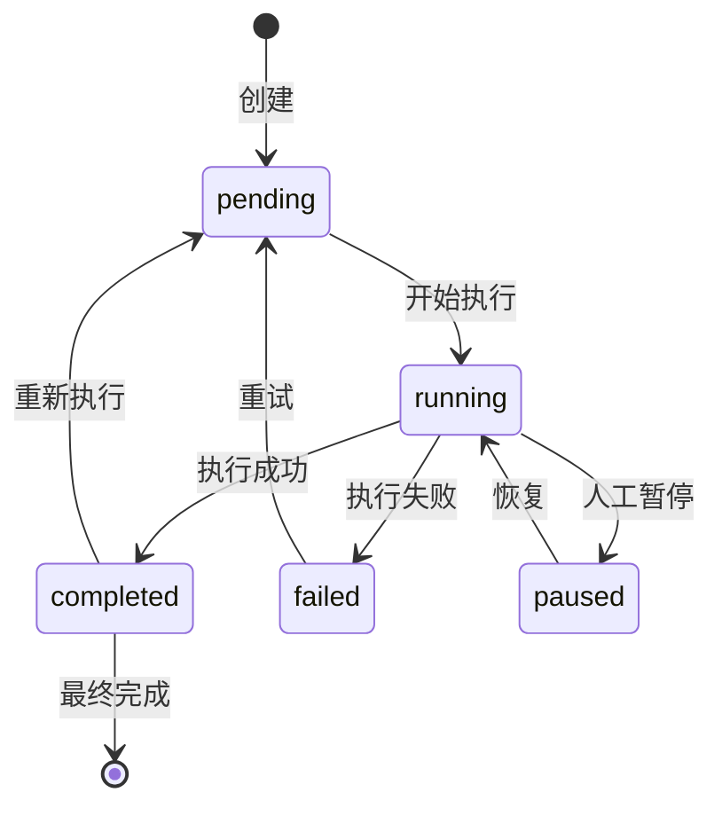

### 1.2 每个阶段详细设计

---

#### Stage 1: Idea（创作脑洞）

- **目的**：将用户的模糊创意转化为结构化的创作方向
- **输入**：用户自由文本描述（如"一个修仙世界，主角能吞噬他人修为"）
- **处理**：AI 提取核心概念、冲突设定、独特卖点，输出结构化创意卡片
- **输出**：创意卡片（含核心概念、冲突类型、独特卖点、目标受众推测）
- **Agent**：story-architect
- **Model**：高能力模型（Opus / GPT-4o）
- **重试/失败**：格式不合规自动重试 2 次，失败后允许用户手动编辑
- **状态转换**：`pending → running → completed/failed`

---

#### Stage 2: Story Premise（故事前提）

- **目的**：基于创意卡片生成完整的故事前提描述
- **输入**：创意卡片 + 项目配置（题材、视角、结构）
- **处理**：AI 生成 1-2 段故事前提，包含核心冲突、主角定位、世界观方向
- **输出**：故事前提文本（存入 `story_premises` 表）
- **Agent**：story-architect
- **Model**：高能力模型（Opus / GPT-4o）
- **重试/失败**：与配置约束冲突时自动检测并提示
- **状态转换**：`pending → running → completed/failed`
- **数据库写入**：`INSERT INTO story_premises (premise_type='premise', content=...)`

---

#### Stage 3: Character Graph（角色图谱）

- **目的**：基于故事前提生成核心角色和角色关系
- **输入**：故事前提 + 项目配置
- **处理**：AI 生成 5-20 个核心角色，自动拆解为角色卡，构建角色关系图谱
- **输出**：角色列表（含角色名、身份、性格、动机）+ 角色关系图谱
- **Agent**：character-designer
- **Model**：中等模型（Sonnet / DeepSeek）
- **重试/失败**：自动重试 2 次，失败后展示已生成部分
- **状态转换**：`pending → running → completed/failed`
- **数据库写入**：
  - `INSERT INTO characters (name, identity, personality, ...)`
  - `INSERT INTO character_relations (source_character_id, target_character_id, relation_type, ...)`

---

#### Stage 4: World Building（世界观构建）

- **目的**：构建完整的世界观设定体系
- **输入**：故事前提 + 角色图谱 + 项目配置
- **处理**：AI 生成世界观元素（国家、城市、势力、历史、文化等），构建元素关系
- **输出**：世界观元素列表 + 元素关系图谱
- **Agent**：character-designer（世界观部分）
- **Model**：中等模型（Sonnet / DeepSeek）
- **重试/失败**：自动重试 2 次
- **状态转换**：`pending → running → completed/failed`
- **数据库写入**：
  - `INSERT INTO world_elements (type, name, description, parent_id, ...)`
  - `INSERT INTO world_element_relations (source_element_id, target_element_id, relation_type, ...)`

---

#### Stage 5: Plot Outline（情节大纲）

- **目的**：生成按故事结构组织的多级情节大纲
- **输入**：故事前提 + 角色图谱 + 世界观 + 项目配置（故事结构类型）
- **处理**：AI 按选定的故事结构（三幕式/英雄之旅/起承转合）生成卷→篇章→章节级大纲
- **输出**：多级大纲树（存入 `plot_outlines` 表，支持 `parent_id` 嵌套）
- **Agent**：story-architect
- **Model**：高能力模型（Opus / GPT-4o）
- **重试/失败**：自动重试 2 次
- **状态转换**：`pending → running → completed/failed`
- **数据库写入**：`INSERT INTO plot_outlines (level, title, summary, parent_id, ...)`

---

#### Stage 6: Chapter Blueprint（章节蓝图）

- **目的**：为每一章生成详细的执行计划
- **输入**：情节大纲 + 角色图谱 + 世界观 + 项目配置
- **处理**：AI 将大纲拆解为章节级蓝图，每章包含 11 个字段
- **输出**：完整章节蓝图列表
- **Agent**：story-architect
- **Model**：中等模型（Sonnet / DeepSeek）
- **重试/失败**：字段缺失自动补全默认值，标记为"待确认"
- **状态转换**：`pending → running → completed/failed`
- **数据库写入**：`INSERT INTO chapter_blueprints (chapter_number, title, purpose, narrative_function, characters_json, key_events, suspense_hooks, pacing, emotion, ...)`

---

#### Stage 7: Draft Generation（正文生成）

- **目的**：为单章生成完整草稿正文
- **输入**：章节蓝图 + 项目配置 + 出场角色卡 + 世界观设定 + 前文摘要 + 知识库检索结果
- **处理**：组装完整 Prompt → 流式调用 LLM → 实时输出到编辑器 → 保存草稿
- **输出**：章节草稿文本（流式输出）
- **Agent**：narrative-writer
- **Model**：中等模型（Sonnet / DeepSeek），推荐性价比优先
- **重试/失败**：
  - LLM 中断 → 保存已生成内容，标记为"未完成"，支持续写
  - 超出字数限制 → 自动截断并提示
  - 模型不可用 → 提示切换模型
- **状态转换**：`pending → running → completed/failed`
- **数据库写入**：
  - `INSERT INTO chapters (chapter_blueprint_id, content, status='draft', word_count, ...)`
  - `INSERT INTO chapter_versions (chapter_id, version_number, stage='draft', content, ...)`

---

#### Stage 8: Rewrite（修稿）

- **目的**：根据用户指令或审稿报告对草稿进行精修
- **输入**：章节草稿 + 用户修稿指令 / 审稿报告
- **处理**：AI 执行局部或整体重写，生成修稿版本，展示 diff
- **输出**：修稿版本 + 与草稿的差异对比
- **Agent**：narrative-writer
- **Model**：中等模型（Sonnet / DeepSeek）
- **重试/失败**：
  - 修稿质量下降 → 提示用户确认
  - 指令模糊 → 提示更具体描述
- **状态转换**：`pending → running → completed/failed`
- **数据库写入**：`INSERT INTO chapter_versions (stage='rewrite', content, diff_from_previous, ...)`

---

#### Stage 9: Refine（润色）

- **目的**：对修稿版本进行文风统一和去 AI 味处理
- **输入**：修稿版本 + 文风约束 + 风格约束
- **处理**：AI 按文风约束润色文本，去除 AI 痕迹
- **输出**：润色版本
- **Agent**：narrative-writer
- **Model**：中等模型
- **重试/失败**：自动重试 1 次
- **状态转换**：`pending → running → completed/failed`
- **数据库写入**：`INSERT INTO chapter_versions (stage='refine', content, ...)`

---

#### Stage 10: Review（审稿）

- **目的**：以编辑视角审查章节质量
- **输入**：当前版本正文 + 项目配置 + 角色状态 + 世界观 + 知识库
- **处理**：AI 生成 10 维度结构化审稿报告（S1-S4 分级）
- **输出**：结构化审稿报告（含问题列表、严重级别、修复建议）
- **Agent**：consistency-checker
- **Model**：轻量模型（Haiku / GPT-4o-mini）
- **重试/失败**：
  - 章节过长 → 自动分段审稿后合并
  - 生成失败 → 重试 1 次
- **状态转换**：`pending → running → completed/failed`
- **数据库写入**：`INSERT INTO review_reports (issues_json, summary, overall_score, ...)`

---

#### Stage 11: Review-Driven Fix（审稿驱动修稿）

- **目的**：基于审稿报告逐项修复问题
- **输入**：审稿报告 + 当前版本正文
- **处理**：AI 逐项构造修复 Prompt，生成修复版本，展示差异
- **输出**：修复版本 + 逐项差异对比
- **Agent**：narrative-writer
- **Model**：中等模型（Sonnet / DeepSeek）
- **重试/失败**：修复后自动触发再次审稿验证
- **状态转换**：`pending → running → completed/failed`
- **数据库写入**：
  - `INSERT INTO review_driven_fixes (issue_type, issue_description, fix_status, fix_content, ...)`
  - `INSERT INTO chapter_versions (stage='fix', content, ...)`

---

#### Stage 12: Proofreading（文字校对）

- **目的**：检测并标记文本中的错别字、语病、标点错误、用词不当
- **输入**：审稿修复后的版本 + 校对维度选择
- **处理**：AI 逐句扫描文本，识别 5 类错误（错别字/语病/标点/用词/逻辑），生成结构化校对结果
- **输出**：校对结果列表（含错误位置、类型、建议修改、置信度）
- **Agent**：无需 Agent（可由 consistency-checker 执行）
- **Model**：轻量模型（Haiku / GPT-4o-mini）
- **重试/失败**：
  - 校对超时 → 自动分段校对后合并
  - 模型不可用 → 降级到本地规则校对
- **状态转换**：`pending → running → completed/failed`
- **数据库写入**：
  - `INSERT INTO proofreading_results (chapter_id, total_chars, total_errors, error_rate, ...)`
  - `INSERT INTO proofreading_errors (result_id, error_type, original_text, suggested_text, start_offset, end_offset, confidence, ...)`

---

#### Stage 13: Finalize（定稿）

- **目的**：确认最终版本，写入数据库并生成文件
- **输入**：审稿通过的版本
- **处理**：写入 `chapters` 表最终版本，生成 .txt 文件到 `final/` 目录
- **输出**：定稿确认 + 文件生成
- **Agent**：无需 Agent（系统操作）
- **Model**：无需模型
- **重试/失败**：写入失败自动重试 1 次
- **状态转换**：`pending → running → completed/failed`
- **数据库写入**：
  - `UPDATE chapters SET status='finalized', content=...`
  - `INSERT INTO chapter_versions (stage='final', content, ...)`

---

#### Stage 14: Export（导出）

- **目的**：将定稿内容导出为多种格式
- **输入**：所有定稿章节 + 导出格式 + 导出参数
- **处理**：按格式生成目标文件，支持 TXT/Markdown/DOCX/PDF/EPUB/HTML/JSON/ZIP
- **输出**：导出文件到 `export/` 目录
- **Agent**：无需 Agent（系统操作）
- **Model**：无需模型
- **重试/失败**：导出失败提示错误信息
- **状态转换**：`pending → running → completed/failed`
- **数据库写入**：`INSERT INTO export_history (output_file_path, output_format, file_size, status, ...)`

### 1.3 流水线执行模式

#### 1.3.1 串行执行（默认模式）


每个 Stage 必须在前一个完成后才能开始，适用于有强依赖的场景。

#### 1.3.2 并行执行

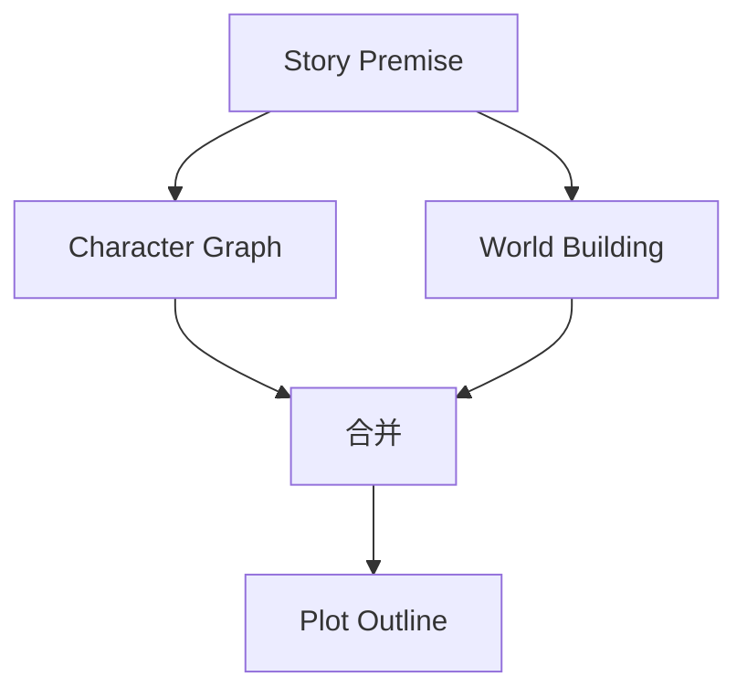

角色图谱和世界观构建可并行执行，二者均依赖故事前提但互不依赖。

**并行规则**：
- 同一父节点的无依赖子节点可并行
- 并行任务共享父节点输出作为输入
- 并行任务完成后由合并节点聚合结果
- 任一并行任务失败不影响其他任务，但合并节点等待所有任务完成

#### 1.3.3 条件分支

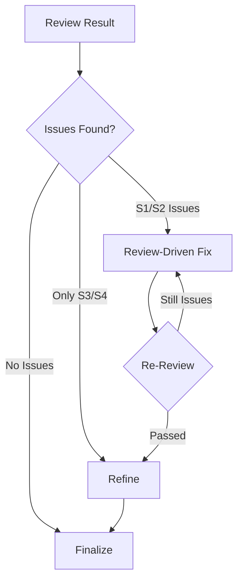

**条件规则**：
- 审稿发现 S1/S2 级别问题 → 强制进入修稿流程
- 仅 S3/S4 级别 → 建议润色但不强制
- 无问题 → 直接定稿

#### 1.3.4 人工确认检查点

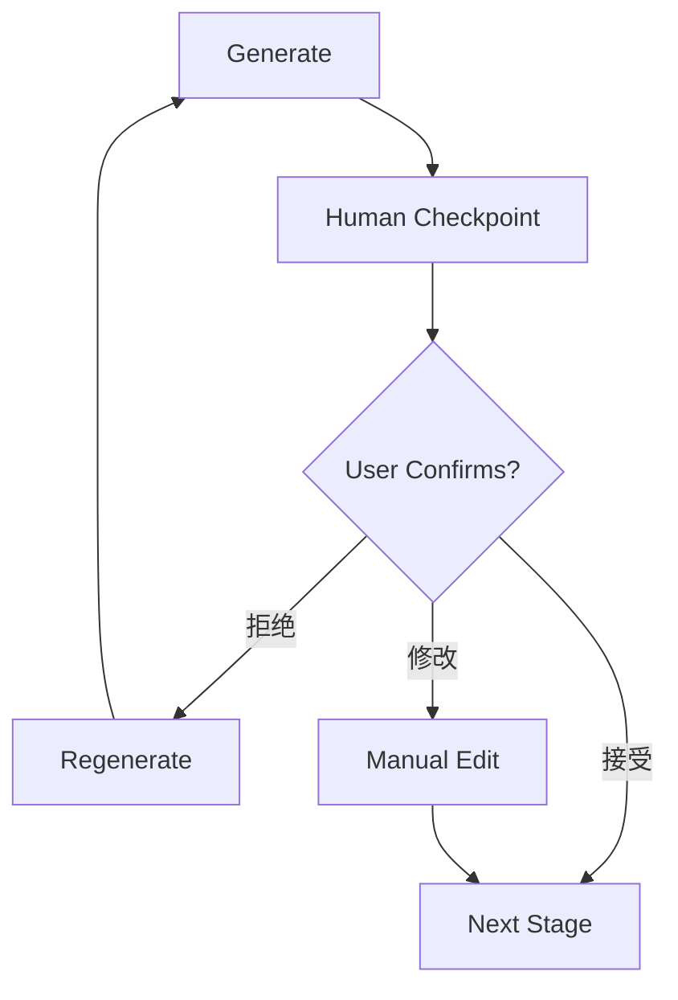

**人工确认点**：
1. **Story Premise 确认**：用户确认故事前提方向
2. **Character Graph 确认**：用户确认角色设定
3. **World Building 确认**：用户确认世界观
4. **Plot Outline 确认**：用户确认情节大纲
5. **Chapter Blueprint 确认**：用户确认章节蓝图
6. **Review 结果确认**：用户决定修稿范围

#### 1.3.5 断点续写

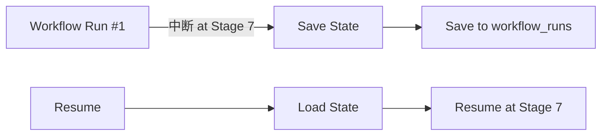

**断点续写机制**：
1. 每个 Stage 执行前将输入参数和当前状态保存到 `workflow_runs` + `workflow_run_steps`
2. 中断后，从数据库恢复上次执行位置
3. 已完成的 Stage 跳过，从未完成的 Stage 继续
4. 支持用户手动设置断点（`workflow_steps.metadata_json.breakpoint = true`）

#### 1.3.6 回滚能力

**回滚层级**：
1. **Stage 级回滚**：将某个 Stage 的状态重置为 `pending`，重新执行
2. **Checkpoint 级回滚**：将流水线回退到最近的人工确认点
3. **数据级回滚**：通过 Git 版本管理恢复项目文件

**回滚操作**：
- Stage 级回滚：`UPDATE workflow_run_steps SET status='pending' WHERE step_id=...`
- 数据级回滚：`git checkout <commit> -- .`（项目文件在 Git 管理下）

---

## 2. Agent 系统设计

### 2.1 Agent 清单

| Agent | 推荐模型 | 职责 | 上下文需求 | 预估 Token/次 |
|-------|---------|------|-----------|--------------|
| story-architect | Opus | 故事架构：题材定位、大纲结构、钩子/反转设计、情感弧线 | 故事前提 + 配置 + RAG | 2000-4000 |
| character-designer | Sonnet | 角色设计：角色档案、语言风格、动机链、对话创建 | 故事前提 + 已有角色 | 1500-3000 |
| narrative-writer | Sonnet | 正文写作：章节生成、去 AI 味、格式合规 | 蓝图 + 角色卡 + 世界观 + 摘要 + RAG | 3000-6000 |
| consistency-checker | Haiku | 一致性检查：事实冲突扫描、伏笔追踪、S1-S4 严重级别报告 | 正文 + 角色状态 + 世界观 + RAG | 1000-2000 |
| story-researcher | Sonnet | 资料研究：CDP 搜索 + 正文提取、多源验证、结构化参考输出 | 搜索查询 + 知识库 | 1000-2000 |
| story-explorer | Haiku | 故事查询：角色/伏笔/设定/进度只读查询 | 查询上下文 | 500-1000 |
| chapter-extractor | Haiku | 章节提取：摘要 + 情节点 + 角色提及 | 章节原文 | 500-1000 |

### 2.2 Agent 生命周期

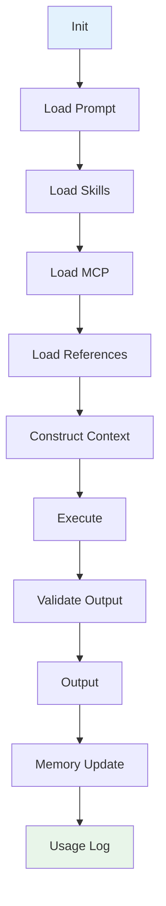

#### 各阶段详细说明

| 阶段 | 说明 | 实现 |
|------|------|------|
| Init | 初始化 Agent 实例，加载基础配置 | 从 `agents` 表读取配置，检查 `is_enabled` |
| Load Prompt | 加载系统提示词 | 从 `prompts` 表读取，按继承链合并 |
| Load Skills | 加载 Agent 绑定的 Skills | 读取 `skills_json` → 加载每个 Skill 的 prompt + schema |
| Load MCP | 加载可用的 MCP 工具 | 从 `model_configs` 获取 MCP 配置，连接工具服务器 |
| Load References | 按需加载 references/ 中的写作理论文件 | Lazy Loading：仅在执行时读取相关文件 |
| Construct Context | 组装完整上下文 | 合并 Prompt + Skills + References + RAG 结果 |
| Execute | 调用 LLM 执行任务 | 通过 Model Provider 流式调用 |
| Validate Output | 校验输出格式 | 按 `schema.json` 验证 JSON 输出 |
| Output | 返回结果 | 返回结构化输出给调用方 |
| Memory Update | 更新 Agent 写作记忆 | 写入 `usage_logs` + 更新上下文缓存 |

### 2.3 Agent 上下文加载

每个 Agent 在执行时加载的上下文数据：

#### story-architect

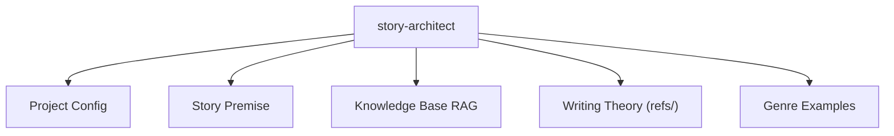

| 数据源 | 用途 | 加载方式 |
|--------|------|---------|
| 项目配置 | 全局约束（题材、视角、结构） | 必选，`SELECT * FROM projects WHERE id=...` |
| 故事前提 | 创作基础 | 必选，`SELECT * FROM story_premises WHERE project_id=...` |
| 知识库 RAG | 参考资料检索 | 按需，`search_context(query='故事结构')` |
| 写作理论 | 三幕式/英雄之旅等理论 | Lazy Loading，读取 `references/story_structure/` |
| 类型范例 | 同类型成功作品参考 | Lazy Loading，读取 `references/genre/{genre}/` |

#### narrative-writer

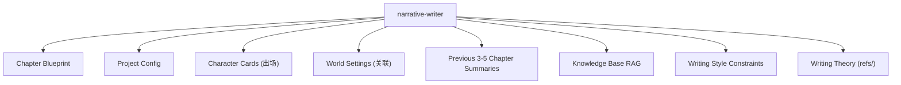

| 数据源 | 用途 | 加载方式 |
|--------|------|---------|
| 章节蓝图 | 本章执行计划 | 必选，`SELECT * FROM chapter_blueprints WHERE chapter_number=...` |
| 项目配置 | 全局约束 | 必选 |
| 出场角色卡 | 角色性格、语言风格、状态 | 必选，按 `characters_json` 加载 |
| 关联世界观 | 本章涉及的世界设定 | 必选，按蓝图关联加载 |
| 前文摘要 | 防止设定遗忘 | 必选，加载前 3-5 章的 `chapter_versions(stage='summary')` |
| 知识库 RAG | 相关设定切片 | 按需，Top-5 语义检索 |
| 文风约束 | 风格要求 | 必选，`projects.style_constraints` |
| 写作理论 | 去 AI 味技巧等 | Lazy Loading，读取 `references/writing_techniques/` |

#### consistency-checker

| 数据源 | 用途 | 加载方式 |
|--------|------|---------|
| 章节正文 | 被审查内容 | 必选 |
| 角色状态快照 | 校验角色一致性 | 必选，`SELECT * FROM character_states WHERE chapter_number <= current` |
| 世界观设定 | 校验设定冲突 | 必选 |
| 伏笔追踪 | 检查伏笔推进 | 按需，`characters.foreshadowing` + `world_elements.description` |
| 知识库 RAG | 辅助校验 | 按需 |

### 2.4 Agent 间上下文传递

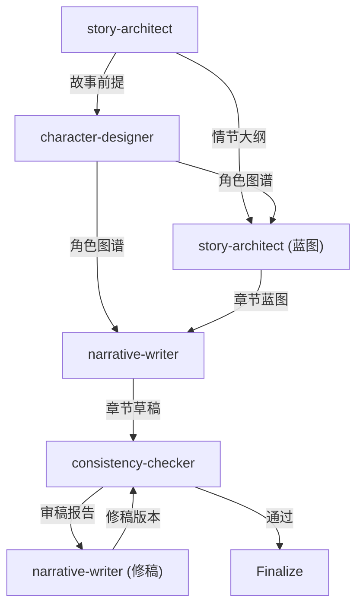

**上下文传递机制**：
1. 上一个 Agent 的输出自动作为下一个 Agent 的输入上下文
2. 数据通过数据库表中转（不直接传递内存引用）
3. 支持选择性传递：仅传递相关字段，避免上下文膨胀

---

## 3. Skills 系统设计

### 3.1 Skill 清单

| Skill | 分类 | 描述 | 绑定 Agent |
|-------|------|------|-----------|
| rewrite | writing | 章节重写：局部段落或整章重写 | narrative-writer |
| summarize | analysis | 章节摘要：生成结构化摘要 | chapter-extractor |
| emotion | analysis | 情绪分析与增强：分析文本情绪，增强情绪渲染 | narrative-writer |
| dialogue | writing | 对话生成与改进：优化对话自然度和角色区分 | narrative-writer |
| style | writing | 风格迁移与一致性：保持文风统一，去 AI 味 | narrative-writer |
| outline | planning | 大纲生成：多级情节大纲生成 | story-architect |
| review | quality | 质量审稿：多维度结构化审稿 | consistency-checker |
| character | analysis | 角色一致性检查：校验角色行为与人设 | consistency-checker |
| rag | knowledge | 知识库检索：语义 + 关键词混合检索 | 所有 Agent |
| export | utility | 格式导出：多格式文件导出 | Finalize 阶段 |

### 3.2 Skill 组成结构

```
skills/
├── rewrite/
│   ├── skill.yaml          # Skill 配置
│   ├── prompt.md           # Prompt 模板
│   ├── schema.json         # 输入/输出 JSON Schema
│   ├── script.rs           # 可选 Rust 扩展
│   └── icon.svg            # 图标
├── summarize/
│   ├── skill.yaml
│   ├── prompt.md
│   └── schema.json
└── ...
```

#### skill.yaml 示例

```yaml
# skills/rewrite/skill.yaml
name: rewrite
display_name: "章节重写"
description: "对章节草稿进行局部或整体重写"
category: writing
version: "1.0"
author: "Novel IDE"

# 参数定义
parameters:
  - name: target_scope
    type: enum
    values: ["paragraph", "section", "chapter"]
    default: "paragraph"
    description: "重写范围"
  - name: instruction
    type: string
    required: true
    description: "重写指令"
  - name: intensity
    type: enum
    values: ["light", "moderate", "heavy"]
    default: "moderate"
    description: "重写强度"

# 绑定配置
bindings:
  agents: ["narrative-writer"]
  events: ["before_rewrite"]
  priority: 10

# 依赖
dependencies:
  - name: rag
    required: false
```

#### schema.json 示例

```json
{
  "$schema": "http://json-schema.org/draft-07/schema#",
  "title": "Rewrite Input",
  "type": "object",
  "properties": {
    "content": {
      "type": "string",
      "description": "待重写文本"
    },
    "instruction": {
      "type": "string",
      "description": "重写指令"
    },
    "target_scope": {
      "type": "string",
      "enum": ["paragraph", "section", "chapter"]
    },
    "context": {
      "type": "object",
      "properties": {
        "chapter_blueprint": { "type": "object" },
        "character_cards": { "type": "array" },
        "world_settings": { "type": "array" }
      }
    }
  },
  "required": ["content", "instruction"]
}
```

#### prompt.md 示例

```markdown
# Rewrite Skill Prompt

你是一位专业的小说编辑，擅长对文本进行精准重写。

## 任务
根据用户的重写指令，对提供的文本进行重写。

## 约束
- 保持原文的核心情节不变
- 保持角色的语言风格
- 重写范围：{{target_scope}}
- 重写强度：{{intensity}}

## 输出格式
```json
{
  "rewritten_content": "重写后的文本",
  "changes_summary": "修改摘要",
  "preserved_elements": ["保留的元素列表"]
}
```

## 输入
原文：
{{content}}

重写指令：
{{instruction}}
```

### 3.3 Skill 特性

| 特性 | 说明 | 实现 |
|------|------|------|
| 启用/禁用 | 每个 Skill 可独立开关 | `skills.is_enabled` 字段 |
| 优先级排序 | 影响 Agent 加载顺序 | `skills.priority` 字段，数字越小优先级越高 |
| 参数配置 | 通过 `schema.json` 定义，前端渲染表单 | `skills.parameters_schema` 存储 JSON Schema |
| 热重载 | 修改后无需重启，文件系统监听 | 监听 `skills/` 目录变更，自动重新加载 |
| 项目级覆盖 | 项目目录下的 `skills/` 优先于全局 | 加载顺序：`{project}/skills/` → `~/.config/novel-ide/skills/` |
| 全局安装 | 安装到用户配置目录 | `~/.config/novel-ide/skills/{skill-name}/` |

---

## 4. Hooks 系统设计

### 4.1 Hook 清单

| Hook | 触发时机 | 功能 | 类型 |
|------|---------|------|------|
| session-start | 会话开始 | 显示当前分支、进度快照、导入状态 | before |
| session-end | 会话结束 | 记录会话到 tracking 文件 | after |
| detect-story-gaps | 会话开始 | 检测设定缺口、大纲缺失、伏笔断裂 | before |
| pre-compact | 上下文压缩前 | 保存进度快照路径和行摘要 | before |
| post-compact | 上下文压缩后 | 提示读取进度快照以恢复上下文 | after |
| validate-story-commit | Git 提交时 | 检查硬编码属性、设定必填字段（仅警告） | before |
| guard-outline-before-prose | 写正文前 | 缺细纲时阻止首次正文创建（硬阻断），强制先生成大纲 | before |
| before-prompt | AI Prompt 构造前 | 注入上下文、校验输入 | before |
| after-prompt | AI 响应后 | 后处理、校验输出 | after |
| before-save | 文件保存前 | 自动格式化、数据校验 | before |
| after-save | 文件保存后 | 索引同步、备份 | after |
| before-export | 导出前 | 最终校验 | before |
| after-export | 导出后 | 清理、通知 | after |

### 4.2 Hook 支持的执行方式

| 执行方式 | 适用场景 | 安全级别 | 示例 |
|---------|---------|---------|------|
| Shell script | 系统级操作、文件处理 | 低 | `bash hooks/validate.sh` |
| Rust function | 高性能、需要数据库访问 | 高 | 内置 Rust 函数 |
| Lua script | 轻量逻辑、配置解析 | 中 | 读取项目配置做校验 |
| JavaScript script | 复杂数据处理、JSON 操作 | 中 | 解析审稿报告生成统计 |

### 4.3 Hook 执行顺序

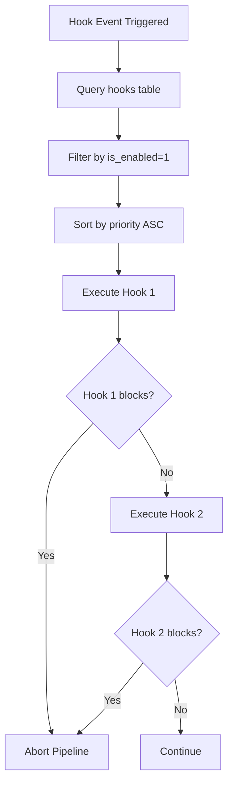

**执行规则**：
1. 按 `priority` 从小到大依次执行
2. 阻断型 Hook（`guard-outline-before-prose`）返回 `false` 时终止后续流程
3. 非阻断型 Hook（`before-prompt`）执行失败仅记录日志，不阻断主流程
4. `before/after` 配对 Hook：`before` 执行完毕后执行主操作，主操作完成后执行 `after`
5. Hook 执行超时（>10s）自动终止

### 4.4 Hook 配置示例

```sql
-- guard-outline-before-prose: 缺细纲时阻止写正文
INSERT INTO hooks (id, project_id, name, event_type, handler_type, handler_content, is_enabled, priority, conditions_json)
VALUES (
  'hook-guard-outline',
  'project-001',
  'guard-outline-before-prose',
  'before_generate',
  'rust',
  'guard_outline_before_prose',
  1,
  1,
  '{"stage": "draft_generation", "check": "blueprint_exists"}'
);
```

---

## 5. Prompt 继承系统

### 5.1 继承链

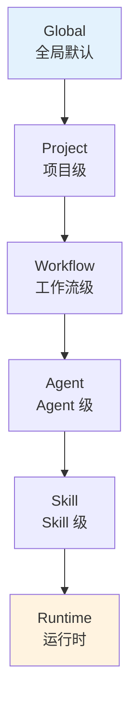

### 5.2 继承规则

| 规则 | 说明 |
|------|------|
| 覆盖合并 | 子级覆盖父级同名字段，未定义字段继承父级 |
| 作用域隔离 | 每级仅继承 `scope` 匹配的 Prompt |
| 变量覆盖 | 子级变量覆盖父级同名变量 |
| 空值透传 | 子级字段为 null 时透传父级值 |
| 禁用穿透 | 子级 `is_enabled=0` 时禁用该 Prompt，不影响父级 |

### 5.3 Prompt 模板结构

每级 Prompt 包含以下文件：

| 文件 | 用途 | 必填 |
|------|------|------|
| system.md | 系统指令（AI 角色定义、行为约束） | 是 |
| user.md | 用户指令模板（任务描述） | 是 |
| assistant.md | 助手角色定义（可选） | 否 |
| variables.json | 变量定义（默认值、类型） | 否 |
| schema.json | 输出格式约束（JSON Schema） | 否 |

### 5.4 变量插值

**语法**：`{{variable_name}}`

**变量来源**（按优先级从高到低）：

| 来源 | 优先级 | 示例 |
|------|--------|------|
| Runtime | 1（最高） | 运行时动态注入 |
| Skill | 2 | Skill 参数 |
| Agent | 3 | Agent 配置变量 |
| Workflow | 4 | Workflow 步骤参数 |
| Project | 5 | 项目配置字段 |
| Global | 6（最低） | 全局默认值 |

**变量解析示例**：

```markdown
# system.md (Agent 级)
你是一位专业的{{genre}}小说作家。
叙事视角：{{narrative_pov}}。
目标读者：{{target_readers}}。
```

当 `genre=仙侠`, `narrative_pov=第三人称有限`, `target_readers=18-35 男性` 时，解析为：

```
你是一位专业的仙侠小说作家。
叙事视角：第三人称有限。
目标读者：18-35 男性。
```

### 5.5 Prompt 拼接流程

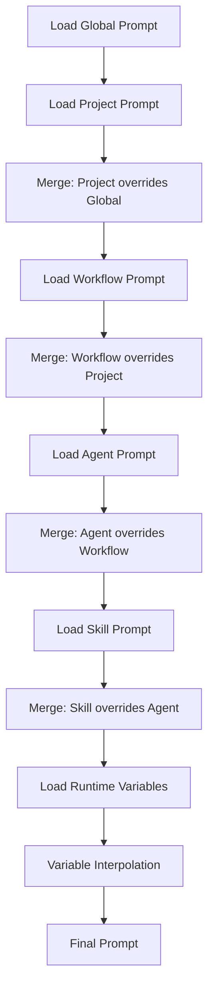

### 5.6 Prompt 调试器

系统提供 Prompt 调试功能：

- 查看最终拼接后的完整 Prompt
- 显示每个层级的贡献内容
- Token 占用统计（按角色分组）
- 继承链可视化

---

## 6. 工作流可视化设计（V2 Feature）

### 6.1 节点类型

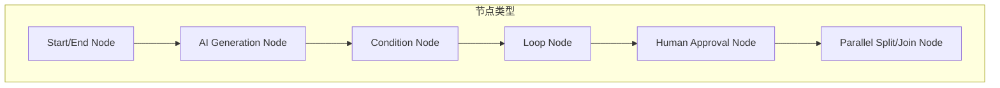

| 节点类型 | 图标 | 说明 | 示例 |
|---------|------|------|------|
| Start | ▶️ | 流水线起点 | 流程开始 |
| End | ⏹️ | 流水线终点 | 流程结束 |
| AI Generation | 🤖 | AI 生成任务 | Draft Generation |
| Condition | ❓ | 条件分支 | Review 结果判断 |
| Loop | 🔁 | 循环执行 | 修稿-审稿循环 |
| Human Approval | 👤 | 人工确认 | Blueprint 确认 |
| Parallel Split | ⑂ | 并行拆分 | Character + World 并行 |
| Parallel Join | ⑃ | 并行合并 | 合并并行结果 |

### 6.2 工作流设计器 UI

V2 版本将提供节点式可视化编辑器，类似 Node-RED / LangFlow：

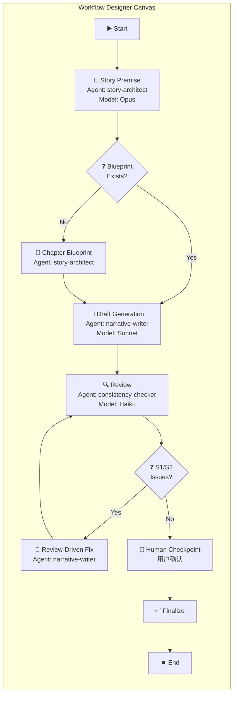

**设计器功能**：
1. **拖拽节点**：从左侧节点面板拖拽到画布
2. **连线**：节点间拖拽连线，建立执行顺序
3. **配置面板**：点击节点右侧显示配置面板
4. **实时预览**：配置修改实时反映到节点
5. **导入/导出**：JSON/YAML 格式导入导出工作流定义
6. **版本管理**：工作流定义支持版本历史

---

## 7. 数据库 Schema 映射

### 7.1 工作流相关表

| 表 | 用途 | 关键字段 |
|----|------|---------|
| `workflows` | 工作流定义 | name, trigger_type, status |
| `workflow_steps` | 步骤配置 | step_type, agent_id, skill_id, sort_order, next_step_id |
| `workflow_runs` | 执行历史 | workflow_id, status, input_json, output_json |
| `workflow_run_steps` | 步骤执行记录 | workflow_run_id, status, input_json, output_json, duration_ms |

### 7.2 Agent/Skill 相关表

| 表 | 用途 | 关键字段 |
|----|------|---------|
| `agents` | Agent 定义 | name, system_prompt, skills_json, model_config_id |
| `skills` | Skill 定义 | name, prompt_template, parameters_schema, category |
| `prompts` | Prompt 模板 | scope, parent_id, role, content, variables_json |
| `model_configs` | 模型配置 | provider, model_name, api_endpoint, api_key_encrypted |

### 7.3 Hooks 相关表

| 表 | 用途 | 关键字段 |
|----|------|---------|
| `hooks` | Hook 定义 | event_type, handler_type, handler_content, priority, conditions_json |
| `hook_logs` | Hook 执行日志 | hook_id, status, input_snapshot, output_snapshot, duration_ms |
| `events` | 事件总线记录 | event_type, source, payload_json, status |

### 7.4 使用统计表

| 表 | 用途 | 关键字段 |
|----|------|---------|
| `usage_logs` | LLM 调用日志 | agent_id, model_config_id, operation_type, prompt_tokens, completion_tokens, latency_ms |

### 7.5 Token 计划表

| 表 | 用途 | 关键字段 |
|----|------|---------|
| `token_plans` | Token 计划管理 | name, provider, plan_type, token_limit, tokens_used, cost_limit, cost_used, reset_cycle |

### 7.6 云端同步表

| 表 | 用途 | 关键字段 |
|----|------|---------|
| `cloud_sync_configs` | 同步配置 | name, protocol, server_url, access_key_encrypted, sync_scope, auto_sync |
| `cloud_sync_history` | 同步历史 | config_id, direction, files_synced, status, duration_ms |

### 7.7 文字校对表

| 表 | 用途 | 关键字段 |
|----|------|---------|
| `proofreading_results` | 校对结果 | chapter_id, total_chars, total_errors, error_rate, status |
| `proofreading_errors` | 校对错误明细 | result_id, error_type, original_text, suggested_text, confidence, is_resolved |

### 7.8 配置备份表

| 表 | 用途 | 关键字段 |
|----|------|---------|
| `config_backups` | 备份记录 | name, backup_scope, is_encrypted, file_path, is_auto |

---

## 8. 状态机定义

### 8.1 Workflow Run 状态机

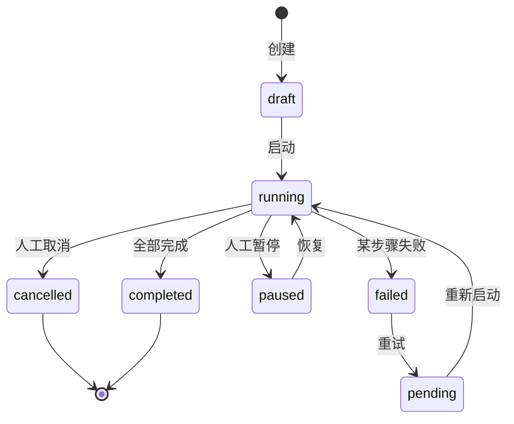

### 8.2 Workflow Step 状态机

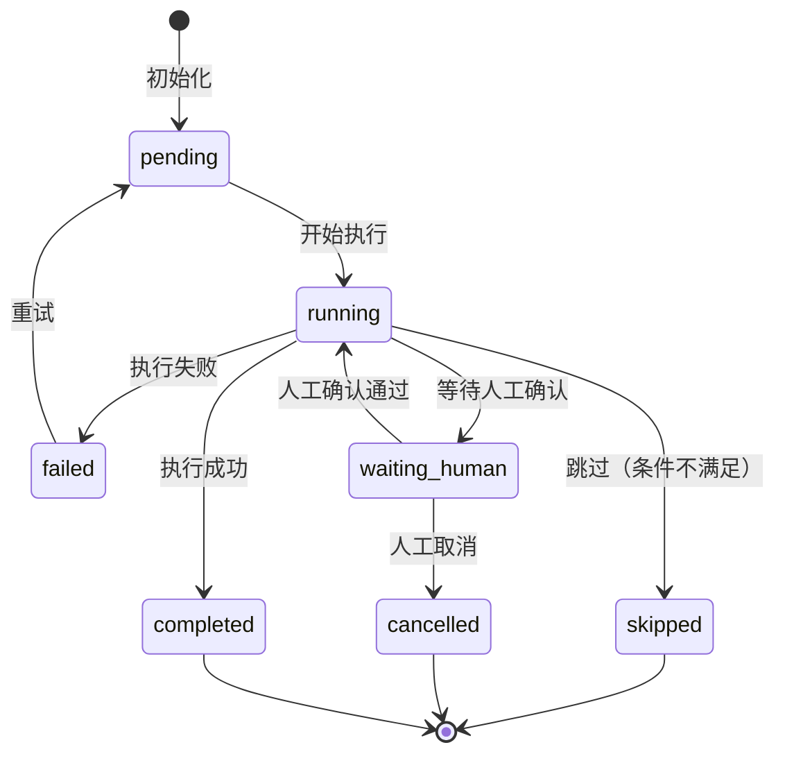

### 8.3 Agent 执行状态机

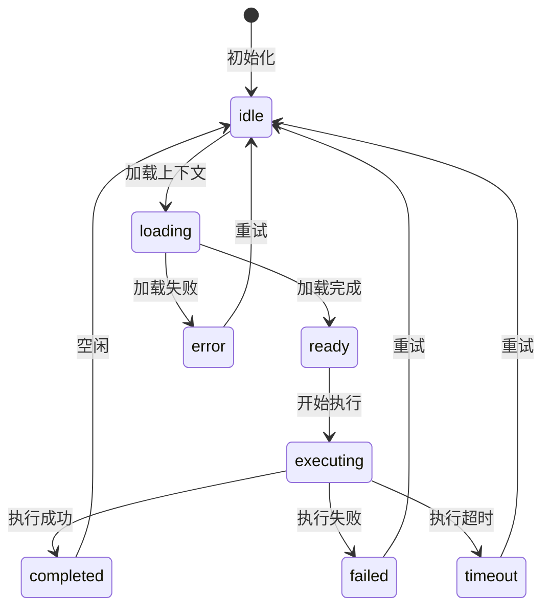

---

## 9. 错误处理策略

### 9.1 错误分级

| 级别 | 名称 | 处理策略 | 示例 |
|------|------|---------|------|
| E1 | 致命错误 | 终止流水线，需人工介入 | 数据库连接失败、模型不可用 |
| E2 | 严重错误 | 自动重试 2 次，失败后暂停 | LLM 输出格式异常、网络超时 |
| E3 | 一般错误 | 自动重试 1 次，失败后降级 | RAG 检索失败、摘要生成失败 |
| E4 | 轻微错误 | 记录日志，跳过继续 | 非阻断型 Hook 执行失败 |

### 9.2 降级策略

| 场景 | 降级方案 |
|------|---------|
| Embedding 模型不可用 | 降级到纯 FTS5 关键词检索 |
| 高能力模型不可用 | 降级到中等模型 |
| RAG 检索失败 | 使用纯配置上下文，忽略知识库 |
| 审稿 Agent 失败 | 跳过审稿，直接进入润色 |
| Hook 执行超时 | 记录日志，继续主流程 |

---

## 10. 性能优化

### 10.1 Agent Lazy Loading

Agent 不预占上下文，仅在执行时加载：
- `references/` 目录中的写作理论文件按需读取
- 角色卡仅加载出场角色，非全量加载
- 知识库 RAG 仅检索当前章节相关切片

### 10.2 上下文缓存

| 缓存层 | 内容 | TTL |
|--------|------|-----|
| Agent 上下文缓存 | 已加载的 Prompt + References | 单次执行 |
| RAG 检索缓存 | 相同查询的检索结果 | 5 分钟 |
| 模型连接缓存 | HTTP 连接池 | 30 分钟 |

### 10.3 并行执行优化

- 角色图谱 + 世界观构建并行执行
- 多章节蓝图批量生成（非逐章串行）
- 审稿 + 修稿循环中的异步处理
